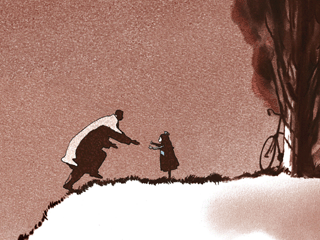
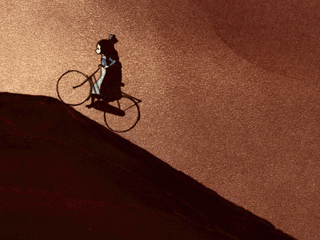
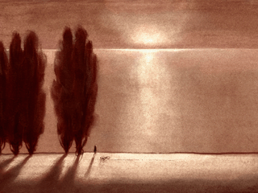
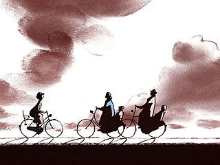
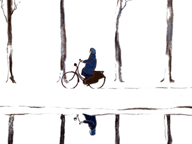
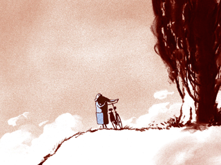

aka 수도승과 물고기, 승려와 물고기, Le Moine et le Poisson  

<!-- truncate -->

[monk1.jpg](./monk1.jpg)  
<아버지와 딸 (Father and Daughter)>로 유명한 마이클 두독 드 비트 (Michael Dudok De Wit) 감독의 1994년작입니다. 길이는 6분 20초.  
  
작품의 내용은 매우 간단합니다. 한 수도승이 물고기를 낚으려고 갖은 노력을 하는 것이 내용의 전부인데 수도승의 동작과 사운드가 아주 잘 매치되어 있습니다. 빠른 멜로디에 맞추어 콩콩거리며 뛰는 수도승의 모습은 보는 이로 하여금 살며시 웃음을 자아내게 하지만 작품을 보고 난 후에 남는 건 웃음만은 아닙니다.  
  
[monk2.jpg](./monk2.jpg)  
제목에서 보다시피 이 작품은 구원이나 해탈, 화두 등과 같은 종교적인 주제에 접근하고 있습니다. 이는 2005년 [한 인터뷰](http://www.mastersofcinema.org/bresson/Words/Dudok_de_Wit.html)에서 로베르 브레송 (Robert Bresson)의 "영화에 관한 노트 (Notes on the Cinematographer)"에서 인용된 문구와 비교되기도 합니다.   
  
**One must not seek, one must wait. (Corot)**  
**Empty the pond to get the fish.**  
  
[monk3.jpg](./monk3.jpg)  
즉 작품 속에서 수도승은 물고기를 잡으려고 갖은 노력을 다 하다가 결국은 그 물고기를 잡지 않고 어딘가로 함께 가게(?) 됩니다. 깨달음 혹은 구원을 얻었다는 표현을 그와 같이 한 것이겠지요. 직접적이지 않은 방법으로 표현되는 두독 드 비트 감독의 [특징\*1](#544-1)이 잘 나타나 있습니다.  
  
음악은 [Serge Besset](http://www.imdb.com/name/nm0078813/)이 맡았고, 바로크 시대의 작곡가인 아르칸젤로 코렐리 (Arcangelo Corelli)의 '라 폴리아 (La Follia)'를 바탕으로 했습니다. <아버지와 딸>에서도 요시프 이바노비치 (Iosif Ivanovich)의 왈츠 ['다뉴브 강의 잔물결 (Donauwellen Walzer)'\*2](#544-2)을 메인 테마로 썼는데, 평상시에도 클래식을 즐겨 듣는다고 합니다.  
  
참고로, 위의 인터뷰에서 보면 감독은 이 <수도승과 물고기>가 잘 되지 않았으면 더 이상 자기 작품을 만들지 않으려고 했다고 합니다. 직접적인 이야기 하나 없는 <아버지와 딸>을 많은 사람들이 좋아해준 것도 놀라웠다고 하네요.  
  

  
광고와 작품을 동시에 작업하면서도 자신의 색을 잃지 않고 더욱 키워나가는 감독의 다음 작품이 기대됩니다.  
  
우연찮게 youtube.com에서 [**링크**](http://www.youtube.com/watch?v=2uk2tJhdTTw&eurl=)를 발견했네요.  
  

**작품 정보**  
  
Director: Michael Dudok de Wit   
Producers: Patrick Eveno, Jacques-Remy Girerd   
Animation: Michael Dudok de Wit, Guy Delisle   
Music: Serge Besset, based on "La Follia" by Corelli   
Folimage-Valence Production (1994)   
Academy Award® Nominee (1994)   
Technique: Brush and Indian Ink, watercolor

  

**감독 소개**  
  
마이클 두독 드 비트 (Michael Dudok De Wit)는 1953년 네덜란드에서 태어나 교육을 받았습니다. 학교 졸업 후, 제네바에서 판화를 공부했고, 영국 판햄에서 애니메이션을 공부하면서 그의 첫 작품 <인터뷰(The Interview)>를 만들었습니다. 바르셀로나에서 1년간 프리랜서로 활동하기도 했던 그는 현재 런던에 머물면서 여러 제작사, 특히 리차드 퍼덤 프로덕션(Richard Furdum Production)과 함께 TV 및 극장용 광고들을 제작, 연출하였고, 이들 작품으로 여러 상을 수상했습니다.  
  
1992년에는 단편 <청소부 톰 (Tom Sweep)>을 스튜디오 폴리마쥬와 함께 남부 프랑스에서 제작하였고, 이후 <수도승과 물고기>를 제작했습니다. <청소부 톰>은 아카데미상에 노미네이트되었으며, 세자르상과 카툰도르(cartoon d"or) 등 다양한 상을 받았스니다. <아버지와 딸(Father and Daughter)>는 2000년 여름에 공개되어, 전세계 유수의 페스티벌에서 수많은 상을 수상했습니다. (2000년 오타와 단편부문, 2001년 안시 대상, 2002년 히로시마 대상, 2002 자그레브 그랑프리 포함) 이 외에, 마이클은 책의 삽화 작업도 했고, 현재 영국 등지의 예술대학에서 애니메이션을 강의하고 있습니다.

  

**관련 링크**  
  
[씨네21 - 안시 | <아빠와 딸> 미하일 두독 드 비트 인터뷰](http://www.cine21.com/Magazine/mag_pub_view.php?mm=005001001&mag_id=2681)  
[씨네21 - 순수한 상상력, 순진한 정책 (폴리마지)](http://www.cine21.com/Culture/culture_view.php?mm=003003002&mag_id=1450)  
[Dudok de Wit Animation](http://www.dudokdewit.com/)  
[마이클 두독 드 비트 필모그래피 (in Acme Filmworks)](http://www.acmefilmworks.com/dir_folders/dirDudok/dudok_filmo.html)  
  
[씨네21 - 로베르 베르송 페이지](http://www.cine21.com/Movies/Mov_Person/person_info.php?id=9412)  
[Jonathan Hourigan interviews Michael Dudok de Wit](http://www.mastersofcinema.org/bresson/Words/Dudok_de_Wit.html)  
<Father and Daughter (아버지와 딸)> [[보기]](http://blog.empas.com/nemo11/read.html?a=12422178) [[보기 #2]](http://bbs3.tvpot.media.daum.net/griffin/do/videoLink?bbsId=S001&articleId=189&pageIndex=1&searchKey=&searchValue=)

  
**\*1** 작품 속 인물들의 표정은 잘 묘사되지 않지만 관객들에게 강한 인상을 남기는 건 두독 드 비트 감독의 특징입니다. 이러한 특징은 <아버지와 딸>에서 절정이었다고나 할까요?  
  
**\*2** 윤심덕의 "사의 찬미"로 잘 알려진 노래지요.  
  

