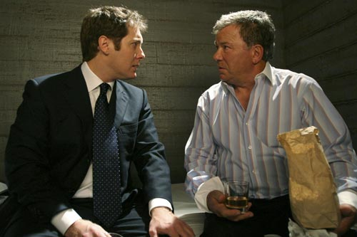
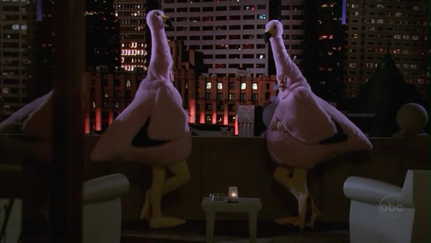

벌써 3번째 시즌을 바라보는 시리즈이지만 뭐... 그래도 적는다.  

<!-- truncate -->

[boston\_legal-stargate.jpg](./boston_legal-stargate.jpg)제임스 스페이더 (James Spader). 그는 멀쩡한 역할, 예를 들면 스타게이트의 다니엘 잭슨 박사 같은 역할도 많이 했지만 난 그를 떠올릴 때마다 (이상하게도) 그를 좀 이상하고 괴상한 취향의 캐릭터로 기억하고 있다. 성격부터 성적인 취향까지.  
  
그런 그가 나오는 TV 드라마는 어떤 분위기일까? 게다가 법정 드라마 전문 제작자 데이비드 E. 켈리가 만드는 법정 코미디 드라마라면? 제목은 <보스턴 리갈 (Boston Legal)>.  
  
[boston\_legal-1.jpg](./boston_legal-1.jpg)이 드라마에 간단하게 이야기하자면 다음과 같다. **"<프랙티스 (Practice)> 보다는 가볍고, <앨리 맥빌> 보다는 진지한 드라마."** 이 드라마는 일종의 <프렉티스>의 스핀오프이면서 구성이나 호흡면으로는 여러 모로 <앨리 맥빌>에 가깝다고 볼 수 있다.  
  
<앨리 맥빌>이 특수효과와 뮤지컬적인 요소를 빌려 코믹하고도 독특한 분위기를 만들어갔다면 <보스턴 리갈>은 제임스 스페이더가 연기하는 앨런 쇼어와 윌리엄 섀트너 (William Shatner)가 연기하는 데니 크레인을 중심으로 한 인물들과 드라마의 내용 자체로 그 유머러스한 분위기를 만든다. 그리고, <프랙티스>가 배우들의 연기와 거친 카메라 톤으로 진지함을 유지했다면 <보스턴 리갈>은 (신기하게도) 캐릭터들의 거침없는 성격 묘사와 카메라 워크를 통해 사실감을 유지한다.  
  
이 드라마의 가장 독특한 점을 하나 꼽으라면 바로 카메라 워크다. 특히 (기술적으로는 전혀 특별하지 않은 기술이지만) 미디엄 샷으로 인물을 잡던 카메라가 대사와 함께 움직이는 인물의 손을 따라 서성인다거나, 숄더 샷으로 인물을 잡던 카메라가 갑자기 줌인으로 들어간다거나 하는 카메라의 움직임이 코미디와 과장된 설정이 난무한 이 드라마를 리얼리티 쇼 수준의 사실감과 동시에 훔쳐보는 듯한 자극을 느끼게 해 준다는 것이다.  
  
[boston\_legal-james\_spader.jpg](./boston_legal-james_spader.jpg)[boston\_legal-william\_shatner.jpg](./boston_legal-william_shatner.jpg)(제목에서 보다시피) 이 드라마는 보스턴의 큰 로펌인 '크레인, 폴 앤 슈밋'을 무대로 진행되며 크게 두 변호사를 축으로 돌아간다. 앨런 쇼어와 데니 크레인. (시즌 1에서 한 명을 더 꼽자면 모니카 포터 (Monica Potter) 가 연기하는 로리 콜슨을 추가할 수 있겠다.)  
  
앨런 쇼어는 가식없이 자신이 원하는 것을 몸소 실행하는 악동 기질의 선천적인 바람둥이면서 뛰어난 능력의 변호사이다. 반면에 데니 크레인은 지금도 여전히 좋은 실력을 자랑하긴 하지만 현재 알츠하이머병을 앓고 있는 (시즌 2에서는 광우병이라고 표현한다) 위대했던 전성기가 지나버린 변호사이다.  
  
[boston\_legal-monica\_potter.jpg](./boston_legal-monica_potter.jpg)로리 콜슨이라는 캐릭터가 시즌 1에만 나오고 극의 중심에서 밀려난 게 개인적으로 아쉽다. 진심을 가지고 냉혹한 상황에 대처하고 반응하는 앨리 맥빌의 프랙티스 버전 쯤 되는 캐릭터라고 생각하고 괜찮게 봤었는데... 하긴 다른 캐릭터들도 마찬가지이긴 하다. 계속해서 나오는 캐릭터는 많지 않다.  
  
글이 길어질 것 같아 짧은 문장 몇 개로 정리해보면 다음과 같다.  
  

-. 이 드라마는 <앨리 맥빌> 이후 내 취향에 가장 잘 맞는 드라마 중 하나이다.  
-. 여전히 부시, 공화당, 보수주의자들을 비웃고 까대는 내용들이 곳곳에 있다. 사실 더 강해졌다. (심지어 부시의 공공연한 친구인 Fox 방송사까지.) (내가 이 드라마를 좋아하는 이유 중의 하나)  
-. 캐릭터의 성격도, 드라마의 내용도 데이빗 E. 켈리의 전작들보다 강해졌다. 강해졌다는 건 소재의 선택, 표현의 수위, 캐릭터의 취향, 극의 전개 등 많은 부분에 적용되는 부분이다. 한마디로 업그레이드!  
-. 제임스 스페이더와 윌리엄 섀트너의 콤비는 드라마의 매력을 드러내는 또하나의 축이다. (제임스 스페이더의 그 퇴폐적인 분위기와 윌리엄 섀트너의 "데니 크레인-" 이라는 대사는 직접 보고 들어봐야 한다.) 게다가 잠자리도 함께(?) 하는 둘의 그 미묘한(!) 관계라니. :)

  

  
이 드라마는 미국이 주도하고 있는 말도 안되는 전쟁, 종교문제, 알츠하이머병, 멸종 동식물 문제, 각종 차별, 검열, 사형, 프라이버시, 동성애, 총기소지 문제 등등 각종 문제들에 대해 조롱하기도 공감하기도 하며 질문을 던진다. 그 질문들은 한번씩 생각해 봄직하며 적당한 여운을 남기기도 한다.  
  
역대 재판 전적 무패를 자랑하는 데니 크레인이 극 중에서 하는 말이 있다.  
  
> 모자에서 토끼를 꺼내. 그게 바로 법정과 현실에서 성공하는 비밀이지.  
> - 데니 크레인  
>   
> Pull a rabbit out of your hat. That's the secret both to trial law and life.  
> - Denny Crane

  
어디서 많이 본 듯한 (그가 만든 이전 작품들을 통해) 에피소드들을 가지고 있고, 정상적인 인물 하나 역시 나오지 않으며, 오히려 더 과감해진 이야기들이 매력적인 건 아무래도 데이비드 E. 켈리가 이 비법을 알아냈기 때문이 아닌가 싶다.  
  
한가지 개인적으로 추측해보자면 만약 이 시리즈의 매력이 사라지는 순간이 온다면 그건 바로 불안하기 그지없는 앨런 쇼어가 차분해지는 때일 것이다. 시리즈가 끝날 때까지 그 때가 오지 않길 바랄 뿐. :)
