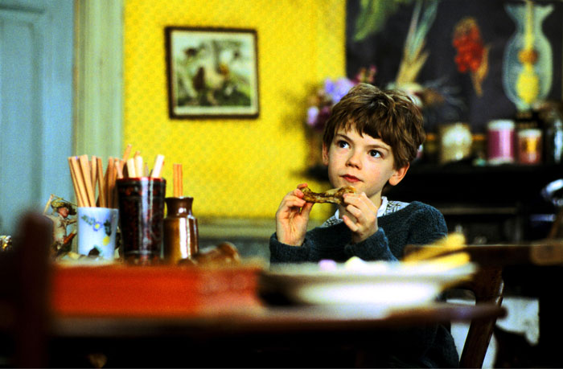
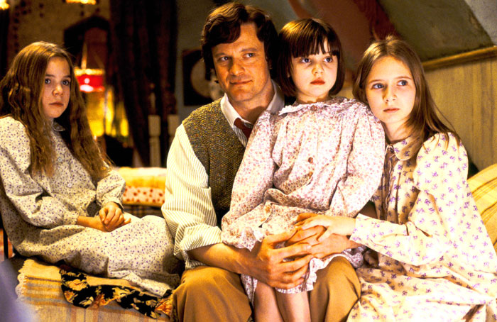

aka 내니 맥피 - 우리 유모는 마법사  

<!-- truncate -->

[nanny\_mcphee\_5.jpg](./nanny_mcphee_5.jpg)**원작은** 추리소설 작가 크리스티아나 브랜드 (Christianna Brand)가 쓴 ["유모 마틸다 (Nurse Matilda)"](http://www.yes24.com/Goods/FTGoodsView.aspx?goodsNo=1947491&CategoryNumber=001001017001002) 시리즈이다. 그리고, **각본은** 유모 맥피역을 맡은 엠마 톰슨 (Emma Thompson)이 직접 썼다. 그녀는 이미 <[센스 센서빌리티](http://movie.naver.com/movie/bi/mi/basic.nhn?code=17458) ([Sense and Sensibility](http://us.imdb.com/title/tt0114388/))>의 각색으로 오스카 각색상을 받은 적이 있다.  
  
**음악은** 얼마 전 <[해리 포터와 불의 잔](http://movie.naver.com/movie/bi/mi/basic.nhn?code=37883) ([Harry Potter And The Goblet Of Fire](http://us.imdb.com/title/tt0330373/))>에서 실력을 보여줬던 패트릭 도일 (Patrick Doyle). 이번엔 굉장히 풍성한 오케스트레이션 편곡을 보여준다.  
  

  
**인상적인 출연진은** 엠마 톰슨 외에도 콜린 퍼스 (Colin Firth)와 <[러브 액츄얼리](http://movie.naver.com/movie/bi/mi/basic.nhn?code=36843) ([Love Actually](http://us.imdb.com/title/tt0314331/))>의 귀여운 꼬마, 토마스 생스터 (Thomas Sangster). 그렇다면 **제작사는**? [워킹 타이틀 (Working Title)](http://www.workingtitlefilms.com/)  
  
[nanny\_mcphee\_0.jpg](./nanny_mcphee_0.jpg)마지막으로 **엔딩 크레딧**(의 애니메이션)이 인상적인데, 최근 작품으로는 <[레모니 스니켓의 위험한 대결](http://movie.naver.com/movie/bi/mi/basic.nhn?code=39705) ([Lemony Snicket's A Series Of Unfortunate Events](http://us.imdb.com/title/tt0339291/))>의 그것을 떠올리게 한다. (물론 떠올리게만 할 뿐 레모니 스니켓 쪽이 훨씬 대단하다. 레모니 스니켓의 경우엔 심지어 DVD 타이틀의 메뉴 화면까지도 정말 멋지다!) 그러고 보니, 뭔가 이 두 작품에 공통점이 느껴진다.  
  
 /  /   
  
  

**참고 클립** **<Lemony Snicket's A Series of Unfortunate Events>** end credits  
  
  
관련 링크 : [Jamie Caliri - Lemony Snicket](http://www.jamiecaliri.com/lemony_snicket_press.html)

  
  

**추가**  
  
1990년 5월 16일생인 토마스 생스터의 최근 작품 중의 하나는 바로 케빈 레이놀즈 감독의 <트리스탄과 이졸데> (Tristan + Isolde, 2006).  
  
  
  
그리고, 그 다음 작품은 다시 콜린 퍼스와 함께 나오는 <The Last Legion > (2007)  
  
  
  
  
  

