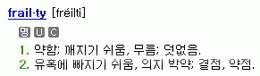

aka 프레일티  

<!-- truncate -->

  
  
이 영화는 <심플 플랜 (A Simple Plan)> 등 많은 영화에서 좋은 연기를 보여주었던 빌 팩스톤 (Bill Paxton)의 첫번째 감독 작품입니다. 배우보다 감독이 되고 싶었다는 인터뷰도 했던 그의 첫번째 영화는 이렇게 시작됩니다.  
  
> [frailty-1.jpg](./frailty-1.jpg)'신의 손' 이라는 연쇄살인범을 쫒던 FBI 수사관 웨슬리 도일에게 자신이 '신의 손'의 형 펜튼이라고 주장하는 사람이 찾아옵니다. 그는 그의 말을 믿지 못하는 수사관에게 자신의 과거 이야기를 해주죠. 그의 어렸을 적 이야기는 다음과 같죠.  
>   
> 나름 평화롭게 살던 아버지 (빌 팩스톤 분)과 두 아들 (형은 펜튼, 동생은 아담)은 어느날 새로운 현실에 마주치게 됩니다. 바로 아버지가 갑자기 신의 계시를 받게 된 것이죠. 천사가 와서 아버지에게 '신성한 임무'를 주겠다고 한 것입니다. [frailty-3.jpg](./frailty-3.jpg)그래서, 아버지의 삶은 그 이후로 사탄을 '파멸'시키는데 주력합니다. 동생인 아담은 아버지의 말을 믿고 잘 협조하는 반면 펜튼은 도대체 이해가 되지 않습니다. 아무리 봐도 아버지의 행위는 사탄을 '파멸'시키는 게 아니라 멀쩡한 사람을 '살인'하는 것처럼 보였기 때문이죠.  
>   
> (이하 생략)

  
영화는 흔한 표현으로 '반전'영화입니다. 누군가는 쉽게 짐작할 수도 있고, 누군가는 기발하다고 생각했을 수도 있겠지만 반전이라는 요소를 제외하고도 이 영화는 잘 만들어진 스릴러 영화입니다. 배우들의 연기도 연출도 좋고 공포스러운 분위기도 제대로죠. 그러나, 제가 나름대로 충격적이었던 건 조금 다른 이유였습니다.  
  
글을 계속 읽으시려면 클릭하세요 (경고: 스포일러가 있습니다.)

[frailty-7.jpg](./frailty-7.jpg)결국 스스로를 펜튼이라고 주장하며 찾아온 그 사내 (매튜 맥커너히 분)은 펜튼이 아니라 동생 아담이었습니다. 그리고, 그 아담은 FBI 수사관을 밖으로 불러내 그를 죽이죠. 그 FBI 수사관도 사실 악마였던 거예요. 엄밀히 따지자면 악마의 마음을 가지고 악마와 같은 행동을 저지른 사람이었던 것입니다.  
  
즉, 아담은 이제껏 아버지로부터 일종의 '가업'을 물려받아 악마를 퇴치해왔던 것입니다. 죽은 사람이 악마인지 아닌지 모르는 사람들이 보기엔 '신의 손' 아담이 연쇄살인범이었겠지만 말이죠.  
  
[frailty-2.jpg](./frailty-2.jpg)제가 놀랬던 건 아담이 가업을 물려받았기 때문이 아닙니다. 영화에서 아담의 아버지나 아담이 악마(라고 지칭되는 사람)들을 죽이기 전에 그들의 죄를 확인하는 장면이 있습니다. 악마들의 몸에 손을 대봄으로써 그들의 지나간 악행이 시각적으로 보이는 것입니다. 이 장면은 사실 별다른 세부 묘사가 없다면 아버지나 아담의 미친 상상일 수도 있어요. 미쳐서 헛것을 보는 것이랄까요?  
  
그러나, 영화 속에서의 묘사는 그렇지 않습니다. 아버지나 아담이 죄를 확인하느라 그들의 몸에 손을 댈 때 그 악마(로 일컬어지는 사람)들은 동시에 무언가로부터 외상을 입은 것처럼 몸을 제대로 가누지 못합니다. 사실 그렇게 가누지 못하기 때문에 그 동안에 도끼로 내려쳐서 그들을 '파멸'시킬 수 있었던 거죠.  
  
[frailty-8.jpg](./frailty-8.jpg)그렇다면 아버지와 아담은 미치광이가 아니었다는 뜻이 됩니다. 게다가 CCTV 카메라도 오작동을 하는 걸 보니 더 분명해지죠. 그들에 의해 죽은 사람들은 정말 악행을 저질렀을 뿐만 아니라 악마였던 거고, 아버지와 아담은 신의 계시를 통해 그들을 구별해낼 수 있는 능력을 받았다는 뜻이라는 거죠. (추가하자면, 아담이 형 펜튼을 죽이는 것도 그가 아버지를 죽였기 때문에 하는 복수가 아니라 펜튼이 악마였기 때문입니다.)  
  
전 사실 종반에 다다르기 이전까지 이 영화가 그릇된 신념으로, 자신만의 기준으로 다른 사람들을 재단하고 처단하는 사람들을 풍자하고 비판하는 내용이라고 생각했었습니다. 왜냐하면 아버지와 아담은 증거를 제시하지도 않고 따져 묻지도 않았거든요. 그냥 그들은 원래부터 알고 있기 때문에 이른바 '절대선의 대리인'이 되었다는 겁니다. 그러나, 세상에 그런 확고한 신념(을 흉내낸 광기)로 이상한 짓을 벌이는 사람이 얼마나 많습니까. (저 멀리 전쟁 좋아하는 나라의 경우만 해도 그렇잖아요)  
  
[frailty-6.jpg](./frailty-6.jpg)그리고, 설사 그들이 악마를 볼 수 있는 능력이 있다고 하더라도 그렇게 스스로 손에 피를 묻혀가며 처단하는 설정은 (다른 여느 공포영화들처럼) 여전히 끔찍합니다. 게다가 그들은 죄책감을 가지지도 않아요. 그들이 행하는 행동은 사람을 죽이는 게 아니라 악마를 처단하는 것이니까요. 사실 그들이 정말 신의 은총을 받았는지 받지 않았는지는 중요하지 않을지도 모릅니다. 하지만, 목적이 수단을 정당화시키지는 않잖아요?  
  
어쨌든, 그들이 '절대선의 대리인'이 사실이라는 결말에는 놀라지 않을 수가 없었습니다. 빌 팩스톤이 원래 어떤 성향인지는 모르겠지만 나름 충격이었어요. 그러고 보니, 매튜 맥커너히는 충실한 기독교인이라는 기사를 본 것 같기도 하지만 아주 오래 전의 일이라 사실 관계가 틀릴 수도 있고요.  
  
아! 그러고 보니 영화의 무대도 텍사스, 빌 팩스톤도 매튜 맥커너히도 텍사스 출신이로군요. 고정관념일지 모르겠지만 텍사스하면 미국 내에서도 가장 강력한 사형제도 운영으로 유명한 곳이잖아요. 그렇게 생각하니 뭔가 연관성이 있을 것도 같습니다. 신의 계시를 통해 확고한 신념을 가지고 악마를 처벌하는 영화의 내용과 매년 미국 52개주 전체에서 집행되는 사형의 30 ~ 50% 정도가 텍사스 한 주에서 이루어지고 있는 현실이 말이죠.  
  
그렇다면 이 영화는 단순한 호러 영화일까요? 아니면 기독교적인 가치관으로서의 신과 악마에 관한 영화일까요? 이 영화의 정체가 과연 무엇인지 새삼 궁금해집니다.

  
 /  / 
