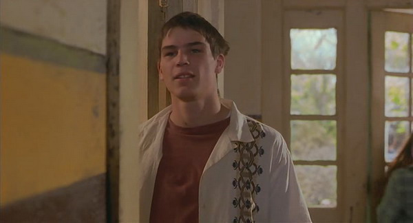
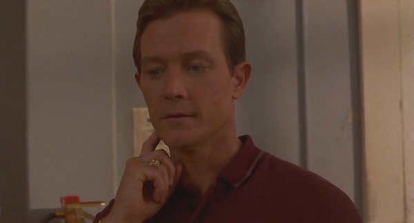
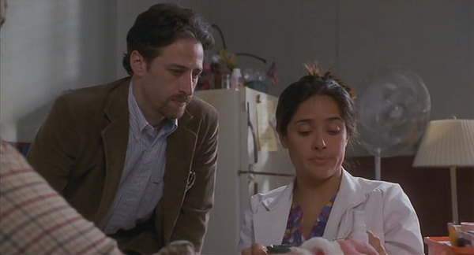
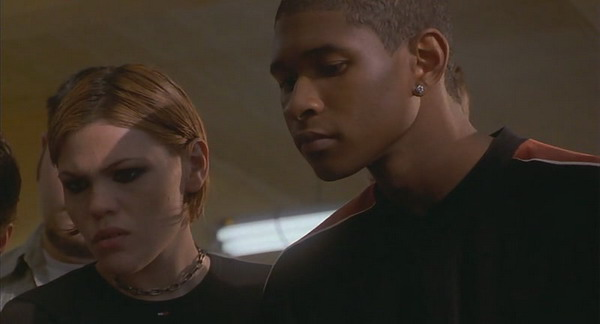

aka 패컬티  

<!-- truncate -->

뒤늦게 보고 나서 떠드는 잡담 몇마디.  
  

-. 감독은 로버트 로드리게즈, 각본은 케빈 윌리엄슨. 그러나, 로버트 로드리게즈 작품 치고는 너무 얌전하고, 케빈 윌리엄슨의 분위기는 너무 강하다.  
  
-. 잭 피니 (Jack Finney)의 '신체강탈자의 습격 (Invasion of the Body Snatchers)'을 대사를 통해 직접 언급하는 것은 <스크림>에서 공포 영화의 법칙을 이야기는 것과 같은 효과. 심지어 스필버그, 루카스, 소넨필드까지 언급한다.  
  
-. 관련 인물과 소설로는 로버트 A. 하인라인 (Robert A. Heinlein)과 그의 소설 "꼭두각시의 비밀 (The Puppet Masters)"

  

-. 오리지널 스코어를 제외하고는 젊은 얼터너티브 락들이 주로 사운드트랙으로 쓰였으나 딱 한 곡만은 예외다. 핑크 플로이드의 "Another Brick In The Wall". 후반부에 We don't need no education~ 부분의 가사가 나오는 것이 재치있다.  
  
-. 학원공포물인 여고괴담과 같은 해에 만들어진 영화. (미국개봉은 1998년. 우리나라에서는 이듬해 개봉.)  
  
-. 이 영화의 마약 (그냥 직접 만든 거긴 하지만)을 통해(?) 살아남는다는 설정 역시 재밌다. 역시 'We don't need no education at school' 정도 되는 건가?  
  
-. 하지만 이 영화는 '학교 (교사, 어른) vs. 학생' 보다는 큰 의미로서의 '루저 (혹은 소수, geek 등)'를 주제에 가깝게 두고 있다.

  

-. 재밌는 사람들이 많이 나온다. 특히 일라이저 우드 같은 경우는 이렇게 열심히 달리니 <반지의 제왕> 시리즈에 기용되었나 싶은 생각이 들 정도.  
  
-. 영화 초반에 나오는 로버트 패트릭의 (<터미네이터 2>의 T-1000 과 같은) 달리기도 짧지만 재치있었고, 어셔의 풋풋한 모습도 인상적.  
  
-. <엑스맨> 시리즈의 진 그레이역으로 유명한 팜케 잰슨과 섹시 스타 샐마 해이엑의 순진한 모습 역시 재밌었고.

  

  
 /  / 
