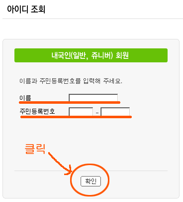
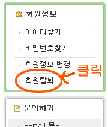
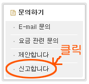

지난번 [리니지](http://summerz.pe.kr/blog/index.php?pl=522)에 이어 이번엔 네이버에서 명의도용 확인하는 방법입니다.  

<!-- truncate -->

  

**1** 일단 확인을 하시려면 [**아이디 조회 페이지**](http://id.naver.com/help/work.php?work=idinquiry)로 갑니다. 그리고, 이름과 주민등록번호를 입력합니다.  
  

  

**2** 그럼 다음처럼 결과가 나옵니다. 저같은 경우는 제가 예전에 생성한 아이디 하나가 나왔으니 명의가 도용되지는 않았네요. 하지만, [작은인장님 같은 경우](http://blog.ohmynews.com/goldenbug/Home.asp?artid=5771)를 보면 도용이 되었습니다. **참고로 네이버는 1인당 아이디를 3개까지 만들 수 잇습니다.**  
  
[naver-id-check-2.png](./naver-id-check-2.png)

  

**3** 만약 도용된 아이디가 있다면 당연히 그 아이디를 삭제 (즉, 탈퇴)하고 싶겠지요? 그래서, 화면 좌측에 있는 메뉴 중 [**회원탈퇴**](http://id.naver.com/help/work.php?work=secede) 버튼을 누릅니다.  
  

  

**4** 그런데, 여기서 좀 갑갑한 일이 벌어집니다. 로그인을 하라고 하는 것이죠. 문제는 다음과 같습니다.  
  

명의가 도용되어 삭제하려는 경우에는 로그인을 할 수 없습니다. 2번에서처럼 아이디를 끝까지 알려주지 않거든요. 로그인을 못하니 삭제도 못하지요.  
  
회원가입시에는 핸드폰 인증 등 확실한 인증 절차 없이 주민등록번호와 아이디로만 회원가입이 가능한데, 해지할 때는 그렇지 못한다는 것 아이러니 합니다.

  

  

**5** 만약 아이디와 비밀번호를 모두 알고 있는 경우 (이 경우는 도용된 경우가 아니겠지요) 에는 로그인을 하고 들어가면 아래와 같은 화면이 나와서 계정 삭제를 할 수 있습니다. 저 같은 경우는 예전에 만들어두고 잊고 있었던 계정을 2번에서 발견해서 (추측해서) 지울 수 있었습니다.  
  
[naver-id-check-5.png](./naver-id-check-5.png)

  

**6** 결국 아이디가 도용된 경우는 화면 좌측의 [**신고합니다**](http://help.naver.com/exMailQuestion.asp?category_id1=TBOX20030930000073) 버튼을 눌러서 처리해야 합니다.  
  
  
한가지 주의할 점은 신분증을 첨부해야 합니다. 스캔해서 문의사항과 함께 첨부하면 될 듯 합니다.  
  

  
이 일이 그저 명의도용 뿐만이라면 다른 여느 사이트들과 별반 다를 게 없을 수도 있지만 위에서 이야기한 [**작은인장님 같은 경우**](http://blog.ohmynews.com/goldenbug/Home.asp?artid=5771) 즉 자신의 주민등록번호로 아이디가 총 4개 만들어져 있는 경우도 있었습니다. 1인당 아이디 3개 제한인데 말이죠. 이건 좀 문제가 있다고 생각됩니다. 아무리 봐도 네이버측의 과실인 거죠.  
  
그러나, 여느 사이트들처럼 차라리 이름과 주민등록번호를 입력하면 아이디를 알려주는 게 좋은 건지 네이버와 같이 알려주지 않는 게 좋은 건지는 잘 모르겠습니다.  
  

\* 개인적인 생각으로는 지금이라도 많은 포털과 서비스에 가입하기 위해 주민등록번호를 입력해야만 하는 방식이 바뀌었으면 좋겠네요. 우린 너무 개인정보의 중요성에 대해 무감각한 현실에 살고 있는 것 같습니다. [공무원이 되기 위해 호적등본을 제출하는 게](http://www.mentalese.net/blog/461) 웃기지 않은 현실 말이죠.
