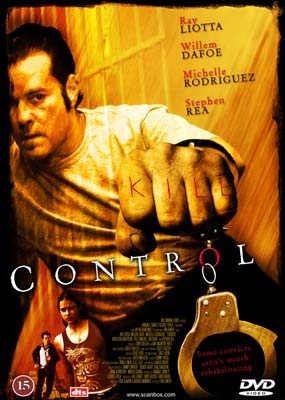
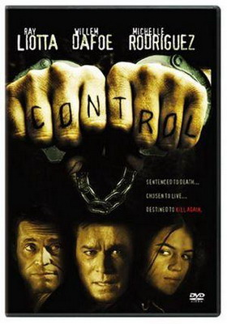

aka 콘트롤  

<!-- truncate -->

감독: 팀 헌터 (Tim Hunter)  
배우: 레이 리요타 (Ray Liotta), 윌럼 대포 (Willem Dafoe), 미셸 로드리게즈 (Michelle Rodriguez)  
  
영화 속에서 리 레이 (레이 리요타 분)는 지극히 폭력적인 성향의 사형수지만 아나그레스라는 신약을 복용하며 서서히 그의 인성이 변하게 된다. 자신이 한 일을 반성하고 다른 사람에게 사과하고 폭력적인 성향도 많이 사라지게 된 것.  
  
우선 두가지가 생각났다. **하나**, 극악한 범죄자들에게 사형 말고 다른 처벌 수단은 없을까? **둘**, 인간의 본성은 과연 선한가? (성선설과 성악설) 그러고 나서 떠오르는 엉뚱한 상상들.  
  

현실에서도 이런 일이 가능할까? 그러기 위해서는 생체실험이 필수겠지? 그렇다면 윤리성 문제 역시 벌어지겠지? 그럼 제약회사들은 그걸 숨기고 실험을 하겠지? (돈이 된다면 말야.)  
  
어느 정도 가시적인 성과가 보이는 시점에서 '허가받지 않은 실험'의 내용이 공개된다면 논란이 되겠지? 성과가 없다면 당연히 '전면금지'되었을 실험의 허용여부가 찬성과 반대로 팽팽히 맞서게 되겠지?  
  
만약 이러한 사례가 인정된다면 다른 제약회사들도 허용되지 않은 많은 생체실험을 강행하겠지? 단지 보안에 더욱 신경을 쓸 뿐. 그렇다면 이미 윤리에 대한 문제제기는 이미 무용지물이 아닐까? 이미 세상은 그렇게 돌아가고 있는 중일까?

  

**이 부분은 스포일러가 들어있습니다.** (클릭) 

그러나, 결국 리 레이의 성품이 변화된 것은 사실 신약 덕분이 아니라 플라시보 효과 때문이라는 것이 밝혀진다. (영화의 제목이 <콘트롤>인 것도 사실은 대조군 (control group)에서 온 것이라는 것은 재치있는 발상이라고 생각된다.)  
  
일상에 피곤한 많은 사람들이 '계기'나 '자극'을 원하는 심리도 비슷한 것 아닐까? 극복하지 못해도 현상을 유지할 수 있지만, 극복이 되면 더 나은 자신을 만들어 줄 수 있는 가짜 자극. (플라시보 (placebo)의 어원은 '만족시키는', '즐겁게 한다'를 뜻하는 라틴어에서 왔다고 한다.)  
  
그렇다면 '계기'나 '자극'을 주는 회사가 있다면 재밌을 것도 같다. 미리 돈을 내면 훗날 자신이 정말 무기력할 때 자신에게 자극을 주는 이벤트를 만들어주는 회사. (물론 그 때가 언제인지를 스스로도 알기 어렵다는 게 문제이긴 하지만.)

  
그나저나 감독은 왜 영화 초반부에 손가락의 문신을 보여줬을까? 포스터에도 그렇고. <사냥꾼의 밤 (The Night of the Hunter)>과 별 관련도 없어보이는데... 설마 감독의 이름이 팀 헌터 (Tim Hunter)인 것과는 관련 없겠지? (설마! -\_-\*)  
  

이건 <콘트롤>의 이미지  

이건 <사냥꾼의 밤>의 이미지  
 /  / 
