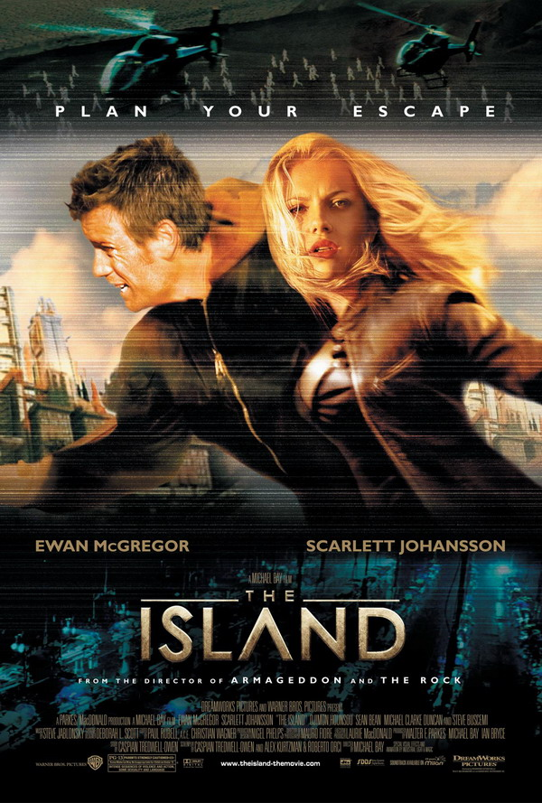

역시 예전에 <맨발의 기봉이>의 예고편을 봤을 때 들었던 생각을 풀어놓은 메모.  

<!-- truncate -->

  
예고편은 네이버 영화에서도 볼 수 있습니다. [**[바로가기 링크]**](http://movie.naver.com/movie/mpp/mp_preview.nhn?mid=5267)  
처음 이 예고편을 봤을 때 난 티저 예고편일 거라 생각했다. 절대 본 예고편이 아닐 거라고 생각한 이유는 편집이 잘 되고 안되고의 문제가 아니었다. 그건 바로,  
  

예고편에 쓰인 음악이 마이클 베이의 SF 블럭버스터 <아일랜드 (The Island)>의 사운드트랙 중 하나인 "My Name Is Lincoln" 이었기 때문이다.

  
참고로 "My Name Is Lincoln"은 얼마전 심형래 감독의 <디워 (D-War)>의 음악감독을 맡았다고 발표가 된 스티브 자브론스키 (Steve Jablonsky)의 작품이며 본편의 흥행실패와는 달리 음악은 많은 사람들의 귀를 자극했던 곡이다.  
  
난 이렇게 개봉한지 오래되지도 않은 유명한 곡을 쓴 이유가 정말로 궁금했다. 이 예고편이 티저였다면 '시간에 쫒겨서', 혹은 '만족할 만한 곡이 아직 작곡되지 않아서'라고 생각했을텐데 정식 개봉이 얼마 남지 않은 지금도 계속 쓰이는 걸 보니 처음부터 의도된 선곡이었나보다.  
  
따라서, 내가 말할 수 있는 유머는 이것 뿐이다.  
  

사실 이 예고편은 <아일랜드>의 복제인간 링컨처럼 기봉이도 <말아톤>의 초원이를 잘 복제한 캐릭터 (및 영화)라는 메시지를 수줍게 밝히고 있는 것이다. 두둥-  
  
**My Name Is 기봉이, Not 초원이!**

  

  
하지만 여전히 궁금하다. 메인테마를 만들 비용이 부족했을까? 로열티를 지불하는 게 더 싸게 먹히나? 아니면 영화의 분위기에 맞는 작곡가를 구하지 못했던 걸까?  
  

**관련글**  
  
[D-War 잡담 (Steve Jablonsky 관련)](http://summerz.pe.kr/blog/index.php?pl=569)
