얼마 전 <키스 키스 뱅뱅>에서 오랜만에 활기찬 로버트 다우니 주니어의 모습을 보니 기분이 좋더라고요. 로버트 다우니 주니어의 팬이라면 팬이랄까? 좋아하는 배우 중 한명이거든요.  

<!-- truncate -->

그가 제 머리 속에 제대로 기억된 건 1990년대 초중반에 본 영화 두 편 때문이었는데, 바로 리차드 아텐보로 감독의 <[채플린](http://movie.naver.com/movie/bi/mi/basic.nhn?code=12295) ([Chaplin](http://us.imdb.com/title/tt0103939/))>과 이 영화 <사랑의 동반자 (Heart and Souls)> 였습니다.  
  
그 영화들 이후로 내심 그의 활약을 기대했는데 마약과 술 때문에 고생을 하면서 제대로 빛을 보지 못하더라고요. 좀 안타까웠지요. 연기도 정말 잘하고, 코미디도 잘 하고 (SNL 출신이예요), 노래도 잘 하고 배우로써 딱인데 말이죠.  
  
오랜만에 <사랑의 동반자>를 다시 봤는데 여전히 재밌더라고요. 당시에 여러번 봤던 영화 중의 하나였어요. 영화 중반까지의 내용은 아래와 같습니다. (화살표를 눌러서 보세요.)  
  

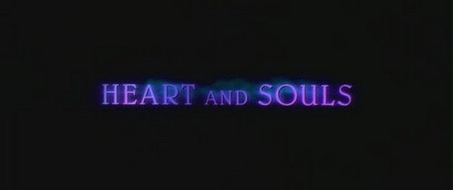

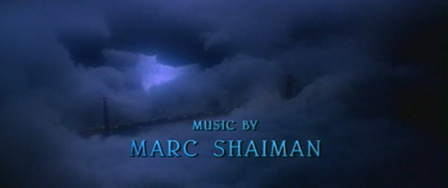

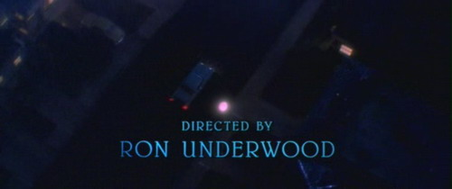

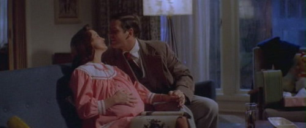

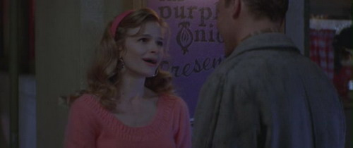

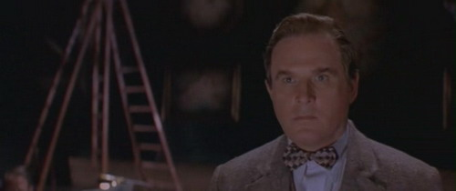

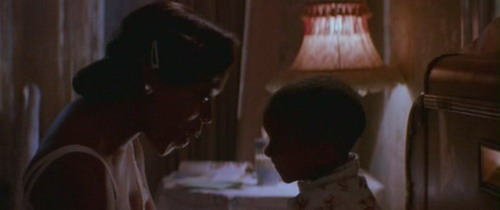

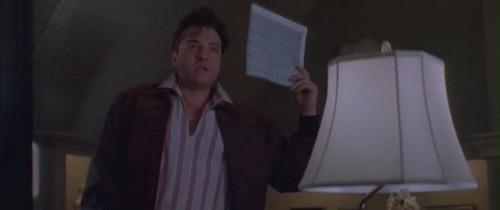

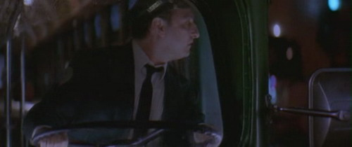

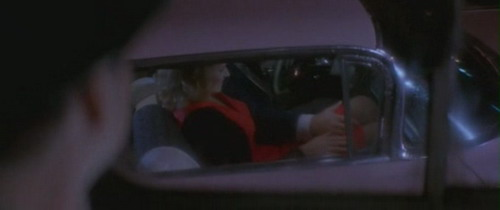

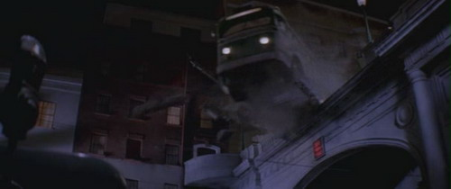

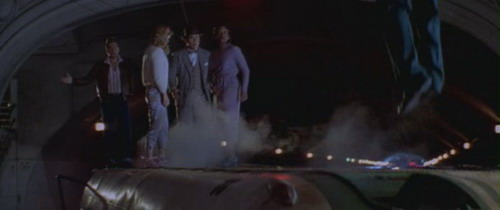

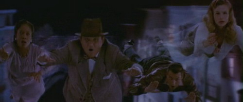

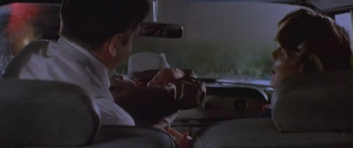

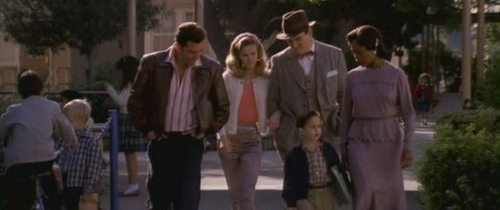

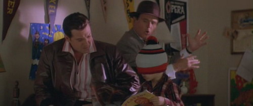

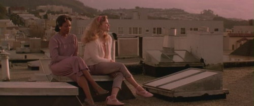

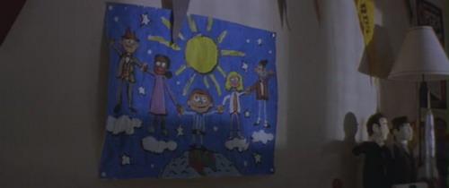

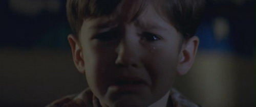

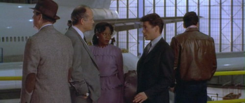

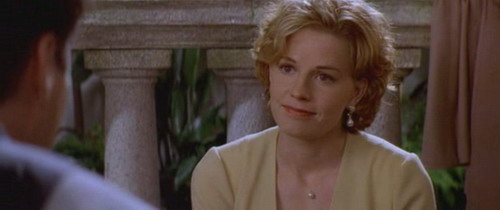

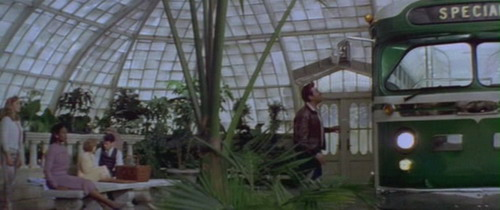

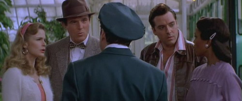

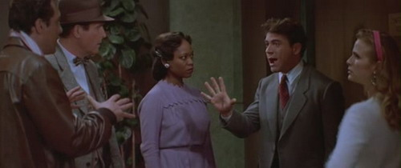

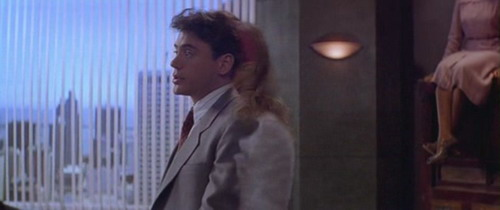

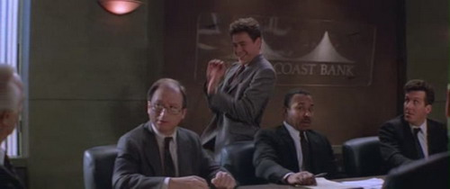

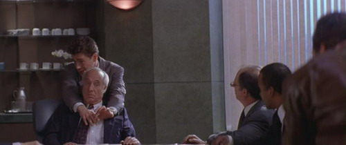

  
성인이 된 토마스 (로버트 다우니 주니어 분)는 유령들을 보지 못하지만, 유령들의 노력으로 다시 그들을 보게 됩니다. 그리고, 그들의 마지막 소원을 마지 못해 도와주기 시작하죠.  
  
꼬마애의 우표 (할아버지의 유품)를 뺏었다가 돌려주지 못해 죽어서도 나쁜 놈으로 기억될 마일로는 우표를 다시 돌려주고 싶어하고, 해리슨은 많은 사람들이 지켜보는 앞에서 무대에 서고 싶어하고, 페니는 자신의 아이들의 안부를 꼭 확인하고 싶어하고, 줄리아는 사랑하는 사람을 다시 만나 진심을 전하고 싶어하죠. 그들이 현실에서 이 모두를 이루기 위해서는 살아있는 사람인 토마스가 필요하고요.  
  
오랜만에 보니 뭐랄까, 90년대 초반의 정서가 느껴지는 영화라는 느낌이 강하게 오더군요. 화면의 톤부터 사운드, 구성 등 여러가지 면에서 말이죠. 마치 <영혼은 그대 곁에>와 <시애틀의 잠 못 이루는 밤> 사이 정도의 정서라고나 할까요?  
  
많이 알려지지 않은 작품이지만 언제봐도 가슴 따뜻해지는 드라마라고 생각해요. 로버트 다우니 주니어의 연기는 다시봐도 여전히 멋지고, 비비킹의 깜짝 출연도 재밌고, 아- 엘리자베스 슈와 톰 시즈모어의 모습도 볼 수 있네요.  
  

음악은 **마크 샤이먼 (Marc Shaiman)**이 맡았는데, 그는 '그리 유명하진 않지만 제가 좋아하는 영화'의 음악도 많이 맡은 음악가입니다. 90년대의 대체로 가벼운 코미디/드라마 음악을 주로 맡았지요. 그가 음악을 맡은 다른 작품으로는 <해리가 샐리를 만났을 때>, <미저리>, <아담스 패밀리> 1,2편, <시스터 액트>, <어 퓨 굿 맨>, <시애틀의 잠 못 이루는 밤>, <스피치리스>, <파리가 당신을 부를 때>, <대통령의 연인>, <조강지처 클럽>, <인 앤 아웃>, <패치 아담스>, <스토리 오브 어스>, <다운 위드 러브> 등이 있습니다.  
  
마크 샤이먼은 80년대 후반 스윙 재즈계의 신동 해리 코닉 주니어와 함께 작업한 것으로도 유명한데, <해리가 샐리를 만났을 때>에서 해리 코닉 주니어의 음악을 넣은 것에 이어 <다운 위드 러브>에서는 새로운 스윙 재즈계의 스타 마이클 부블레와 작업을 같이 하기도 했죠.  
  
개인적으로 가수로도 데뷔한 로버트 다우니 주니어의 음색이 해리 코닉 주니어와 스팅을 섞어 놓은 듯하다고 여겨왔는데, 그의 활동 초기 때 이렇게 함께 작업을 했다는 게 재밌습니다. :)  
  
게다가 로버트 다우니 주니어는 결국(?) <앨리 맥빌>에서 스팅과 듀엣으로 노래를 부르기도 하죠.

  
p.s. 네이버 영화란 가보니 극장개봉도 한 것 같던데, 기억은 안납니다. 전 비디오로 봤거든요.  
  
 /  / 
