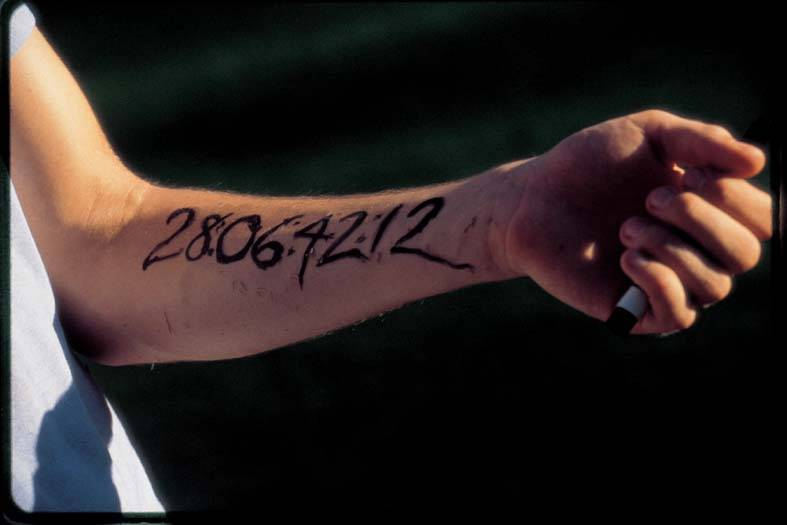
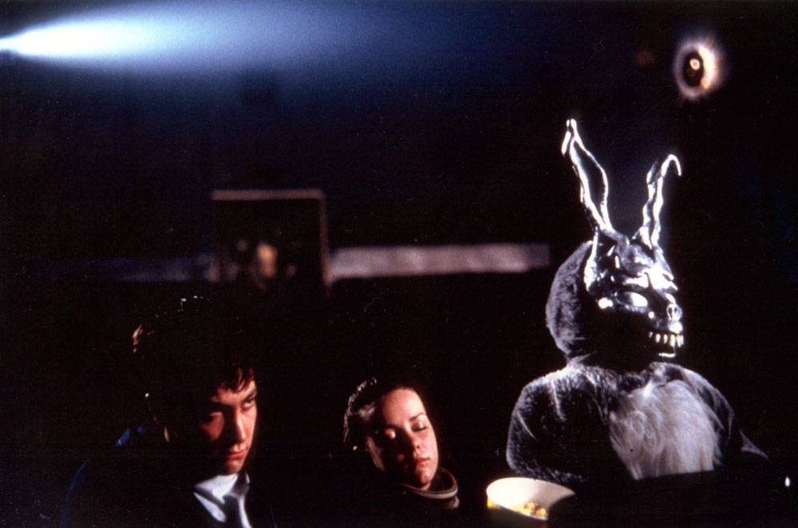
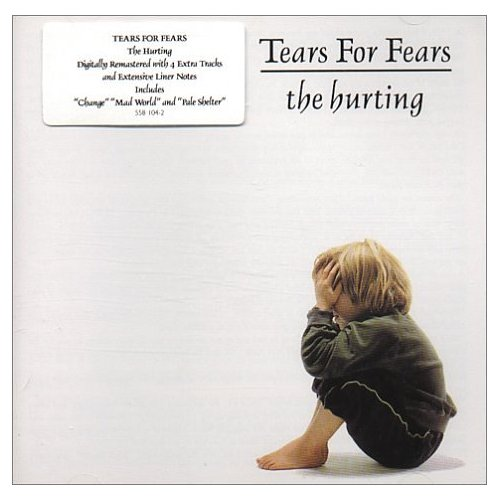
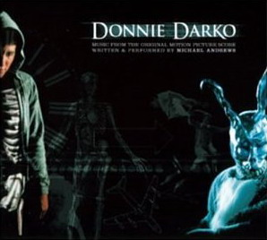

도니 다코

<!-- truncate -->

진부한 표현이지만, 영화 <도니 다코>는 컬트 영화임에 틀림이 없습니다. 흥행에는 완전히 참패했지만 많은 팬들을 보유하고 있으니 말이죠. 물론 저에게도 재밌는 영화였습니다.

이 영화는 비교적 열린 구조를 취하고 있습니다. 도니 다코 (제이크 질렌할 분)가 정말로 미친 건지, 아니면 그가 정말로 시간 여행을 한 것인지 인류는 종말을 맞이하는 것인지 모든 것은 불분명할 뿐더러 감독은 영화 내내 최소한의 암시만 주고 있을 뿐입니다.


```
**줄거리**

1988년 미국. 도니 다코는 내성적인 성격 때문에 가족들과도 서먹한 사이가 된 고등학생이다. 어느 날 자다가 이상한 부름을 따라 나간 도니는 정체불명의 토끼 괴물 프랭크와 마주친다. 프랭크는 28일 뒤인 할로윈에 세상이 멸망할 것이라고 말한다. 그 날 밤하늘에서 비행기가 떨어져 도니의 방을 부숴 놓는다.
아침에 골프장에서 깨어난 도니는 토끼가 말한 숫자가 자기 팔뚝에 새겨져 있는 것을 발견한다. 도니는 몽유병 때문에 사고를 피했다고 생각하지만, 도니의 주변에선 자꾸만 이상한 일들이 벌어진다. 친구들은 점점 도니를 피하지만, 도니는 새로 전학 온 그레첸이라는 여학생과 친해진다. 그러나 토끼 괴물 프랭크는 점점 더 자주 도니를 찾아와 혼란스러운 이야기들을 들려주면서, 내성적인 도니가 공격적인 행동을 하도록 몰아붙인다.
28일이 지나 어느덧 '종말의 날'이라는 할로윈 날. 그레첸이 사고를 당해 죽고, 도니에게는 시간을 되돌릴 기회가 주어진다.

출처 : [KBS 프로그램 하이라이트](http://cyberpr.kbs.co.kr/kbs_sosik/cm/movie_show.html?cd=826)
```



이 영화에 대한 평론가들의 평 중에서 제가 공감했던 의견 중 하나는 '80년대 미국 레이건 재임 당시의 암울한 시대상을 그린 소품'이라는 것입니다. (기억이 확실치는 않지만 이와 관련된 감독의 인터뷰도 읽었던 기억이 나고요.) 그렇다면 아무래도 미국사람들이 더 공감하기 쉽겠지요. 그래서 그런지 미국에서의 이 영화에 대한 평가가 더 높은 것도 같아요. (물론 세계적으로 어떤 시대의 전체적인 흐름은 비슷하겠지만 말이죠.)

(반면 SF 팬들은 이 영화의 허술한 논리적 설명 때문에 실망을 하는 듯 합니다. SF 적인 측면에서 보면 그냥 그런 영화이고, SF 라는 장르에 충실한 영화도 아니라고들 하고요.)

제가 생각하는 그 분위기를 예로 들면 이런 것들입니다. 평화로운 마을, 행복해야만 하는 가족, 착한 척 하는 사람들, 위선을 덮는 껍질뿐인 도덕 의식, (레이건) 정부의 무능과 부패, 물질적으로 풍요로운 세상, 도전이 없는 시대. 목적이 없어도 살아지는 인생, 그러나 내면적으로도 사회적으로도 여전히 존재하는 모순.

그러고 보면 - 제 경험에 비추어 생각하자면 우리나라는 90년대 중반까지가 저 '레이건 시대'와 비슷하지 않을까 싶습니다.

90년대 중반 이후에 벌어진 사회적인 변화 - X세대 출현 (젊은이들의 적극적 변화), 문민정부와 국민의 정부 출범, 6.15 공동선언 등 일련의 변화에 비추어 보면 그 전까지는 많은 문제점들이 내재되어 있었지만 드러나지 않고 곪아가고 있었던 시대였다는 거죠. 양극화란 단어도 없었고, 못사는 후진국에서도 어느 정도 벗어났다고 자위하던 시기였고, 많은 사람들은 여전히 정권과 권력에 맞서 투쟁하고 있었지만 일반인들은 대충 투표하며 평화롭게 프로야구와 농구대잔치를 즐기고 있었던 시대였다고 말할 수 있을 듯도 싶거든요. (물론 단편적인 예시들입니다.)



이쯤 적고 나니 사실 <도니 다코>는 SF의 표현을 슬쩍 빌린 사회풍자극이라고 말할 수도 있겠군요. 마치 <아메리칸 뷰티>나 <매그놀리아>처럼 말이죠. 그리고, 도니 다코는 특별히 미쳤다기 보다는 (정신분열증), 그저 평범한 젊은이였다는 생각도 들고요. **'현대인들은 모두 정신병을 앓고 있다. 정도의 차이일 뿐.'** 뭐 이런 문구처럼 말이죠.





The Hurting ('83)





Donnie Darko soundtrack ('02)


삽입곡으로 유명한 Mad World는 원래 1983년 발표된 Tears For Fears의 앨범 The Hurting에 수록된 곡입니다. 영화를 위해 Gary Jules가 리메이크 했죠.

Tears For Fears는 1980년대 뉴웨이브 대표 밴드 중 하나입니다. 밴드 이름에 대한 유래는 유명합니다. "아서 자노브 (Arthur Zanov)의 '근본적인 절규 요법 (Primal Scream Therapy)'에서 지을 정도로 정신분석적인 부분에 큰 관심을 가졌다." 뭐 이런 문장으로 표현될 수 있습니다. 이들 노래의 가사에서도 그 흔적을 느낄 수 있습니다. (정작 아서 자노브가 뭐하는 사람인지는 정확히 모릅니다만. -\_-)

이 노래의 경우도 마찬가지입니다. **가사를 유심히 들여다보면 영화의 내용이 노래 안에 다 들어있어요. 감독이 이 노래로부터 영화를 끌어냈다고 봐도 될 정도로 말이죠.** 노래가 발표된 시기와 영화의 시대적 배경이 일치한다는 건 두말할 것도 없고요.

그러나 시대가 급변했기 때문일까요? Tears For Fears는 2집 때까지는 대 성공을 거두며 승승장구했지만, 3집부터 급격히 쇠퇴의 길을 걸었습니다. 아마도 뉴 웨이브가 90년대 들어서 맥을 못춘 것과 같은 맥락이겠지요.


**가사 보기**

All around me are familiar faces
Worn out places worn out faces

내 주위를 둘러싼 것들은 모두 낯익은 얼굴들
지겨운 곳들 지겨운 얼굴들

Bright and early for their daily races
Going nowhere, going nowhere

일상을 위해 밝은 표정으로
어디로도 가지 않지, 어디로도 가지 않아

Their tears are filling up their glasses
No expression, no expression

눈물은 술잔을 채우고
어떤 감정도 없이, 어떤 표정도 없이

Hide my head I want to drown my sorrow
No tomorrow, no tomorrow

고개를 숙였지 슬픔에 빠지고 싶어서
내일은 없어, 내일 따윈 없어

And I find it kinda funny, I find it kinda sad
The dreams in which I’m dying are the best I’ve ever had

좀 웃긴 걸 알아냈어, 좀 슬프기도 해
그 중에 내가 죽는 꿈이 최고였지

I find it hard to tell you, I find it hard to take
When people run in circles it’s a very very

네게 말하기 어렵다는 걸 알아, 받아들이기 어렵다는 것도 알아
사람들이 원을 그리며 달리는 여기는 아주 아주

Mad world
Mad world

미친 세상이야
미친 세상이야

Children waiting for the day they feel good
Happy birthday, happy birthday

아이들은 행복한 날을 기다리지
행복한 생일, 생일 축하해

Made to feel the way that every child should
Sit and listen sit and listen

다른 애들처럼 즐거워 하려면
앉아서 들어봐. 자, 앉아서 들어봐

Went to school and I was very nervous
No one knew me no one knew me

학교에 갔는데 정말 불안했어
아무도 날 몰랐거든 아무도 날 알아보지 못했어

Hello teacher tell me what’s my lesson
Look right through me look right through me

선생님, 제 수업은 뭐죠?
날 똑바로 쳐다봐, 날 똑바로 쳐다봐

And I find it kinda funny, I find it kinda sad
The dreams in which I’m dying are the best I’ve ever had

좀 웃긴 걸 알아냈어, 좀 슬프기도 해
그 중에 내가 죽는 꿈이 최고였지

I find it hard to tell you, I find it hard to take
When people run in circles it’s a very very

네게 말하기 어렵다는 걸 알아, 받아들이기 어렵다는 것도 알아
사람들이 원을 그리며 달리는 여기는 아주 아주

Mad world
Mad world

미친 세상이야
미친 세상이야

Enlarge your world
Mad world

네 세계를 넓혀봐
미친 세상을


**Tears for Fears - Mad World**


**Gary Jules - Mad World** for a film, <Donnie Darko>


**Donnie Darko Original Trailer**


**그 밖에**

[**Evergreen Terrece - Mad World**](http://www.youtube.com/watch?v=qZ1R4RoIbVI) Evergreen Terrece도 Mad World를 불렀는데 이건 동영상이 없지만, 누가 드래곤 볼 영상에 맞춰 올린 게 있네요.


**그리고**

- 그러고 보니, 이 영화의 엔딩을 보면서 가슴이 아팠었는데 장준환 감독의 <지구를 지켜라>의 엔딩이 문득 떠오르네요. 물론 내용면으로는 큰 관련은 없지만, 장르가 같은 SF 인데다가 비극적인 주인공이 과거를 떠올린다는 측면에서 말이죠. (아, 두 주인공 모두 영화 속에서 싸이코로 비춰진다는 공통점도 있군요.)

- 드류 베리모어, 참 대단해요. 약물중독의 위기를 넘기고 흥행배우의 궤도에 다시 올라탄 것만 해도 대단한데, 제작에까지 센스를 발휘하는 걸 보면 말이죠.

- 애쉬튼 커처가 주연한 <나비 효과 (The Butterfly Effect)>가 개봉된 이후엔 <도니 다코>를 <나비 효과>와 비교하는 사람들도 종종 있더군요. 전 서로 비교하기에 어울리지 않는 영화들이라 생각합니다만.


[](http://us.imdb.com/title/tt0246578/) / [](http://movie.naver.com/movie/bi/mi/basic.nhn?code=33795) / [](http://www.rottentomatoes.com/m/donnie_darko/)
