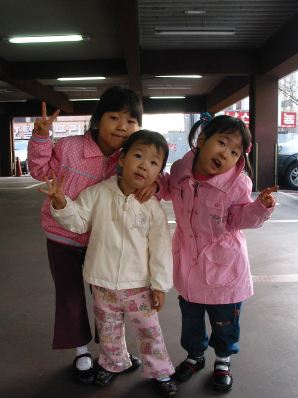
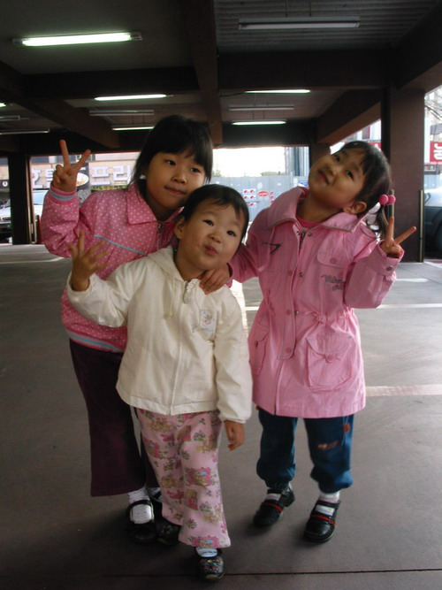
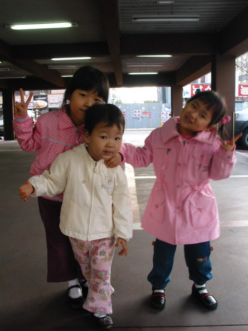

간단하게 사운드 소스가 필요해서 조카들 목소리를 잠깐 빌렸습니다. 마침 작업에 필요한 연령대와 조카들의 실제 나이가 비슷하여 한번 시켜봤던 거죠. ^^  

<!-- truncate -->

"와~ 출발!" 을 계속 연습하는 사운드 클립입니다. 승연이 (5살)는 그래도 잘 하는데, 아직 도연이 (4살)는 어려서 발음이 부족하네요. 그냥 언니를 따라하는 정도입니다. 듣다 보니 재밌어서 올려요. 조그맣게 속삭이는 소리로 "자~ 시작~" 하는 사람은 저고요;;;  
  
그런데, 목소리가 이렇게 우렁찰 줄 모르는 바람에 전부 클리핑되었네요. -\_-)a  
  
  
play 버튼을 누르면 들을 수 있습니다.  
  
아래 사진은 올해 4월 사진.  
  

