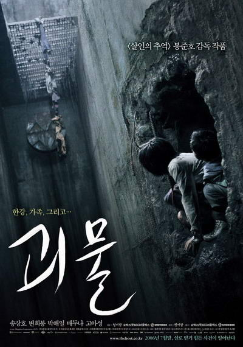
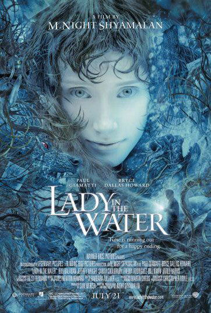

aka Signs, M. Night Shyamalan's Signs  

<!-- truncate -->

1. SF 영화/소설의 열렬한 팬이 아닌 제가 보기에도 이 영화는 외계인이 침략하는 영화들의 기본적인 구조를 그대로 재현하고 있습니다. 더 직접적으로 말하자면 스필버그도 리메이크 했던 조지 오웰의 <우주 전쟁 (War of the Worlds)>와 완전히 동일한 플롯을 가지고 있습니다. 심지어 영화에서 와킨 피닉스가 연기한 메릴이란 인물이 아예 이 작품을 직접 언급하기도 하지요.  
  
[signs-war\_of\_the\_worlds.jpg](./signs-war_of_the_worlds.jpg)  
2. 그 뿐만이 아닙니다. <식스 센스> 이후로 샤말란 감독의 모든 영화에서 음악을 맡고 있는 **제임스 뉴튼 하워드**는 이 영화에서도 역시 솜씨를 드러내고 있는데, 그는 (그의 장기가 그렇듯) 매우 전통적인 방식의 스코어를 들려주고 있습니다. 특히 오프닝 크래딧에서 보여주는 타이포의 구성과 음악의 조화는 마치 옛날 영화를 보는 듯한 느낌 (복고적인 느낌)을 그대로 재현하고 있습니다.  
  
[signs-1.jpg](./signs-1.jpg)  
또한, 음악은 영화의 중반 이전까지는 약간의 코믹함을 살짝살짝 도와주며 극의 흐름에 직접적인 영향을 주는 건 자제하고 있지만, 후반부로 달려갈 수록 음악은 거의 시종일관 서스펜스를 유지시켜주고 있습니다. 세심한 사운드와 더불어 영화의 분위기를 잡아준 일등공신이지요.  
  
3. 샤말란은 어른들을 위한 동화를 쓰는 동화 작가입니다. 물론 영화라는 현대적이고 시청각적인 방식을 사용하지만요. 그의 다른 영화들과 마찬가지로 이 영화도 사실은 영화의 외관과는 무관한 내용을 담고 있습니다. SF 팬이나 외계인에 열광하는 사람들이 보면 너무나 어처구니 없는 영화일 수 있겠으나 사실 이 영화는 외계인에 관한 영화도, 정통 SF 영화도 아닙니다. 심지어 외계인을 제대로 묘사하지도 않지요. 사실, 그는 이 영화를 통해서 위의 두가지 분위기를 이용하여 (고전 SF 소설의 이미지, 고전 영화의 이미지) 어른들을 위한 우화를 소개하고 있거든요.  
  
[signs-newsweek.jpg](./signs-newsweek.jpg)  
4. 이 영화는 믿음에 관한 영화입니다. 실제로 영화의 내용은 믿음을 잃어버린 전직 성공회 신부가 믿음을 회복하는 과정을 보여줍니다. SF적인 요소와 (<식스 센스>와 같은) 반전에만 초점을 맞춘 사람들은 악평을 퍼부었지만, 사실 욕을 얻어먹을 만한 부분은 거의 없는 것 같습니다. 실제로 몇가지 작은 사운드와 느릿한 이야기 진행으로 차근차근 서스펜스를 쌓아가는 연출은 대단히 매력적입니다. 배우들의 연기 또한 훌륭하고요.  
  
여기서 결국엔 믿음을 되찾는 신부 역을 맡은 멜 깁슨이 2년 후에 <패션 오브 크라이스트>를 만들었다는 사실도 흥미롭군요.  
  
[signs-passion\_of\_christ.jpg](./signs-passion_of_christ.jpg)  
5. 이 영화를 다시 보다가 문득 봉준호 감독이 생각났습니다. 샤말란 감독의 개봉예정작인 [**<레이디 인 워터>**](http://www.youtube.com/watch?v=JNaViPcx57s)가 먼저 떠올랐는데, 여기서는 물에 약한 외계인이 차기작에서는 물 속의 여인이라는 설정으로 뒤집힌 게 재밌었지요. 그러다 보니 자연스럽게 (때가 때인지라 ^^) 봉준호 감독의 [**<괴물>**](http://www.youtube.com/watch?v=bNbZE8NX0nk)에까지 생각이 미친 것이지요. 그러고 보면, 봉준호 감독 역시 샤말란 감독처럼 영화의 장르적인 요소를 잘 이용하면서도 탈장르적인 영화를 만들고, 또한 영화의 외형과는 전혀 다른 이야기들을 풀어놓는 감독 중의 하나잖아요.  
  

기대 중이지요.

이 영화 역시요.

  
6. 다음은 영화의 중반부에 그레이엄 (멜 깁슨 분)이 메릴 (와킨 피닉스 분)에게 하는 대화입니다. 이 영화를 통해 감독이 하고 싶은 말이 전부 담겨있는 듯 하군요.  
  

**대화 내용 보기 (클릭)** 

People break down into two groups  
when they experience something lucky.  
  
뭔가 행운을 경험한 사람들은 두 개의 집단으로 나뉘지  
  
Group number one sees it as more than luck more than coincidence.  
They see it as a sign.  
evidence that there is someone up there watching out for them.  
  
첫번째 그룹은 그걸 단순한 운이나 우연 이상의 것으로 생각해  
그들은 그걸 징조라고 보는 거야  
하늘에서 그들을 지켜보는 누군가가 있다고 믿는 거지  
  
Group number two sees it as just pure luck, a happy turn of chance.  
I'm sure the people in group number two are looking at 14 lights in a very suspicious way.  
For them, the situation is fifty fifty - Could be bad, could be good.  
But deep down, they feel that whatever happens,  
they're on their own and that fills them with fear.  
Yeah, there are those people.  
  
두번째 그룹은 그게 단순한 행운이고 좋은 기회라고 생각해.  
내 생각에 그들은 지금 이 14개의 빛을 의심스럽게 바라보고 있을 거야.  
그들에게 지금의 상황은 50대 50이란 거지 - 나쁠 수도 있고, 좋을 수도 있는.  
그러나 속으로 들어가면 그들은 무슨 일이 생겨도  
스스로에게 의지해 그리고 그건 그들을 두렵게 하지  
(주: 마땅히 의지할 사람이 없으니 두렵다는 의미)  
그래, 그런 사람들이 있어  
  
But there's a whole lot of people in the group number one.  
When they see those 14 lights, they're looking at a miracle.  
And deep down, they feel that whatever's going to happen,  
there'll be someone there to help them.  
And that fills them with hope.  
  
하지만 첫번째 그룹의 사람들은 대부분 이런단 말야  
저 14개의 빛을 보면서 그걸 기적이라고 생각하는 거야  
마음 속 깊이 그들은 무슨 일이 생기든  
그들을 지켜줄 누군가가 있을 거라 믿는다고  
그리고 그게 그들에게 희망을 주는 거야  
(주: 일종의 절대자를 믿으면 오히려 마음이 편안하다는 의미)  
  
See, what you have to ask yourself is, what kind of person are you?   
Are you the kind who sees signs, sees miracles?   
Or do you believe that people just get lucky?  
  
그럼 한번 생각해봐, 넌 어떤 쪽이야?  
어떤 징조나 기적을 믿는 쪽이야?  
아니면 그냥 단지 사람들이 운이 좋다고 믿는 쪽이야?  
  
Or look at the question this way...  
is it possible that there are no coincidences?   
  
아니면 이런 식으로 질문해보면 어떨까...  
세상에 우연이란 없는 건 아닐까?

  
 /  / 
