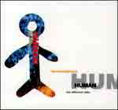
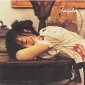
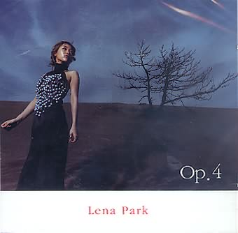

- 90년대 초중반, 가요계의 대세 중 하나였던 015B가 마지막(?) 앨범을 내고 잠수한 게 1996년이었다. 해체한다는 말도 없었고, 그렇다고 언제 앨범을 낼 거라는 기약도 없었다. 요즘말로 하자면 핑클이 "우리는 이제 각자 활동하지만 언제까지나 핑클이예요." 뭐 이런 것? (그 때는 그런 개념도 없었지만)  

<!-- truncate -->

- 당시 내 주변 사람들이 그들의 베스트로 꼽는 부동의 앨범은 2집 <Second Episode> 였다. '4210301', '이젠 안녕', '친구와 연인' 으로 시작하는 앨범. 하지만, 난 2집을 늦게 들어서인지 좋은 노래가 많다는 걸 알면서도 언제나 3집 <Third Wave>을 베스트로 꼽았었다. (개인적으로 3집이 가사에서부터 악기구성, 편곡 등 015B하면 떠오르는 감성들이 본격적으로 자신감있게 드러난 앨범이라고 생각한다. 그건 바로 **감수성**과 **재치**)  
  
  
- 015B가 6집 <The Sixth Sense>을 마지막으로 들어가고 난 후 한참 지나 애시드 재즈부터 라운지 계열까지 (쉽게 예를 들자면 롤러코스터부터 클래지콰이까지) 다양한 음악이 가요에도 흘러들었는데, 종종 정석원 생각이 났었다. '도회적인 분위기, 꽉 짜인 비트, 하우스부터 일렉트로니카에 잘 어울리는 음악을 할 수 있을텐데, 015B라면 말이지...' 하면서.  
  
  
- 게다가 정석원은 틈틈히 이승환과 이가희, 박정현 등 다른 가수 앨범에서 죽지 않았음을 (^^) 보여줬는데, 곡의 구성이나 편곡에서 느낀 건 지나칠 정도로 사운드에 집착하는 모습이었다. (어느 리뷰에서는 **편집증적**이라는 단어를 사용할 정도로) 이 또한 일렉트로니카와 라운지 계열에 잘 어울리는 조건 아니겠는가! ^^  
  

이승환 4집

이가희 1집

박정현 4집

  
- 각설하고, 7, 8월 경에 나올 정규 앨범을 기다리는 팬들을 위해 특별히(^^) 출시한 앨범이라는 <Final Fantasy>를 들어봤는데, 015B의 히트곡을 일렉트로니카와 라운지 계열의 뮤지션들이 부른 곡이 7곡, 015B의 신곡이 2곡이었다. 원래부터 객원가수 시스템을 이용한 그룹인지라 단순한 리메이크 앨범도 아닌, 그렇다고 헌정앨범도 아닌 묘한 성격의 앨범이라고나 할까?  
  
  
- 어쨌거나 앨범의 각 곡들은 전체적으로 잘 조율되어 있다. (프로듀싱은 정석원이 직접 했겠지? 한마디로 015B스럽다.) 처음 들었을 때 귀에 남았던 곡은 **Blue Sorbet의 '수필과 자동차'**, **W의 '신인류의 사랑'** 그리고 **015B의 신곡 'No Way'**.  
  
- 즉 <Final Fantasy>는 자연스럽게 015B가 후배 뮤지션들에게 미친 영향을 보여주는 앨범이면서도 앞으로의 015B가 들려줄 음악의 성격을 능히 짐작케 해주는 앨범이라 할 수 있다. 올 여름에 그들의 정규 앨범이 나온다니 기대만발이다.  
  

**p.s.**  
  
- <Final Fantasy>는 오프라인에서만, 그것도 딱 만장 판다고 하더니 온라인에서도 판다. 이를테면 [파란의 뮤직샵인 클릭팝](http://clickpop.paran.com/music/?D2=Album&PK_CD=74613). 그리하여 "특히, 이 앨범에 주목해야 될 가장 큰 이유는 벅스, 도시락, 멜론 등 온라인 음악사이트와 모바일에 음원 공개를 하지 않고 음반을 구입해야만 음악을 들을 수 있는 앨범으로 아날로그 팬들을 위한 진정한 앨범이라고 할 수 있다"던 보도자료는 뻘쭘한 상태로 남게 되었다.  
  
- 앨범커버는 모두 [**매니아DB**](http://maniadb.co.kr/)에서.

  

**관련 링크**  
  
[W - 신인류의 사랑 듣기](http://blog.naver.com/wedi86/130006355907)  
[015B - I Hate You (노래:유효림) 듣기](http://blog.naver.com/koo4455/20026129475)  
[Blue Sorbet - 수필과 자동차 듣기](http://blog.naver.com/yong2dao/30006013634)
