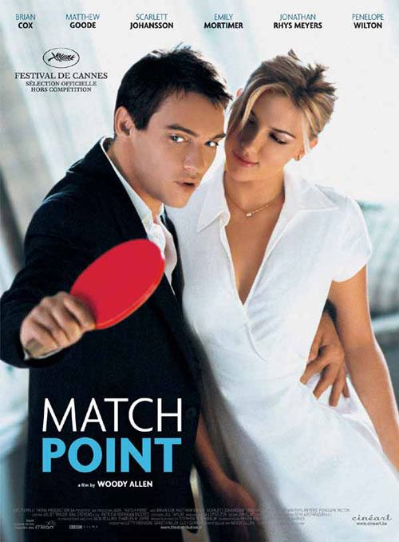
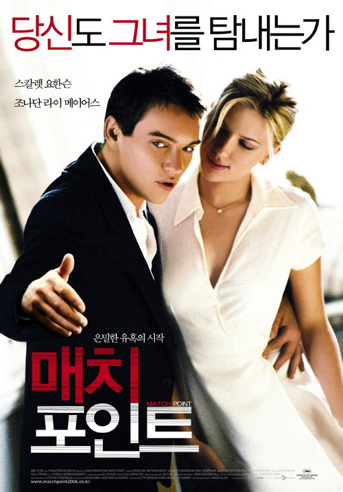

aka Match Point  

<!-- truncate -->

일단 간단하게 인물들의 관계를 이야기하자면,  
  

크리스 (조나단 뢰스 마이어스 분)는 테니스 강사이고 어느날 부유층 집안의 톰 (매튜 굿 분)에게 강습을 하다가 그의 여동생 클로이 (에밀리 모티머 분)와 만나게 되고 클로이는 크리스에 한눈에 빠진다. 그러던 어느날 톰의 약혼녀 노라 (스칼렛 요한슨 분)를 만난 크리스는 노라에게 빠지게 된다. 크리스는 결국 클로이와 결혼하고 일적으로도 클로이 아버지의 회사에서 승승장구하지만 노라와 바람을 피우게 된다. 하지만, 이 위험한 관계는 종점을 향해 달려간다.

  
[match\_point-3.jpg](./match_point-3.jpg)  
일단 이 영화에서 제시하는 메시지는 영화 초반부 대사와 같이 "인생은 운에 좌우된다"는 것이다. 일종의 남자 신데렐라인 크리스는 운이 좋아 재력있는 집의 사위가 되며, 운이 좋아(?) 미모의 정부 (精婦)를 만나게 되고, 역시 운이 좋아 위기를 벗어나게도 된다. 테니스를 칠 때 공은 네트에 맞곤 하는데, 그럴 때마다 공은 네트를 넘어가 상대편 영역에 떨어지기도 넘지 못해 자신의 영역에 떨어지기도 한다. 운이다.  
  
어찌보면 이거야 말로 새로운 우디 알렌식 유머일 수도 있다. 인생이 한낱 운에 의해 좌우된다는 이야기 말이다. 인생은 정말 그럴까? 우리는 드라마를 봐도 개연성이 부족하면 한마디씩 한다. "에이, 저거 작가가 날림으로 쓰는 거 아냐?", "세상에 저런 게 어딨어~" 하지만 현실은 드라마보다 더 드라마틱하지 않은가. 이게 씁쓸한 이유는 이 운이 어떤 한 개인의 노력보다, 의지보다 더 큰 영향력을 발휘한다는데 있는 거겠지.  
  
개인적으로 인상적이었던 장면. 노라와 바람을 피던 크리스는 아내인 클로이에게 바람 피우는 사실을 고백하려고 하지만 아내가 "오페라나 보러 가자"는 말을 듣는 순간 사실을 이야기하길 주저한다. 모든 걸 포기하고 정부에게 달려가기엔 자신이 얻은 부와 안정된 삶이 너무 크다는 게 "여가 시간에 오페라를 즐길 수도 있는 생활"로 표현되는 것이다. (물론 예전 우디 알렌 영화였다면 더욱 길고 강하게 웃길 수도 있지 않았을까 싶다.)  
  
영화는 처음부터 끝까지 정색을 하고 흘러가는 편이다. 과연 인생은 "운 (lucky)"이냐 "선 (good)"이냐 혹은 관계의 지속은 "사랑 (love)" 이냐 "욕망 (lust)"이냐 하는 이야기들이 부유층 혹은 인텔리 사회 속의 인물들을 통해 덤덤히 전달된다.  
  
영화를 보는 내내 섬세하고 집중력이 높은 영화라고 생각했지만, 그렇다고 카메라가 인물들을 내면 깊숙이까지 들여다보지는 않는다. 비교적 차분히 그리고 툭 던지듯, '그래서, 뭐 어쩌라고?', '세상에 이럴 수도 있지 뭘' 정도의 톤이랄까?  
  

**그리고**  
  
1. 일단 이 영화는 예전과 비교해 절반의 우디 알렌 영화이다. 그의 트레이드 마크 격인 속사포 같은 대사도 없고, 내용 전개도 희극과는 거리가 멀다. 반면 여전한 그의 유머 감각은 굉장히 작고 친밀하게 드러나고, 그의 영화에 들었을 법한 오페라가 사운드트랙을 채우고 있다. (마지막에 형사들 에피소드는 재밌었다. 우디 알렌 표.)  
  
2. 중간에 히치콕의 <현기증 (Vertigo)>을 떠올리게 하는 장면이 있다. 야심찬 크리스가 클로이와 결혼한 후 우연히 노라를 발견하는데 그 장소가 바로 미술관이다. 어찌보면 굉장히 평범한 장면인데, 이상하게도 <현기증>에서 퇴역경찰 스코티가 그가 미행하는 친구의 아내 메들린을 미술관에서 훔쳐보는 장면이 단번에 연상되었다.  
  
3. 또 다른 영화도 떠오르는데 바로 <태양은 가득히> 혹은 <리플리>이다. 신분상승의 욕구가 강한 젊은 남자를 중심으로 범죄가 섞인 이야기가 진행된다는 점에서 생각을 안할래야 안할 수가 없다.

  
p.s. 지금도 궁금하다. 왜 국내판 포스터는 사진을 수정까지 해가며 라켓을 갖다 버렸을까? 우디 알렌은 이 사실을 알까?  
  

탁구라켓 잡은 손이

맨손으로 바뀌었지요.

  
 /  / 
