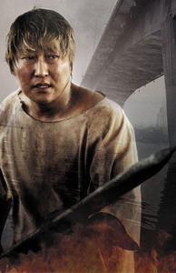
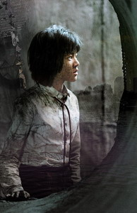
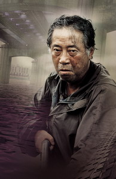
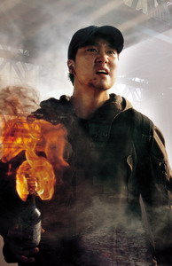
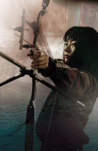

aka The Host  

<!-- truncate -->

여기저기 이 영화에 대한 이야기가 쏟아지고 있어 그 이야기들을 종합하기만 해도 정보가 넘친다. 헉헉. (게다가 감독은 봉테일이라 불리는 봉준호 감독!) 그렇지만, 나도 한마디.  
  

  

  
**(다만, 글 전체가 스포일러 덩어리이니 원치 않으신 분들은 피하세요.)**  
  
**펼쳐 보기** (클릭) 

**시사성**  
  
일단 내겐 이 영화가 노골적인 반미 영화라든가 시사성이 너무(?) 강한 영화로 보이지는 않았다. '노골적'이라는 표현이 어떠한 대상이나 상황을 과장하고 확대한다는 측면에서 본다면 말이다. 실제로 미군은 한강에 포르말린을 흘려 보낸 사건이 있었고, 이 사건 이후로도 [누구도 제대로 처벌받지 않았었고](http://cafe.naver.com/parkchoi.cafe?iframe_url=/ArticleRead.nhn%3Farticleid=46), 그 외에도 미국은 이라크를 침공하고도 여태껏 [대량살상무기 하나 제대로 못찾고도 버티는가 하면](http://www.hani.co.kr/arti/international/international_general/3230.html), 과거에도 베트남 전쟁에서 에이전트 오렌지라는 고엽제를 무분별하게 살포하고도 [제대로 책임지지 않은 전례](http://www.hani.co.kr/arti/international/international_general/17141.html)가 있다. 영화에서는 이를 사실감을 주는 장치로 직간접적으로 표현한 것 뿐이다. 이를 노골적인 처사라고 부르는 건 마치 **홍길동이 호부호형을 허락받지 못하는 상황**과 같은 것 아닌가? (만약 세상에 '악의 축'이라 불릴만한 집단이 예로부터 존재한다면, 오늘날 세계를 가장 불안하게 만드는 집단은 바로 미국 아닌가. 20세기 들어서 미국이 직간접적으로 일으킨 전쟁만 해도 도대체 몇 건인가.)  
  
반대로 이야기하자면, <살인의 추억>에서도 그 시절의 시스템을 노골적으로 풍자했다. 이를테면, 시위 진압 때문에 수사 경찰병력이 다 빠져나가는 설정, 피해자가 얼마가 생기든 과학과는 거리가 먼 경찰들의 무식한 수사 행태 같은 것들. 내가 보기엔 <괴물>에서 보여지는 미국의 행태나 <살인의 추억>에서 보여지는 80년대의 우리네 정서나 어차피 다 우리나라에서 벌어졌던 그리고 벌어지는 일일 뿐이다.  
  
영화는 미국 외에도 한국 사회의 시스템이 가진 부조리한 면을 차근차근 보여준다. (이는 봉준호 감독의 모든 영화에서 나오는 적절한 분량(?)의 사회적인 메시지가 아닐까 싶다.) 어떤 이들은 사회비판적인 메시지를 너무 의도적으로 드러내는 것 같아서 불편하다고 하지만 내가 보기엔 있는 걸 제대로 보여주는 것은 현실감 느껴지는 영화를 만드는 가장 효과적인 방법 중 하나라고 생각한다. 실제로 그런 어처구니 없는 시스템과 그로 인해 피해받는 개인들을 매일 9시 뉴스에서 보고 있지 않은가.

  

**영화의 전개 혹은 결말**  
  
영화가 투덜거리기만 하고 그 어떤 대안도 내놓지 못한다는 지적 역시 높아진 기대치 때문에 생겨난 불평이 아닌가 싶다. 봉준호 감독의 전작 <살인의 추억> 역시 어떤 대안이나 해결방안을 제시하지 않았지만 그 시대를 충실하게 그려냈다는 게 큰 장점인 영화로 평가받고 있다. 사실 우리는 현재 벌어지는 일들에 대해 이야기하는 걸 거북해 하는지도 모른다. <살인의 추억>이야 연쇄살인범에 대한 이야기니까 모두들 한쪽 편에 서서 이야기를 지켜봤겠지만, <그 때 그 사람들>에 대한 논란처럼 이 영화는 한쪽 편에서만 보지 않기 때문이다.  
  
류승완 감독의 <짝패>를 보면서 한판 한판 스테이지를 깨 나가는 아케이드/액션 장르의 전자오락 같다는 느낌을 받았는데 (류승완 감독도 그런 의도가 어느 정도 있었다는 글도 읽었고), 봉준호 감독의 <괴물>에서도 그와 비슷한 느낌을 받았다. 서로 별로 살갑지 않은 가족 구성원인 등장인물들이 차근차근 자기 몫을 해나가며 괴물을 추적하고 처리(?)하는 영화의 전개가 마치 운동회 때 이어달리기를 해 나가는 듯한 느낌이었다. 봉준호 감독 특유(?)의 수평 트래킹이 전면에 부각된 표현수단으로 보였다고나 할까.  
  
보면서 문득 떠오른 영화가 있다. 데니 보일 감독의 <[28일 후](http://movie.naver.com/movie/bi/mi/basic.nhn?code=36342) ([28 Days Later...](http://us.imdb.com/title/tt0289043/))>. 물론 이 영화에서는 실제로 바이러스가 존재하긴 하지만, 정말 무서운 건 인간이라는 주제가 이 영화의 맥락과 비슷하지 않나 싶은 생각이다. 게다가 <28일 후>에서의 바이러스의 이름도 "분노 바이러스" 아닌가. 물론 <28일 후>에서는 바이러스에 대한 직접적인 공포에서 인간에 대한 공포로 옮겨가는 과정이 연결되는 반면, 이 영화에서는 바이러스는 다 거짓이고, 피해를 보는 개인들이 스스로의 힘으로 문제를 해결해 나가는 과정을 그리고 있지만.

  

**특수효과**  
  
CG가 좀 티난다는 글도 종종 보이는데, 이것 역시 생각하기 나름인가 보다. 난 괴물에 어류나 양서류 같은 것들도 섞여 있다고 생각했는데, 그렇다면 원래 물 밖에 나왔을 때도 미끈하게 보이지 않은가? CG가 튄다고 하는 사람들은 그 미끈함을 어색함이라 느낀 것 아닐까 추측해 본다.  
  
마지막에 괴물이 불타는 씬도 마찬가지인데, 석유에 불을 지르면 원래 불이 피사체와 따로 노는 듯한 느낌이 들기도 하고, 만약 깨끗한 알코올이라면 불에 타는 것도 약간 투명하고 맑은 느낌이 난다. 어쨌든 어색하지 않다고 느낀 이유는 내가 상상하는 느낌과 크게 다르지 않았기 때문이다. (물론 몇몇 장면과 괴물의 전체적인 움직임에 약간 어색한 면도 있지만 다른 비싼 헐리우드 괴수영화와 비교해도 크게 뒤떨어지지 않는 듯 하다.)

  

**사운드**  
  
**음악**은 좀 아쉽다. 일단 봉준호 감독의 전작인 <살인의 추억>과 비교를 안할 수가 없다. 이와시로 타로가 <살인의 추억>에서 들려준 타악 (리듬) 중심의 스코어들은 영화 속에 잘 녹아들면서도 분위기를 정확하게 잡아줬었는데, 이번 이병우의 음악은 이병우 특유의 색깔이 조금 이질적으로 느껴졌고 감성적인 느낌의 메인 멜로디는 음악 자체로는 좋지만 영화와는 약간 불균형적으로 느껴지기도 했다.  
  
추가) 적으려다 깜빡하고 안 적은 것 하나. 트럼펫의 리드가 인상적인 주제곡 "한강찬가"를 비롯하여 음악의 전체적인 분위기에서 살짝 **'에반게리온'**의 사운드트랙이 떠오르기도 했다. (그러고 보니 에바도 괴수라면 괴수라고 할 수 있을까?) 어쿠스틱 - 트럼펫과 첼로. 힘찬 편곡. 마이너풍의 멜로디. 갑작스러운 엔딩.  
  
**음향** 역시 좀 애매하다. 어떤 분들은 영화 중간에 대사가 잘 안들린다는 말까지 나오던데 사운드를 담당한 분 말씀으로는 [극장의 세팅에도 영향이 있다](http://dvdprime.dreamwiz.com/bbs/view.asp?major=MD&minor=D1&master_id=22&bbsfword_id=&master_sel=&fword_sel=&SortMethod=&SearchCondition=&SearchConditionTxt=&bbslist_id=965130&page=1)고도 한다. 롯데시네마 라페스타관에서 봤는데 대사는 잘 들리는 편이었으나 몇몇 고음이 찢어지는 장면들이 있었다. 특히 사운드트랙이 주로 깔리는 장면에서 심했는데, 많이 아쉬웠다. 하지만, 전체적으로 묵직한 톤을 유지한 사운드는 좋은 컨셉이었고, 좋은 구현이었다고 본다. (결국 최종 믹싱에서의 문제일까 아니면 정말 극장마다 시스템의 성능 편차가 심한 걸까?)  
  
괴물의 사운드의 경우는 몇몇 잡지에서 읽은 사운드 관련 기사에 비해 큰 임펙트가 남지 않았으나 무난하게 잘 처리되었다고 생각한다.

  

**그 밖에 개인적으로 인상적이었던 장면 몇가지**  
  
잠만 자는 조금 멍청한 아버지 강두. 매점에서 열심히 자다가도 "아빠~" 소리를 들으면 "우리 딸, 현서야~" 하면서 자동으로 깬다. 결국 초반부에 괴물에게 쫒길 때 현서 목소리인 줄 알았던 그 소녀의 손을 잡는 바람에 현서를 놓친다. 그러나, 영화의 마지막엔 현서가 지켜준 소년을 거두어 키운다.  
  
현서가 죽고 난 후 (잡혀가고 난 후) 합동분향소에서 남주는 양궁으로 딴 동메달을 바치고 남일은 소주병을 바친다(?). 영화 마지막에 남일은 소주병으로 만든 화염병으로 괴물을 공격하고, 남주는 영화를 통틀어 자신의 양궁실력을 처음이자 마지막으로 괴물에게 제대로 보여준다.  
  
내시경(?) 검사 해야한다면서 의사는 잡혀온 강두에게 금식을 지시하지만, 강두는 그런 거 지킬 사람이 아니다. 밤에 몰래 골뱅이 통조림을 까서 먹는다. 예전에 골뱅이 통조림에서 포르말린 검출되서 사장이 구속되고 어쩌고 했으나 결국 자연산 버섯에서 검출되는 양의 몇 분의 일도 안되는 양이었다고 판명났던 사건을 떠올리게 했다. 조금만 지나도 잊어버리는 우리나라 사람들의 특징이 씁쓸하게 표현되어 있다. 이 씁쓸함은 마지막에 발가락으로 TV를 끄는 장면과도 연결되어 있다.  
  
강두 가족이 병원을 탈출하면서 승합차 안에서 TV를 보는 장면은 전체적으로 코미디 씬이었다. '노랑 머리가 제일 무식했어요' 라는 간호사의 증언 같은 것도 재밌었지만, '세균으로 얼룩진 동메달' 하면서 나오는 신문들의 제목들과 자료 화면으로 남주가 양궁대회 화면을 보여주다가 악수하는 장면에서 손에 빨간 동그라미를 치는 장면은 재치 만점이었다.  
  
몰래 병원을 탈출한 강두 가족은 매점에 모여 허기를 달래는 장면에서 잡혀갔던 현서가 천연덕스럽게 이들과 함께 식사를 한다. 물론 판타지다. 왜 우리나라엔 '멀리 떠난' 이들의 밥(과 반찬)을 한쪽에 퍼두는, 특히 식사 때면 '멀리 떠난' 가족을 떠올리는 그런 정서가 있지 않나. 그냥 소리없이 찡했다. 바로 다음 장면에서 허기진 현서가 물을 받아먹는 장면으로 연결되면서 가족의 정서가 더욱 부각된다.  
  
희봉은 한발이 더 남았다는 강두의 말을 듣고 강두의 엽총을 건네받는다. 하지만 계산을 잘못한 강두, 희봉은 너무도 허무하게 최후를 맞이한다. 희봉의 마지막 씬은 조금은 길게 갔어도 괜찮았을 듯 싶다. 매력적인 캐릭터가 너무 일순간에 죽으니 당황스러웠다.  
  
남일을 돕는 척 하며 현상금을 노리던 운동권 출신 뚱게바라 선배는 남일이 형사들을 따돌리고 도바리를 칠 때, 건너편 방에서 남일을 향하여 엄지손가락을 번쩍 든다. 돈 욕심 때문에 후배를 위험에 빠뜨렸으나 이미 도망에 성공했으니 잘 하라고 응원을 해준 것일까? 아니면, 그 쪽 동네 의리라는 게 그런 걸까?  
  
남주가 화염병을 만들며 원효대교로 가고 있을 무렵 거기엔 강두의 자유를 주장하는 대학생들의 데모가 한창이었다. 그런데, 그들의 복장은 월드컵 응원 복장을 떠올리게 했다. 짝짝짝 짝~짝~ 대한민국! 큰 풍선도 띄워놓고 마치 대학축제 같은 분위기. 좋은 의미든 나쁜 의미든 간에 요즘의 모든 시위는 팬시화된 경향이 있는 게 사실이다.  
  
마지막에 노숙자가 부어주는 휘발유를 괴물이 받아먹는 장면은 살짝 안쓰러울 수도 있는 장면이었다. 이제껏 혼자서 살아가다가 '아, 나에게도 먹을 것을 주는 누군가가 있구나.' 하는 느낌 정도로. 하지만, 이전에 괴물에 대해 표현된 것이 없어서 그 느낌이 크진 않았다.

  

**관련링크**  
  
[영화 <괴물> 공식 홈페이지](http://www.thehost.co.kr)  
  
[DVD프라임 - [정보] [괴물] 사운드 믹싱에 관한 코멘트](http://dvdprime.dreamwiz.com/bbs/view.asp?major=MD&minor=D1&master_id=22&bbsfword_id=&master_sel=&fword_sel=&SortMethod=&SearchCondition=&SearchConditionTxt=&bbslist_id=965130&page=1)  
  
씨네21 - 괴물의 [변희봉](http://www.cine21.com/Magazine/mag_pub_view.php?mm=005002001&mag_id=40137), [송강호](http://www.cine21.com/Index/magazine.php?mm=005002001&mag_id=40140), [박해일](http://www.cine21.com/Index/magazine.php?mm=005002001&mag_id=40142), [배두나](http://www.cine21.com/Index/magazine.php?mm=005002001&mag_id=40141), [고아성](http://www.cine21.com/Index/magazine.php?mm=005002001&mag_id=40139)  
[씨네21 - SF 스릴러의 형식을 뒤집어쓴 정치영화, <괴물>](http://www.cine21.com/Movies/Mov_Rev/review_view.php?mm=002001001&mag_id=40283)  
[씨네21 - <괴물> 봉준호 감독, 영화평론가 김소영 교수 대담](http://www.cine21.com/News_Report/news_view.php?mm=001001001&mag_id=39944)  
  
[씨네21 - <살인의 추억> 음악감독，이와시로 다로](http://www.cine21.com/Index/magazine.php?mm=005002003&mag_id=18756)  
[이와시로 타로 - Faces (살인의 추억 OST 중) 듣기](http://blog.naver.com/gimmehide/10000494335)  
[딴지일보 - [이너뷰] 딴지, 봉준호 감독을 만나다!!](http://blog.naver.com/allabbung/100009226826) (예전 인터뷰임. 딴지일보 사이트에서는 못 찾겠음 -\_-)  
  
[계란소년의 불법 비밀 양계장 - 몰로토프 칵테일](http://eggraising.egloos.com/995077)  
  
[한강찬가 오리지날 / 보컬 버전 / 트럼펫 버전 듣기](http://blog.naver.com/dkfma2994/29027597)  
[한강찬가 피아노 버전 듣고 보기](http://dory.mncast.com/mncHMovie.swf?movieID=10006391120060820154629)

  
 / 
