이 글은 Arborday님의 [공포영화를 좋아하는 블로그](http://arborday.egloos.com/)로부터 왔습니다.  

<!-- truncate -->

음악에 대한 생각은 수시로 바뀌고, 또 한 앨범, 한 뮤지션 혹은 한 장르에 푹 빠졌다가 또 다른 것에 빠지고... 하는 식을 반복하기 때문에 아래의 답변들은 사실 좀 애매한 면이 있어요. 굳이 붙이자면, 2006년 8월초 현재 강하게 떠오르는 기억을 바탕으로 적은 문답입니다. 그럼, 시작합니다.  
  
1. 음악을 좋아 하나요?  
예. 좋아해요.  
  
2. 하루에 음악을 듣는 시간은 어느 정도 되나요?  
예전엔 틈만 나면 들었지만, 요즘은 많이 못 듣습니다. 다른 매체에 들어있는 음악을 제외하면 기껏해야 30분? ㅠ.ㅠ  
  
3. 주로 듣는 음악은?  
요즘이라고 한다면 대중없습니다. 닥치는대로-\_- 들어요. 지금 제 mp3 플레이어에 들어있는 장르를 보아하니 얼추 포크, 블루스 혹은 뉴에이지네요.  
  
4. 지금 듣고 계신 곡은 무엇인가요?  
이 글을 쓰는 순간까지는 안 듣고 있었지만 -\_-; 이 문항을 보고 플레이어를 켰습니다.  
[Richard Bona](http://www.allmusic.com/cg/amg.dll?p=amg&sql=11:hgngtq4zmu46)의 'Eyala'가 나오네요.  
(1999년 발표된 [Scenes From My Life](http://www.allmusic.com/cg/amg.dll?p=amg&sql=10:j9dayl62xpzb) 앨범에 있는 곡입니다.)  
  
play 버튼을 누르면 음악이 시작됩니다.  
  
5. 음악가가 되고 싶다고 생각해본 적 있으신가요?  
예. 있습니다.  
  
6. 내 인생에 있어서 음악이란?  
음악이 있어서 행복해요. (무슨 냉장고 CF 멘트 같군요. :-/ )  
  
7. 가장 최근에 구입한 음반은?  
새 앨범 역시 산지 좀 됐습니다만, 그나마 최근이라면... [Tom Waits](http://www.allmusic.com/cg/amg.dll?p=amg&sql=11:61y67ur0h0j0)의 [Small Change](http://www.allmusic.com/cg/amg.dll?p=amg&sql=10:w7ae4j370waw)를 재구입했습니다.  
(도대체 이 앨범은 몇장째 다시 사는지 모르겠어요. -\_-; 몇 장 함께 샀는데 다른 건 기억이 잘 안나네요.)  
[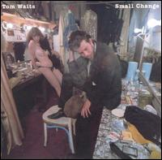](http://www.allmusic.com/cg/amg.dll?p=amg&sql=10:w7ae4j370waw)  
  
8. 개인적으로 아끼는 음반은?  
아, 이런 질문은 참 어렵네요. 솔직히 많은 앨범이 없어지기도 하고 지금도 제 손에 닿지 않는 곳에 있을 뿐더러 그걸 떠나서도 가장 아끼는 걸 고른다는 건 거의 불가능해요. 두루두루 열심히 들으니까요.  
아끼는 앨범은 아니지만 제일 처음으로 돈주고 구매한 정식(?) 앨범은 기억납니다. ^^ 그 전까지는 맨날 라디오 방송을 녹음하거나 짝퉁 테입들을 들었었죠. (어렸을 땐 집에 녹음하고 지우고 녹음하고 지우고 하던 테입이 항상 100~200여개 정도 있었던 것 같아요.) 바로 박남정 앨범입니다. :) 기억에 의하면 [2집](http://music.naver.com/album.nhn?tubeid=2kk120000911)이네요. ('널 그리며'와 '사랑의 불시착'이 들어있는)  
[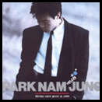](http://music.naver.com/album.nhn?tubeid=2kk120000911)  
  
9. 가지고 계신 음반수는?  
모르겠습니다. CD와 테입이 다른 곳에 있어요.  
  
10. 콘서트(라이브 혹은 파티)는 자주 가시는 편인가요?  
예전에는 자주 갔습니다. 지금은 아닙니다. ㅠ.ㅠ  
최근에 간 건 'YB의 우리는 대한민국입니다'였습니다.  
  
11. 가장 감동적인 콘서트는?  
지금 딱 떠오른 건 정태춘이 ['아, 대한민국...'](http://www.maniadb.com/album.asp?a=125613) 앨범을 냈을 당시 했던 공연입니다. 1989년 혹은 1990년이었을 거예요. 앨범이 나오기 전에 공연부터 본 걸로 기억해요. 참고로 이 앨범은 가요의 사전심의 철폐를 주장했고, 정태춘과 박은옥이 노동자의 비참한 현실에 눈을 뜨고 낸 첫 앨범이죠.  
[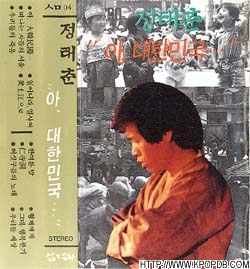](http://maniadb.com/album.asp?a=125613)  
  
이 공연은 제가 처음 갔던 단독 공연이었고, 그 때의 충격은 상당했지요. (제대로된 첫 공연 감상 + 포크 가수였던 정태춘의 놀라운 변신 + 음악 자체의 선동성!)  
  
12. 내한공연을 해줬으면 좋겠다고 생각하는 음악가가 있나요?  
너무나 많지만 요즘 생각으로는 [데미안 라이스](http://www.maniadb.com/artist.asp?p=133535) 정도?  
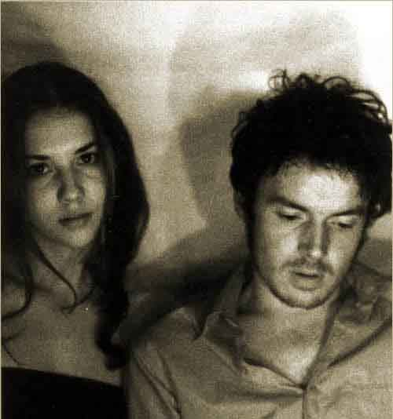  
  
13. 나의 음악 청취 변천사  
위에서 설명했듯 기본적으로 열심히 라디오를 들었죠. 배철수의 음악캠프나 이종환의 별밤, 이문세의 별밤, 김기덕 2시의 데이트 등을 열심히 들었더랬죠. 아, 정영음과 전영혁의 FM 25시도 빼놓을 수 없죠.  
많은 분들처럼 위의 프로그램이 거의 제 앨범 구매 가이드 역할을 해줬죠. 특히 전영혁의 FM 25시와 정영음, 배철수의 음악캠프는 뭐랄까, 언제나 신천지를 알려주는 보물창고였습니다. :)  
초등학교 때는 가요를 많이 들었지만, 중학교 올라가면서부터 팝송 (팝 + 락 등 외국음악)을 주로 들었습니다. 심지어 한동안 가요를 대놓고 '수준 낮은 음악'이라고 생각하기도 했어요. 물론 지금은 그 편견이 깨졌지만요.  
고등학교 때 뉴에이지와 아트락, 재즈를 열심히 들었던 기억도 나요. (뭐랄까, 왠지 어려운(?) 음악을 들으며 폼을 재고 싶은 마음도 있었을 거예요.) 아는 뮤지션과 밴드는 많지 않았지만 한번 들으면 주구장창 듣는 스타일이었죠. 쉽게 표현하자면 조지 윈스턴과 뉴 트롤즈, 키스 자렛부터 찾아 듣기 시작한 거죠. 당시 예외적으로(?) 국내 가수 중에서는 서태지와 신해철 (넥스트), 015B, 이승환 등을 좋아했던 기억이 납니다. 그들의 간접적인 추천음악들도 구매 리스트에 올라갔었죠. ^^  
대학 1-2학년 때는 주로 사운드트랙을 열심히 찾아가며 들었습니다. 즈비그뉴 프라이즈너, 대니 앨프먼 그리고 한스 짐머를 많이 좋아했었죠. (물론 지금도 좋아하고요.) 뒤이어 칸노 요코라든지 히사이시 조 등 일본 뮤지션들도 찾아듣게 되었고요. 그리고, 그 이후로 지금까지는 장르에 관계없이 제 취향에 맞는 음악들을 장르 가리지 않고 찾아 들어오고 있지요.  
아, 가요에 대한 제 잘못된 편견이 깨지기 시작한 것 역시 대학 시절이었습니다. 주로 당시 유행하는 가요들보다는 옛날 노래들을 찾아들으며 '오오오- 왜 몰랐을까' 했던 느낌이 지금도 생생하네요. 신중현, 산울림, 시인과 촌장, 신촌 블루스 등 예전엔 뭐가 좋은지 몰랐던 뮤지션들의 맛을 알아갔던 거죠. ^^  
  
14. 음악에 관련된 에피소드가 있습니까?  
많아요. 역시 하나 딱 꼬집어 이야기하기 뭐하네요. 음... 아주 오래된 기억 중에 이런 게 있어요. 집에 굴러다니던 노트에 열심히 가사를 적어가며 노래 가사를 외웠던 기억이요. 가사를 적으며 외웠던 기억으로는 첫번째네요. 정수라 노래였어요, ['바람이었나'](http://blog.naver.com/ssalt20/20025147723). 가사를 1절만 적어보면 - 이제는 너를 잊어야 하나 / 그냥 스쳐가는 바람처럼 / 파란 미소를 뿌리던 꿈의 계절을 / 모두 잊어야 하나 / 바람이 몹시 불던 날 / 우리는 헤매다녔지 / 조금은 외롭고 쓸쓸했지만 / 그것은 낭만이었지 / 만나면 할말을 못하고 / 가슴을 태우면서도 / 그렇게 우리의 사랑은 / 끝없이 깊어갔는데  
쓰고 보니 당시(?) 저런 식으로 외웠던 곡들이 몇개 기억나네요. 배인숙의 ['누구라도 그러하듯이'](http://blog.naver.com/blue710113/150000919715) (절마다 가사가 헷갈려서 너무 어려웠어요-\_-. 원곡은 Alain Barriere의 ['Un Poete'](http://blog.naver.com/lpbada/100026986564)), 최혜영의 ['그것은 인생'](http://blog.naver.com/bwv1067/110005378841) 같은 곡들 말이죠.  
  
15. 좋아하는 음악가(혹은 그룹)을 적어주세요.  
아. 너무 많은데요. 순위두고 좋아하는 것도 아니고... 비교적(?) 아주 최근 뮤지션들을 제외하고, 앨범 한두장 정도만을 엄청 좋아하는 경우도 제외한다면,  
비틀즈, 라디오헤드, 에릭 클립튼, 마크 노플러, 레드 제플린, 크림, 지미 헨드릭스, 다이어 스트레이츠, R.E.M., 메탈리카, RATM, 카멜, 뉴 트롤즈, 르네상스, CS&N, 톰 웨이츠, 대니 앨프먼, 한스 짐머, 즈비그뉴 프라이즈너, 얀 티어슨, 에바 케시디, 키스 자렛, 스팅, 머라이어 캐리, 스티비 원더, 조안 바에즈, 엘리엇 스미스, 토리 에이모스, 사라 멕라클란, 스타세일러, 뮤즈...  
적다가 새삼 의미없음을 알았습니다. 하나 적으면 더 많은 수가 떠오르네요. -\_-;  
  
16. 위에 적어주신 음악가중 자신에게 있어 특별한 의미가 있는 사람이 있습니까?  
없습니다.  
  
17. 나만의 명곡이 있나요?  
지금은 없습니다.  
  
18. 노래 잘 부르세요?  
주로 고함을 지르죠.  
  
19. 노래방에 가면 꼭 부르는 곡이 있나요?  
지금은 없습니다.  
예전에 한동안 뮤턴트의 ['잔인한 너'](http://blog.naver.com/bboho02/60022362633)를 애창곡이라고 말하고 다녔던 적이 있습니다.  
  
20. 춤은 잘 추시나요?  
몸치. 춤치. 춤 잘 추는 사람들, 정말 부러워요. ㅠ.ㅠ  
  
21. 좋아하는 OST, 또는 음악이 좋다고 생각했던 영화는?  
역시 많습니다. -\_-; 하지만 생각해보니 제가 제일 좋아하는 OST 앨범이라고 할만한 걸 평상시 생각해두지 않았다는 걸 알았네요. 특정 몇몇 곡 때문이 아니라 앨범이 전체적으로 좋아 자주 들었던 것 중 몇 개 적어봅니다.   
(세가지색 3부작의) <블루> (Bleu, 1993), <청춘 스케치> (Reality Bites, 1994), <러쉬> (Rush, 1991), <해리가 셀리를 만났을 때> (When Harry Met Sally, 1989), <렌트> (Rent, 2005), <정글 스토리> (1996), <아멜리에> (Amelie, 2001), <시카고> (Chicago, 2002), <밴디츠> (Bandits, 1997), 뮤지컬 <라이온 킹> (Lion King, 1997 Original Broadway Cast, 1997), <아이 앰 샘> (I Am Sam, 2001), <트레인스포팅> (Trainspotting, 1996), <에브리원 세즈 아이 러브 유> (Everyone Says I Love You, 1996) 등  

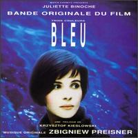

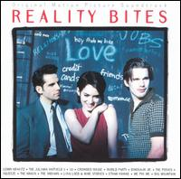

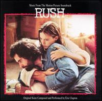

  

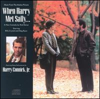

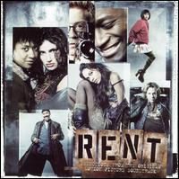

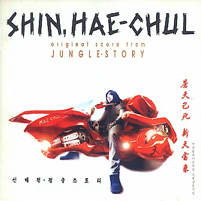

  

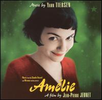

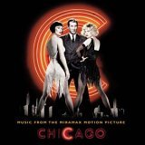

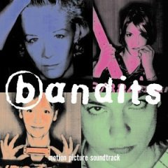

  

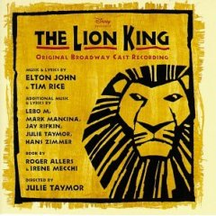

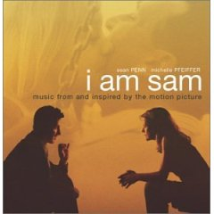

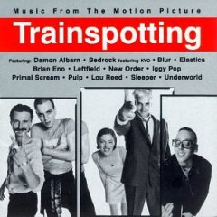

  
[everyone\_says\_i\_love\_you-ost.jpg](./everyone_says_i_love_you-ost.jpg)  
22. 애니메이션이나 게임 곡 중 좋아하는 것은?  
이 문항 때문에 위에 애니메이션은 적지 않았어요. 에반게리온의 그 수많은(-\_-) 앨범들, 카우보이 비밥의 역시 그 많은(-\_-) 앨범들 그리고 히사이시 조가 맡은 지브리의 사운드트랙 앨범들을 좋아해요.  

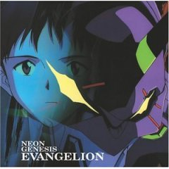

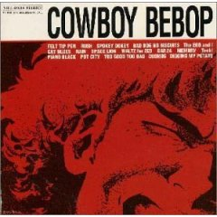

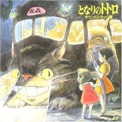

  
23. 가지고 있는 MP3는 몇 곡 정도 되나요?  
모릅니다. -\_-; 예전에 한창 다운 받은 MP3들을 CD로 굽던 시절이 있었는데, 그 CD들 역시 좀 멀리 있고, mp3 플레이어가 생긴 후엔 가지고 있는 앨범도 MP3로 구워서 듣고 했으니까요.  
  
(24번은 원래 없나보죠?)  
  
25. 자주 듣는 라디오 프로그램이 있습니까?  
지금은 없습니다. 요즘 방송들은 음악은 안틀고 말이 너무 많아요.  
  
26. 음악이 듣고 싶을 때와 듣기 싫을 때는?  
음악이 듣기 싫을 때 - 음악과 관계없는 일을 정말 집중해서 해야할 때. 내가 좋아하지 않는 음악이 어딘가에서 흘러나올 때.  
음악이 듣고 싶을 때 - 그 외 전부.  
  
27. 앞으로 더 들어보고 싶은 음악은?  
뭐든지. 몰라서 못 듣고 있을 뿐이죠. 흐흐.  
  
28. 음악을 듣기위해 자주 가는 사이트는?  
예전에 인디음악을 좀 들어보려고 http://epitonic.com 와 http://sputnik7.com 에 자주 갔었던 것 빼고는 특별히 정해놓고 가는 곳은 없습니다. 아, 블로그를 하시는 분들 중 고수가 많지요. 네이버에서 블로그를 할 때 알았던 고수님들은 제가 예전에 사용했던 네이버 블로그에 가셔서 [이웃]을 클릭해보면 알 수 있습니다. 주소는 http://blog.naver.com/remmus 입니다. (그쪽 제 블로그는 지금 닫혔지요)  
  
29. 쓰고 계신 음악 청취용 유틸리티는?  
윈엠프. http://www.winamp.com  
  
30. 음악에 관한 잡지나 서적을 자주 읽는 편인가?  
종종 읽습니다.  
  
31. 좋아하는 악기는? 특별히 연주할 줄 몰라도 상관없습니다.  
베이스와 첼로. 첼로는 사람의 감성에 가장 가까운 악기인 것 같아요. 베이스 없는 음악은 ~~붕어~~단팥 없는 붕어빵이죠.  
  
32. 추천해주고 싶은 곡이 있나요?  
불규칙적인 업데이트를 통해 [radio.blog](javascript:void(0);)에 곡을 올리고 있습니다. 종종 그걸 들으면 되지 않을까 해요.  
;)  
  
33. 기분 전환할 때 듣는 음악은?  
특별히 없습니다. 아무 음악이나 다 들어요. 극도로 시끄러운 장르만 빼고요.  
  
34. 지금 핸드폰 벨소리는?  
핸드폰에 기본으로 들어있는 벨소리. 지금 제목을 확인하니 '오늘밤 나와 함께'라고 하는군요. -\_-; 벨소리와 진동이 동시에 되서 쓰고 있어요. 컬러링은 스티비 원더의 ['You Are The Sunshine Of My Life'](http://blog.naver.com/ommadawn/20019629420)이고요.  
  
35. 학창시절 음악성적은?  
전체적으로 좋았어요. 개인적으로 학교에서 음악시험을 보는 이유를 잘 모르겠어요. 어떤 음악이 좋은지, 그리고 자기가 어떤 음악을 좋아하는지, 좋은 음악은 어떻게 찾아 들어야 하는지를 알면 되는 거 아닌가요? 그걸 시험까지 (그것도 암기) 보는 게 잘 이해되지 않아요.  
  
36. 음악을 듣는 이유는?  
그냥 음악이 좋아요. 물론 공부하는 마음으로 듣기도 하고요.  
  
37. 음악이란? (혹은 좋은 음악이란, 나쁜 음악이란)  
음악은 그림자같은 거예요. 어디든 따라다니지요.  
없으면 허전하지만 그렇다고 전면에 나서는 일도 별로 없고요.  
좋은 음악은? 자기가 들어서 좋으면 좋은 음악이라고 생각해요. ^^  
  
38. 바톤을 받을 사람은?  
아, 이거 너무 어려운걸요? 이런 걸 처음해봐서 더 그런가봐요. 줄 분들도 마땅치 않고... -\_-; 원하시는 분이 있다면 받아주세요. ^^
