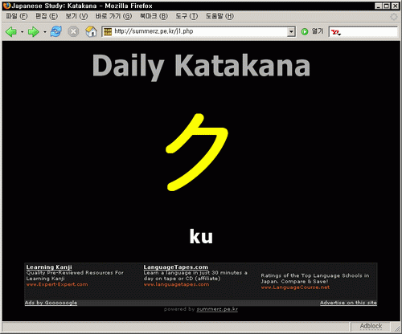
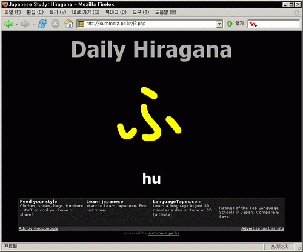

페이지를 열 때마다 히라가나 (카타카나)가 한 글자씩 나옵니다. 아래 로마자로 발음이 표시되고요. 열 때마다 혹은 새로고침 할 때마다 랜덤으로 나오니 지금 막 일본어 공부를 시작한 분들이라면 시작페이지로 놓고 써도 되지 않을까 해요.  

<!-- truncate -->

아래 그림이나 바로가기를 클릭하면 바로 이동합니다.  
  
  
  
[▶ 데일리 카타카나 바로가기](http://summerz.pe.kr/j1.php)  
  
  
  
[▶ 데일리 히라가나 바로가기](http://summerz.pe.kr/j2.php)  
제가 한창 일본어 공부한다고 할 때 만들어 두었던 페이지입니다. 예전에 누가 HTML과 자바스크립트로 만든 걸 보고 힌트를 얻어 php로 비슷하게 작성한 것입니다.
