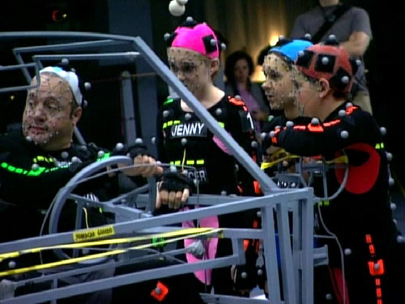
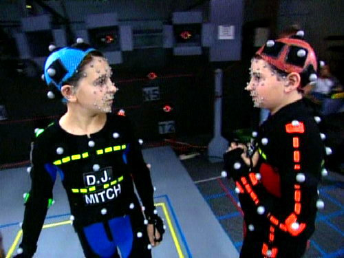
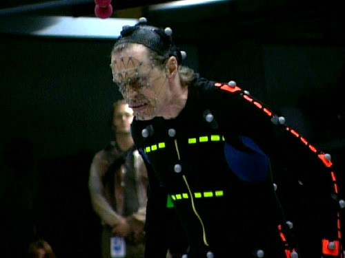

aka Monster House  

<!-- truncate -->

[monster\_house.jpg](./monster_house.jpg)  

모션캡쳐 중

차우더와 제니

네버크래커 (스티브 부세미)

  
**문화적 차이와 시대적 배경**  
  
이야기 설정 자체부터 문화적 차이가 느껴졌다. 이를테면, 정원이 있는 집들, 자신의 토지 (property)에 대한 집착, 서로를 신경쓰지 않아도 되는(?) 이웃들 같은 것들 말이다. 만약 이런 것들을 한국적인 설정으로 바꾸면 어떻게 할 수 있을까? 배경을 시골로 바꿔버리는 것 말고.  
  
지 (매기 질렌할 분)와 본즈 (제이슨 리 분)의 관계, 전자오락에 빠진 스컬 (존 헤더 분)과 경찰관들, 휴가 간 부모님 등을 보면서 왠지 80-90년대 청소년 영화들의 정서가 살짝 떠오르기도 했다. 한마디로 사건이 일어나는 그 집들 사이의 도로에서 <백 투 더 퓨처>의 타임머신 자동차가 달려갈 것만 같았다고나 할까.  
  
**이해하기 어려웠던 결말 + 엇갈린 음악**  
  
영화의 편집이 좀 어정쩡하게 느껴졌던 이유는 "조금 더 재밌게 (혹은 매끄럽게) 만들 수 있는 이야기 아닌가?" 하는 생각이 떠올랐기 때문이다.  
  
 **스포일러가 들어있어 감춥니다.** 

좀 이해하기 힘든 부분들도 있었는데 예를 들면 이런 것들이다. 영화의 후반부에 집의 정체가 밝혀지는데 무시무시한 할아버지인 네버크래커의 죽은 아내의 영혼이 집에 들어가게 되었다는 것이 바로 그것이다. 이 때 할아버지의 아내였던 콘스탄스와의 비극적인 사랑에 대한 할아버지의 애절한 회상이 나온다. 하지만, 영화의 제일 마지막 부분에서 그 무시무시한 집 (콘스탄스)을 물리친 디제이의 손을 잡고 '그동안 40여년간 집 (콘스탄스)에 갇혀있었는데, 이젠 자유'라며 고맙다고 하는 부분이 나온다. 할아버지의 진심은 무엇이었을까? 그 동안 콘스탄스를 위로했던 말은 거짓말이라는 걸까?  
  
내가 결정적으로 이 부분에서 헷갈렸던 이유는 음악 때문이었다. 할아버지가 디제이에게 구해줘서 고맙다는 말을 할 때 나오던 음악은 모든 것이 성공적으로 해결되었다는 식의 전형적인 느낌의 엔딩곡이었다. (아이들도 많이 보는 영화이기 때문에 갈등을 해소시켜주는 것도 물론 중요했겠지만,) 내 생각으로는 그 때 약간 미스터리한 느낌의 음악이 깔렸으면 어땠을까 싶었다. 그래야 할아버지와 콘스탄스의 관계, 불쌍한 콘스탄스의 분노 같은 것들이 함께 표현될 수 있을 것 같았기 때문이다.  
  
영화를 보고 나서도 그 마지막 음악이 자꾸 걸린다. 이상한 모습 때문에 놀림 받던 콘스탄스를 결정적으로 타자화시켜버린, 선과 악의 대립구도로 만들어버린 게 바로 마지막에 흘러나온 바로 그 음악이었기 때문이다. 귀에는 편안하게 들리는 멜로디지만 내용적으로는 잔인한 음악. 많은 가능성을 단순히 권선징악 수준으로 닫아버린 음악.

  
**3D 시스템 - 리얼 디 (Real D)**  
  
[롯데시네마](http://lottecinema.co.kr)에서 새로운 입체영화 시스템 리얼 디 (REAL D)로 영화를 봤다. 기존 3D 시스템 (듀얼 프로젝터)에 비해 장점이라고 한다면 렌즈가 1개여서 초점이 명확하기 때문에 눈이 덜 피로하고, 원형 편광 안경을 쓰고 보기 때문에 영화를 보다가 자세를 바꿔도 입체감이 유지된다고 한다. (하지만, 리얼 디가 144프레임이라고 홍보를 하지만 소스는 같은데 리얼 디 구현을 위해 프레임을 뻥튀기 했다는 말도 있고, 광량에 있어서 듀얼 프로젝터에 비해 딸린다고 한다.)  
  
3D 시스템으로 영화를 본 건 처음이라 비교할 수는 없지만, 전체적으로 만족스러웠다. 보통의 영화에 비해 살짝 어둡긴 했지만 상당히 선명했고, 상어가 튀어나오고 공룡이 불을 뿜는 그런 판타스틱 리얼 입체영화 광고(-\_-)와 같은 장면들은 없었지만 (^^), '아- 이런 게 3D 영화구나-' 하는 걸 충분히 느낄 수 있었다. 그런 입체감들은 특히 원근감이 표현되는 장면에서 제일 두드러졌다. (예: 영화 초반 낙엽들이 카메라 쪽으로 흩날리는 장면, 카메라 가까이에도 피사체가 있고 동시에 멀리에도 인물들이 보이는 장면들 등) 왜 예전에 <폴라 익스프레스 3D> 를 보지 않았을까 하는 후회가 들었다. (<폴라 익스프레스 3D>가 개봉했을 때 **'깊이의 미장센'** 등의 글들이 있었던 걸로 기억하는데, <몬스터 하우스>를 보니 이제야 그 말의 뜻이 이해가 간다.)  
  
다만, 가격은 기존 영화에 비해 비싼 편이다. CGV든 롯데시네마든 3D로의 관람가격은 성인 1인당 11,000원.  
  

**추가정보**  
  
이미지무버스 (ImageMovers)는 로버트 저메키스가 1997년 만든 프로덕션 회사이다. 그동안 자신이 감독을 한 작품들을 제작했는데 (<왓 라이스 비니스>, <캐스트 어웨이>, <폴라 익스프레스>) 이번엔 자신은 프로듀서로 물러서고 길 케넌이라는 신인 감독을 내세워 작품을 발표했다.  
  
3D 시스템으로 [롯데시네마는 리얼 디를 선택](http://www.lottecinema.co.kr/event/now/event_detail.asp?catcode=31&EVent_ID=E000011549)했고, [CGV는 듀얼 프로젝터를 선택](http://www.cgv.co.kr/event/ingEvent/subEvent/060804_event_02.aspx)했다. 참고로 3D로는 두 상영관 모두 더빙판만 상영한다. (즉, 자막판을 보려면 일반 상영관에 가야한다.)  
  
**관련링크**  
  
[맥스무비 - <폴라 익스프레스> 3D 아이맥스 200% 즐기는 방법](http://www.maxmovie.com/movie_info/news_read.asp?idx=MI0001478884&mi_type=03&key=&search=)  
[씨네21 - DMB vs 아이맥스](http://www.cine21.com/Magazine/mag_pub_view.php?mm=005001001&mag_id=32994) [**[1]**](http://www.cine21.com/Magazine/mag_pub_view.php?mm=005001001&mag_id=32994) [**[2]**](http://www.cine21.com/Magazine/mag_pub_view.php?mm=005001001&mag_id=32995) [**[3]**](http://www.cine21.com/Magazine/mag_pub_view.php?mm=005001001&mag_id=32996)

  
 /  / 
