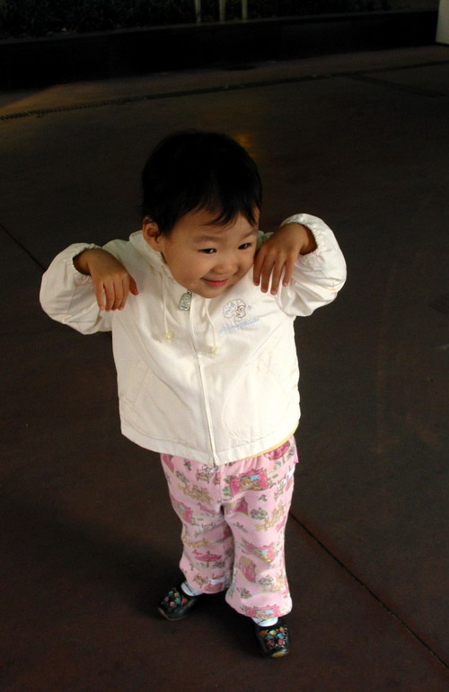

어제 도연이 (올해 4살짜리 조카)가 뭔가 기분이 좋지 않아 울고 있어서 안고 베란다로 나갔다.

<!-- truncate -->

나 : (멀리 있는 달을 가리키며) 와~ 달이 저기 아파트 위에 떴네?

도연이 : (울음을 그치며 짧게) 예!

(좀 있다가)

도연이 : (귀여운 척하며) 삼촌- 근데, 저 달이랑 함께 자고 싶어요.

나 : 밖에서 ?

도연이 : (입을 뾰족 내밀며) 예, 밖에서.

나 : 그럼 추울텐데? 도연이 추워도 괜찮아?

도연이 : (고개를 흔들며 특유의 말투로 짧게) 아뇨~

(역시 조금 있다가)

도연이 : (입을 오무리며) 그럼 달은 춥겠다.

나 : 왜?

도연이 : 음… 밖에서 혼자 자니까.

나 : 그러게, 춥겠네…

도연이 : 삼촌- 그럼, 내가 마술봉으로 (팔을 작게 빙글빙글 돌리며) '수리수리 마수리 얍!' 해서 달에 날개가 뿅~ 하고 생기면 달이 (베란다 안을 가리키며) 여기로 올텐데. (와~ 이 긴 문장을 거의 정확한 발음으로!)

나 : 여기 베란다 안으로?

도연이 : 예!

나 : 달이 추우니까 날개를 달아줘서 달이 베란다 안에 와서 자게 한다고?

도연이 : 예!

나 : 우리 도연이가 착하네?

도연이 : (입꼬리가 씨익 올라가며) 히히히

'저 예쁘죠?' 하는 포즈
