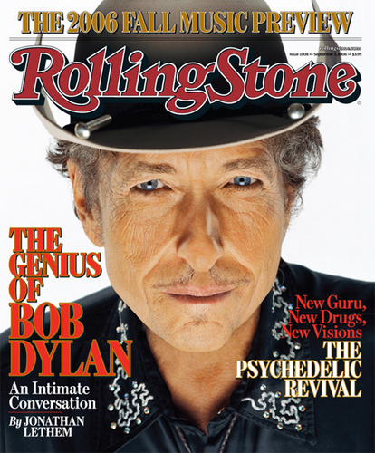
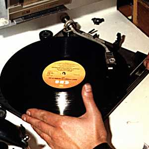
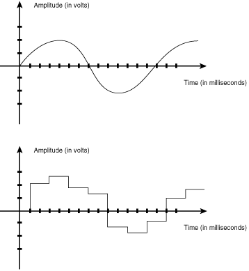
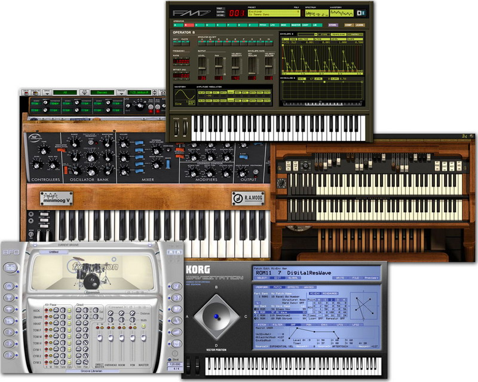
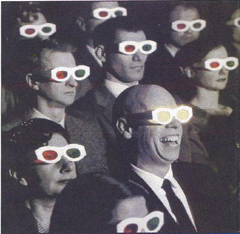

얼마전 밥 딜런이 신보를 발표했다는 사실을 알고 난 얼마 후, 난 그의 신보 Modern Times를 들어볼 기회가 있었다. **역시 밥 딜런! 모든 트랙은 멋졌다.** 5년 만에 발표한 44번째 앨범인 Modern Times는 그를 (1976년 Desire 앨범 이후) 30년 만에 빌보드 차트 1위에 올려놨다.

<!-- truncate -->

[**링크 : Rolling Stones - The Genius of Bob Dylan** (영문기사)](http://www.rollingstone.com/news/story/11216877/the_modern_times_of_bob_dylan_a_legend_comes_to_grips_with_his_iconic_status/)

하지만, 그는 롤링 스톤즈와의 인터뷰에서 현대의 (Modern) 음악에 대해 다소 시니컬한 반응을 드러냈다. **요즘 레코딩된 앨범들의 음질은 매우 형편없다 (You listen to these modern records, they're atrocious)**는 것이었다. 심지어 자신의 앨범에 대해서도 녹음 당시 스튜디오에서 직접 들었던 것이 녹음해서 CD에 실린 것보다 10배는 더 좋을 것이라고 말하기도 했다.

이 글은 **'60년대부터 활동해 온 포크 음악의 대부가 왜 그런 말을 했을까'** 하고 의아한 생각이 들었던 게 시작이었다.

**1. LP와 CD**

예전부터 지금까지 LP 예찬론자들과 CD 옹호론자들 사이에서는 음질에 대한 논쟁이 끊이지 않고 있다. 원래 '소리'라는 개념은 자연계에 존재하는 파동의 형태로 존재하기 때문에 스타일러스의 물리적 이동으로 음악을 재생하는 것이 훨씬 자연스럽고 따뜻한 느낌을 준다는 게 LP 예찬론자들의 주장 중 하나이다. 반면 CD 옹호론자들은 보관도 어렵고 들을 때마다 마모되는, 심지어 재생 도중 발생하는 럼블, 클릭 등 LP는 정확한 소리를 재생하기 어렵고 어차피 보통의 사람들은 블라인드 테스트를 하면 CD인지 LP인지 거의 구분을 할 수 없으므로 (오히려 오디오 컴포넌트의 영향을 받는다) 여러가지 면에서 CD가 좋다는 주장을 한다.

사실 CD가 LP를 잡고 음악을 듣는 수단으로 자리잡는데는 그리 오랜 시간이 걸리지 않았다. CD 이전에는 LP 시장 내에서도 33⅓ rpm (컬럼비아 레코드)과 45 rpm (RCA 빅터) 사이의 경쟁이 있었다가 적절한 타협(?)을 이루었으나 CD에는 동시에 무너져버렸다. CD가 가진 휴대성 (compact)과 보관의 편리함이 주된 이유였고 아마도 LP와 큰 차이없는 음질을 가지고 있다는 것과 첨단의 물건이라는 매력도 작용하지 않았을까 싶다. 또한, 디지털이라는 게 많은 사람들에게 익숙해지기 전이라 알려진 장단점들이 많지 않았기 때문일 수도 있을 터이다.

**2. CD와 mp3**

mp3는 한동안 여러모로 시장에서 지탄을 받고 있었다. 적어도 우리나라에서는 지금도 그렇다고 생각하고 어느 정도 타당하기도 하다. mp3라는 말은 '불법 다운로드'라는 말과 동일어였고, 지금도 많은 사람들의 생각 속에는 음반시장을 위협하는 골치거리이다.

하지만 난 조금 다르게 생각한다. 우선, 이미 시장에 mp3 음원이 합법적인 형태로 존재한다. 물론 이 시장은 음반산업 관계자들이 인정한 시장이다. 불행히도 제대로 준비되지 못한 채 만들어진 이 시장은 애플의 아이튠즈처럼 유행을 만들어내지도 못하고, 일반 사용자들이 리핑한 것보다 월등한 성능을 자랑하지도 못하고, 그저 인터넷 서비스 업체와 통신 업체들의 배를 불려주는 곳이 되었다. 뮤지션들도 음반산업 관계자들도 손님일 뿐이다.

개인적으로 궁금한데 우리나라는 인터넷 환경도 다른 나라에 비해 월등히 좋은데 왜 128 kbit / 44.1 kHz 로 인코딩한 파일들을 사용하는지 모르겠다. 합법적인 시장이 주는 메리트를 부각시키는데 있어서 음질을 좋게 만들어주는 건 아주 좋은 방법 중 하나라고 생각하는데 말이다. 하긴 심지어 태그 정보가 엉망인 곳도 있는데 이런 걸 바라는 건 무리인 건가? (한 가수의 여러 앨범의 곡들에 일관적인 태그가 붙는 건 바라지도 않는다.)

그래서인지 온라인 mp3 시장이 합법적으로 형성된 후에도 가수들은 (음반기획사들은) CD를 사달라고 팬들에게 (소비자들에게) 부탁을 했다. 묘하게 엉뚱한 상황이 아닐 수 없다.

**3. 디지털과 음악**

가장 쉽게 표현하자면 음악은 '잘 구성된 소리들로 만들어진 예술, 오락'이라고 생각한다. 그렇다면, 소리는 무엇인가. 소리란 어떤 물체를 두들기거나 현을 튕길 때, 그 주변에 있는 공기 (매체)가 진동하는 것을 의미한다. 즉, 공기 (매체)의 진동이 멈추면 소리는 사라지고, 우리의 귀는 이 진동으로 발생하는 공기 중의 작은 압력차를 미세한 전기적인 신호로 바꾸어 뇌에 전달해준다. 우리가 소리를 듣는 매카니즘이다.

즉, 이 공기의 진동, 전파 (propagation)는 자연계에 존재하는 현상이다. 즉, 컴퓨터로는 구현할 수 없다. 컴퓨터는 단지 흉내 (simulation)를 낼 뿐이다. 자연계의 소리를 디지털로 변환하는 과정을 샘플링이라고 한다. 예를 들어 이 공기의 압력을 초당 44,100번 측정하고 (44.1 kHz), 측정한 압력을 0에서 65535 사이의 값 (16bit)으로 나타낸 매체가 바로 CD이다. 즉 CD의 음질도 최상이 아니라는 뜻이다.

일반인이 들을 때 CD는 충분히 좋은 퀄리티를 자랑한다고 알려져 있다. 하지만, 그동안 인간이 진화한 걸까? 사람들은 CD의 음질로도 모자라 이제 더 좋은 소리를 담을 수 있는 매체를 개발했고 개발하고 있다. DVD-A와 SACD가 바로 그것이다. 간단하게 말해 이 두 매체는 48 kHz / 24 bit 이상으로 샘플링한 소리를 (0과 1을 통해) 담고 있다. 실제로 이러한 매체가 들려주는 소리는 CD보다 월등함을 자랑한다. 하지만, 한편으로는 이런 생각이 든다. **"그래봐야 0과 1을 이용해 자연계에 존재하는 소리를 흉내낼 뿐이잖아."** 즉, 곡선의 형태로 존재하던 음파 (wave)는 디지털에서는 연속된 계단의 형태로 존재한다는 뜻이다. 그 계단을 작게 만들 순 있지만 없앨 수는 없다.

이미지 출처 : http://www.softlookup.com

**4. 다시 LP와 CD 그리고 mp3**

그렇다면 LP의 음질과 CD의 음질을 보자. LP의 음질은 CD의 음질보다 좋은가? 아니, 반대로 CD의 음질은 일반인이 듣기에 가격 대 성능비가 적절한 매체인가? LP의 제작공정은 믿을만 한 것인가? mp3는 CD 수준의 음질을 다시 손실압축한 것이니 당연히 음질이 좋지 않겠지?

일단 이렇게 생각해본다. LP의 제작과정과 결과물은 아날로그적이다. 턴테이블에 올려 플레이를 시켜 나오는 음질도 아날로그이다. 이게 LP의 특징이고 장점이고 단점이다. 누가 (레코딩하고 마스터링하고) 커팅했는지에 따라 **음질**은 차이가 있겠지만 최종 결과물은 어쨌든 **'각각 고유한 소리'**를 낸다.

CD와 mp3는 그렇지 않다. 둘다 그저 흉내를 낸다. 더군다나 mp3는 손실압축을 하기 때문에 음반을 제작할 당시 고려되었던 아주 미세한 설정들은 날려버린다. 마스터링을 위해 비싼 돈 주고 외국 스튜디오가서 작업한 것들을 mp3는 담아내지 못한다. 하지만 들리지 않는다고 없는 소리일까? 영향이 없을까?

난 영향이 있다고 생각한다. 얼마 전 mp3를 들으면 근력이 약해진다는 실험이 화제가 되었다. 정확한 '과학적'인 근거는 알 수 없지만, 자연계에 연속적인 (공기)압력의 차이로 존재해야 하는 소리를 단절된 (샘플링한) 소리의 연속으로 듣고 있으면 무의식적으로 스트레스를 받지 않을까 추측해본다.

CD와 LP의 음질 차이라는 건 [좋다/나쁘다]의 평가가 아니라고 생각한다. 이건 서로 다른 형태의 소리라고 생각한다. 연속적인 소리를 잘 만들어낸 음악은 듣기 좋은 아날로그 음악, 단절된 소리의 연속을 이용해 듣기 좋은 소리를 만들어낸 건 잘 만든 디지털 음악.

여기까지 생각하고 나니 밥 딜런처럼 오래전부터 아날로그 기기들로 작업을 해온 사람이라면 충분히 그 차이를 말할 수 있을 것 같다는 생각이 들었다. (게다가 난 밥 딜런의 음악을 좋아하기 때문에 그의 음악적 호불호에 찬성을 보내는 것이고.) 정확한 증명된 과학적 이론은 들 수 없지만 요즘 음악들이 형편없다는 건 그런 걸 의미하는 것이라는 생각이 들었다.

**5. 전자 악기와 디지털 장비**

하지만, 이내 드는 생각은 그렇다면 원래부터 디지털의 형태로 존재하는 소리는 어떻게 되는 건가 하는 거였다. 요즘 대부분의 우리나라 음악은 전자 악기로 만들어진다. 일렉트릭 기타나 키보드를 말하는 것이 아니다. 수많은 가상악기들 (virtual intstuments), 사운드 샘플들로 곡을 만든다. 쉬운 예로 드럼 루프 몇 개 만들어 찍고, 베이스 리듬 만들어 루핑시키고, 코드 얹힌 다음에 보컬이 녹음을 한다. 보컬 빼고는 모두 전자 악기.

게다가 이런 악기를 제외하고도 녹음을 하는 장비들 역시 대부분 디지털이다. 믹싱 콘솔부터 수많은 이펙터들까지. 그런 다음 좋은 DA (디지털-아날로그) 컨버터를 통해 사운드를 뽑아내서, 다시 파일 형태로 만들어서 믹싱, 마스터링을 거쳐 CD가 나온다.

그렇다면 이건 태생부터 아날로그와는 거리가 먼 디지털 음악 아닌가? 이런 걸 LP로 만들어서 LP와 CD의 차이를 느끼는 사람들에게 들려주면 차이를 알 수 있을까? 밥 딜런이 이야기한 지점은 바로 여기에 있지 않은가 하는 것이다.

아무리 잘 사운드를 만져도 디지털의 질감을 아날로그로 만들 수는 없다는 게 내 생각이다. 무에서 유를 창출할 수는 없으니까. 아날로그가 가진 연속성 대신 디지털이 가진 수많은 작은 분절된 계단들을 매끄럽게 메울 수는 없다고 생각한다. 그렇다면 굳이 CD를 듣느니 고음질로 인코딩한 mp3를 듣는 게 여러모로 편리하고 합리적인 청취습관이 아닐까?

**6. 음반시장의 불황**

여기까지 생각하고 나니 음반시장의 불황은 mp3가 주범이 아니라는 생각까지 든다. 기술의 발전에 따른 음반 제작의 과정을 간단하게 살펴보면 이렇게 볼 수 있겠다.

보컬,악기 녹음 : 아날로그

**7. 달라진 경쟁 상황**

게다가 예전과 시장이 달라졌다. 예를 들자면, 예전엔 메탈리카는 메가데스와 경쟁하고, 송대관은 태진아랑 경쟁하면 됐다. 넥스트가 앨범을 발표하면 뒤이어 서태지가 앨범을 발표하며 서로 앨범 판매량과 팬들의 반응을 이슈 삼아 경쟁했다.

그러나, 현재는 다르다. 음반은 영화, 게임, 책 심지어 놀이동산과 같은 다른 산업과 경쟁한다. 심지어 영화감상은 CD 1장보다 더 싸다. 책은 CD보다 훨씬 오랜 시간 감상을 할 수 있다. 놀이동산의 경우 물론 돈은 조금 더 비싸지만 몸을 움직이며 직접 체험을 하고, 쇼도 구경하고 자연을 느끼며 데이트를 할 수도 있다. 스타벅스에서 편안한 소파에 앉아 차를 마시며 스타벅스에서 선곡한 컴필레이션 음반을 들으며 책도 읽고 사람도 만나고 하는데 드는 돈은 CD 1장 값보다도 적다.

물론 CD는 한번 사면 영원히 가지고 있을 수 있다지만, 그건 음악을 좋아하는 매니아들이나 예전에 샀던 앨범들을 다시 꺼내서 음악을 듣지 보통의 사람들은 그렇지 않다. 몇 번 듣고 어디 CD꽂이에 꼽아두거나 다시 꺼내서 들어도 몇 곡만 들을 뿐이다. (게다가 어떤 화면도 없이 멍하니 음악만 집중해서 듣는 일이 요즘 같은 시대에 쉬운 일일까?) 그에 비해 조금 돈을 더 주면 좋은 사운드트랙이 덤(!)으로 들어있는 재밌는 게임 타이틀을 살 수 있다. DVD 타이틀도 저렴한 것들은 CD보다 가격 경쟁력이 더 좋다. (옛날 영화 중에서도 좋은 영화가 얼마나 많은데!)

사정이 이와 같은데 한번 사면 무르지도 못할 CD가, 다시 꺼내 듣지도 않을 CD가 별다른 변화도 없이 예전만큼 팔리길 기대하는 건 무리가 아닐까. 더군다나 모든 음반 구매자들이 음악 매니아는 아니다.

더군다나 우리나라에서의 빛의 속도와도 같은 인터넷망이라는 커다란 변수가 있다. 갈 곳도 별로 없고, 놀 것도 별로 없는 우리나라에서는 인터넷이 그 즐거움에 대한 욕구의 상당부분을 커버해낸다. 비트의 이동 속도가 인간들이 서로 약속하는데 걸리는 시간을 추월하는 곳이 바로 인터넷이다. 예를 들면 외국에서 발매된 DVD는 그대로 리핑되서 우리나라에 정식으로 수입되기 전에 인터넷을 통해 볼 수 있다. 라이센스로 발매되지 않은 해외의 멋진, 훌륭한 뮤지션들의 음반도 인터넷을 통해 들을 수 있다.

**8. 변화**

음반시장은 변화가 필요하다. 특히 우리나라 음반시장은 더욱 그래보인다. 일단 어떻게 해서든지 인터넷 서비스 업체와 통신업체에게 뺏긴 주도권을 찾아오는 것이 중요하다고 본다. 더 좋은 음질의 디지털 음원을 배포하는 것도 좋은 방법 중의 하나라고 생각한다. 적극적 마케팅이랍시고 TV 쇼프로에 무조건 얼굴을 들이밀거나 무료 쇼케이스를 남발하기 보다는 한번을 보여줘도 제대로 보여주는 것은 어떨까? (물론 거대 기획사나 음반제작사들의 경우는 힘들 듯 하다.) 홍대 클럽처럼 실력있는 뮤지션이 나와서 공연하는 장소도 많아지면 좋을 듯 하다. (게다가 이는 또다른 음악관련 산업을 키우는 계기도 될테고)

엉뚱한 생각 같지만 오히려 일반 소비자에게 (mp3는 말할 것도 없고) CD가 가장 좋은 소리를 내는 매체가 아니라는 사실을 알리는 것도 매우 중요할 듯 싶다. 이와 함께 mp3에 이미 귀가 길들여진 소비자들에게 음질적으로 차원이 다른 음악을 선보일 기회를 자주 갖는 것 역시 중요하다고 본다.

LP와 CD가 영원하지 않았던 것처럼 mp3도 영원하지 않을 것이다. 그렇다고 다시 소비자의 취향이나 기술이 아날로그의 형태로 유턴을 하지도 않을 것이다. 더 좋은 음질의 새로운 포맷이 등장할 수도 있고, 음질을 포기하더라도 감상이 더 편리한 방법으로 나아갈 수도 있을 것이다. 중요한 건 이러한 변화가 음반업체의 뜻대로만 이루어지지는 않을 것이라는 점이다.

**관련 링크**

- [Rolling Stones - The Genius of Bob Dylan](http://www.rollingstone.com/news/story/11216877/the_modern_times_of_bob_dylan_a_legend_comes_to_grips_with_his_iconic_status/<br%20/>) (영문)
- [Audio Magazine - 객관적 평가 對 주관적 평가](http://www.enjoyaudio.com/story/dialog.html) (번역자료)
- [ZDNet Korea - 디지털 뮤직「성공하려면 음질 높여라」](http://www.zdnet.co.kr/news/internet/0,39031211,39131136,00.htm)
- [Weiv - mp3와 진정성(authenticity)의 문제](http://weiv.co.kr/view_detail.html?code=view&num=2025)
- [디시뉴스 - 이승환, CD로는 9집이 마지막!](http://www.dcinside.com/webdc/dcnews/news/news_list.php?code=ahh&id=132967&curPage=1&s_title=1&s_body=1&s_name=)
