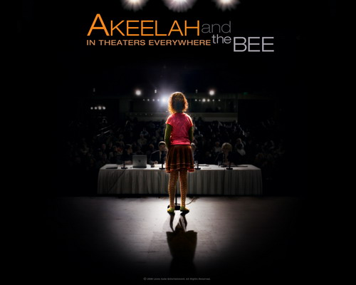

aka [**Akeelah And The Bee**](http://www.akeelahandthebee.com/), 아킬라 앤 더 비

<!-- truncate -->

- 철자 맞추기 대회 (spelling bee)에 대한 이야기가 늘어지지는 않을까 하는 우려는 모두 안녕~ 이야기의 진행이 이런 류 (학생 스포츠 영화, 성장영화)의 영화와 크게 다르지는 않지만 전체적으로 재치있고 감동적인 영화였다. 영화가 전달하는 메시지도 단조롭지 않다.

- 프로듀서로도 참여한 로렌스 피쉬번은 마치 <매트릭스> 시리즈의 모피어스와도 같았다. 물론 배경도, 장르도 완전히 다른 이야기이지만. 완벽하지는 않지만 유능하고 절제된 지도자의 모습.

- 여러모로 아킬라를 도와주고 먼저 손을 내미는 자비에라는 캐릭터를 보며, '집에 돈도 많고, 성격도 좋고, 재치있고, 똑똑하고… 이거 완전 [**엄마 친구 아들**](http://comicmall.naver.com/webtoon.do?m=detail&contentId=15441&no=9&pageNo=11)이구나.' 싶었다 ;;;

- 철자 맞추기 대회도 일종의 스포츠라고 볼 때 (실제로 마지막 라운드를 ESPN에서 방송하니 그리 엉뚱한 생각은 아닌 듯), 최근에 본 영화 중에서 <프라이데이 나잇 라이트> (Friday Night Lights, 2004)가 잠시 생각났다. 경제적으로 풍요롭지 못한 마을 사람들이 대회에 나가는 젊은이(들)에게 갖는 기대감과 부담감이라는 소재가 <아키라 앤 더 비>에서도 (비교적 가볍게) 사용된다.

 - (스포일러) 주인공 아킬라와 자비에가 짝을 이루고 딜런과 우승을 다투는 대결 구도를 이루며 극이 진행되어 가다가 마지막에 아킬라와 딜런이 공감대를 이루며 함께 노력하는 구도로 변화되는 게 재밌었다.

- 스타벅스 엔터테인먼트에서 처음 제작하는 영화. [라이온스 게이트](http://www.lionsgate.com/)가 스타벅스와 파트너쉽 계약을 채결해서, 미국의 스타벅스 매장에서 대대적으로 홍보가 된 영화. 영화 도중 스타벅스 PPL이 단 한 건도 나오지 않아서 오히려 신기해 했다.

- 평상시 스타벅스의 음악 선곡 능력이 좋다고 생각하기 때문인지 몰라도 이 영화의 음악들도 좋았다.

**내 맘대로 trivia**

왜 철자 맞추기 대회가 spelling bee일까. [위키피디아에서 찾아보니](http://en.wikipedia.org/wiki/Spelling_bee) 확실치는 않다고 한다. 하지만 예전부터 어떤 특정한 행동을 위한 사회적 모임이나 회합 등에 bee라는 단어가 쓰였다고 한다. (마치 벌들이 단체 생활을 이루며 살아가듯이 사람들도 어떤 목적을 위헤 모이니 벌과 비슷하게 보였나보다) 기록으로는 1825년에 처음 spelling bee라는 단어가 쓰였다고.

미국의 The United States National Spelling Bee는 1925년에 처음 열렸고, 1941년 Scripps Howard News Service라는 회사가 이 대회의 스폰서가 되면서부터 Scripps Howard National Spelling Bee 라는 이름으로 굳어졌다고.

2006년 대회 우승자는 현금을 포함해 $42,500 상당의 상품을 받았으며 우승 단어는 Ursprache 이다. 이 단어의 뜻은 조어 (祖語, protolanguage) 즉, '하나의 언어가 시간이 흐름에 따라 분열, 장기간에 걸쳐 둘 이상의 서로 다른 언어로 분화되었을 때 그 근원이 되는 언어를 이르는 말'이라고 한다.

연도별 우승 단어와 우승자 등에 대해 알고 싶으면 역시 위키피디아의 [**Scripps National Spelling Bee - Champions and winning words**](http://en.wikipedia.org/wiki/Scripps_National_Spelling_Bee#Champions_and_winning_words)를 보면 된다.

- http://imdb.com/title/tt0437800/
- http://movie.naver.com/movie/bi/mi/basic.nhn?code=58201/
- http://www.rottentomatoes.com/m/akeelah_and_the_bee/

**사운드트랙 리스트**

1. Aaron Zigman - "A.K.E.E.L.A.H."
2. The Spinners - "Rubberband Man"
3. The Staple Singers - "Respect Yourself" [**[듣기]**](http://blog.naver.com/dhd315/29658391)
4. Jackson 5 - "ABC" [**[듣기]**](http://blog.naver.com/keyhan2002/10002119138) [**[라이브 버전 보기]**](http://blog.naver.com/10040o0/80032182073)
5. Al Green - "L.O.V.E. (Love)"
6. Curtis Mayfield And The Impressions - "People Get Ready" [**[듣기]**](http://blog.naver.com/india0arie/100018021864)
7. Brothers Johnson - "STOMP" [**[듣기]**](http://blog.naver.com/izimbra/20006723219)
8. Aretha Franklin - "Respect" [**[듣기]**](http://blog.naver.com/shjheric/100020727854)
9. Harold Melvin and the Bluenotes - "Wake Up Everybody" [**[듣기]**](http://blog.naver.com/walker33/60020954688)
10. Aaron Zigman - "Prestidigitation"
11. Keke Palmer - "All My Girlz" [**[뮤직비디오 보기]**](http://blog.naver.com/wayson/80024331490)
12. Heather Small - "Proud" [**[듣기]**](http://blog.naver.com/rainsy7/20007775666)
13. Aaron Zigman - "Scrabble 1"
14. RES - "To Empower"
15. Aaron Zigman - "Scrabble 2"
16. Erica Rivera - "Let Your Baby Go"
