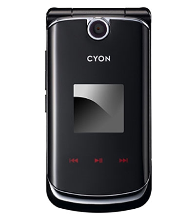
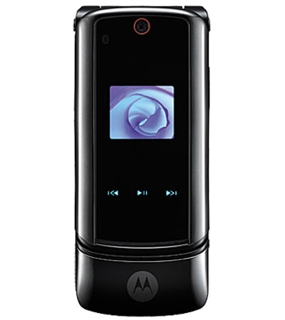
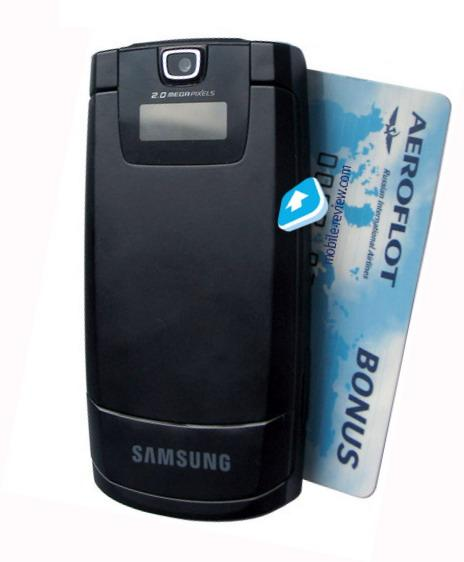

 LG KV2300

<!-- truncate -->

 모토로라 Krazr

 삼성 D830

[**모토 크레이저, LG폰 베꼈다 ?**](http://news.media.daum.net/economic/industry/200610/02/munhwa/v14233356.html) 라는 기사가 있던데, 사진으로 보니 마지막에 모토로라 마크 있는 부분을 빼면 정말 비슷하네. 삼성 폰도 비슷한 컨셉인데 불룩한 느낌이고. (왜 삼성폰은 저 바가지스러운 불룩함을 끝내 유지하는 걸까?)

그런데, 개인적으로 이런 기사는 결국엔 오히려 모토로라에 도움이 되는 기사가 아닌가 싶다.

참고로 삼성 핸드폰 사진은 [모바일-리뷰닷컴](http://mobile-review.com/)에서 가져와서 돌렸다.
