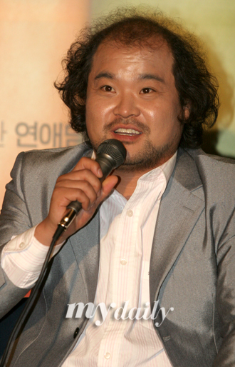

여기 저기서 평들이 많을 뿐더러 대부분 그 평들에 공감이 간다. 일단 '추석 화제작' 자리를 점한 듯 싶다.

<!-- truncate -->

- '능숙한 이야기꾼'으로 추앙(^^)받는 최동훈 감독에 비하면 이야기의 흐름이 그리 매끄럽지 못했다. 특히 화란 (이수경 분)과의 로맨스는 곽철용과 정마담 양쪽에 효과적으로 작용하는 요소이긴 했으나 시작과 끝이 좀 어설펐다고나 할까? 그래서, 감독이 인터뷰에서 내용보다 캐릭터에 중점을 둔 영화라고 한 건가?

딴지는 아니지만, 갓 데뷔작을 낸 최동훈 감독을 '능숙한 이야기꾼'이라고 모두 인정했던 게 예전부터 좀 이상했다. 물론 <범죄의 재구성>이 장르적으로 잘 만들어진 작품인 건 사실이지만.

- 전체적으로 매우 숨가쁘게 진행되었지만 화란과의 이야기가 아무래도 위에 이야기한 것과 같다보니 중부반부에는 조금 늘어지는 느낌이 들었다. 반대로 이야기하자면 그 잠시를 제외하고는 2시간이 넘는 시간이 전혀 길게 느껴지지 않았다.

- 실제로 원작 만화의 1부를 영화화 했지만 대사는 2, 3부에서 빌려온 것들도 있다.

- 김혜수의 연기는 참 좋았다. 하지만 몇 장면에서는 좀 아슬아슬했다. 예전과 같이 어설픈 연기가 나올 듯 한 장면들이 느껴졌다는 뜻. 그렇게 느낌과 거의 동시에 예전부터 들었던 공상이 떠올랐다. "김혜수의 아름다운 외모가 (혹은 좋은 성격이) 촬영 현장에서 감독들을 현혹시키는 것이 아닐까? 연기에 대한 제대로 된 판단을 못할 정도로 미를 발산하기 때문일까?" 말도 안되는 공상이지만 만약 사실이라면 최동훈 감독은 그 유혹을 힘들게 이겨낸 듯 싶다. :) 앞으로도 김혜수를 영화 속에서 잘 써먹는 감독이 많았으면 좋겠다.

- 19세 이상 관람가라는 게 대박 흥행이라는 관점에서는 약점이겠지만, 그래도 그 몇몇 장면들이 이야기에 설득력을 준 면이 있다고 생각한다.

- 음악은 노골적으로 예전 스타일로 편곡되었다. 흥미로운 건 들으면서 편곡 스타일이 80년대 초반 정도라고 생각했는데, 실제 영상과 붙어서 느껴지는 전체적인 공간감은 그 보다 훨씬 이전 - 6,70년 정도로 느껴졌다는 것이다. 음악의 그 활용적인 측면에 있어서 **<사생결단>**이 생각났다. 물론 영화 속에서 쓰이는 방법은 상당히 다르다.

- 박무석 역의 김상호라는 배우, 인상이 좋다. <범죄의 재구성>에도 휘발유라는 역으로 나왔었는데 요즘 여기저기 많이 출연하는 듯 하다. 앞으로도 좋은 영화에서 많이 봤으면 좋겠다. :)

- 그리고 다들 말하는 아귀 역의 김윤석. 요즘 말로 보면서 **덜덜덜** 했다. <천하장사 마돈나>에도 나왔다는데 안봐서 모르겠고, 딱 한편 봤음에도 앞으로 주목해야 할 배우가 아닐까 싶은 생각이 들 정도로 포스가 장난 아니었다.

- 이상하게 제목이 <짝패>와 헷갈린다. 방금도 영화 정보 찾느라 검색하는데 '짝패'라고 치고는 '이상하다?' 싶었다.

<범죄의 재구성> 느낌이 났다.

- http://movie.naver.com/movie/bi/mi/basic.nhn?code=57723
- http://kmdb.or.kr/movie/md_basic.asp?nation=K&p_dataid=07435
