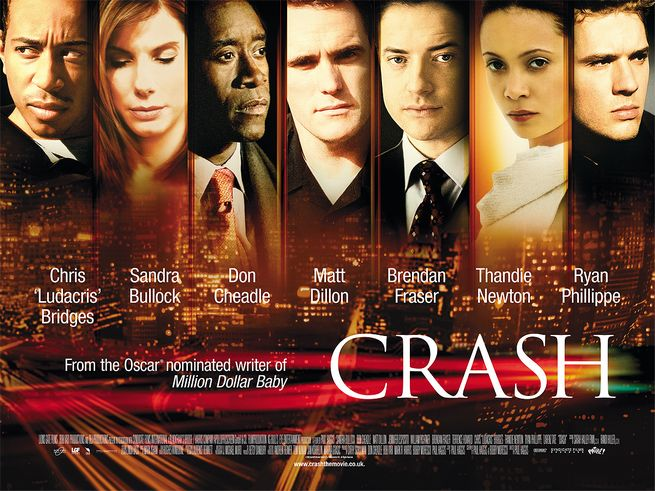

aka Crash

작년 말 영화 <크래쉬> (Crash)를 보고 적어 뒀던 메모.

<!-- truncate -->

이 영화를 괜찮게 봤으면서도 끝내 불편한 느낌이 남았던 이유는 딱 한가지, 다음과 같은 내용들 때문이었다.

남편이 보는 앞에서 흑인 부인을 성추행한 그 건장한 백인 경찰 (멧 딜런 분)이 끝내는 그 여성의 목숨을 사고 현장에서 구하고 생명의 은인이 된다는 것과 말 (영어)도 못하면서 불법이주를 감행한 동양인들을 흑인 불량배가 풀어준다는 내용, 그리고 어리석은 아랍계 상점 주인.

실제로 이 영화는 각종 인종들이 뒤범벅되어 사는 미국 사회의 단편을 보여주고 있다. 누구에게나 나름대로의 결점과 상처를 가지고 살아가며, 그에 따르는 영향을 받으며 살아간다. 서로 이해하지 못하는 그 사정들 때문에 서로 부딪히기도 피하기도 힌다. 이 영화는 그런 이야기이다. 세상은, 영화의 마지막 장면의 접촉사고처럼 의도하지 않아도 부딪히는 많은 사람들이 모여서 사는 것 아니냐는 이야기.

그럼에도 나는 위와 같은 애피소드들에는 여전히 불편하다. 왜 그럴까? 혹시 내 마음 속에는 백인을 역차별 하고 있는 것인가? 하는 생각도 들었다. 이미 구조가 만들어낸 편견과 차별을 개개인의 책임만으로 돌리는 건 부당한 판단이라고 생각하기 때문이다.

하지만, 어차피 저들은 가상의 인물이고, 영화는 누군가의 의도로 기획되고 구성된 것이므로 난 그냥 불편해 하기로 했다. 미국에서 벌어지는 많은 아이러닉한 이야기들 중에 굳이 백인이 흑인을 구해내고, 흑인이 동양인을 용서하는 이야기들을 골랐다는 것이 지금의 현실을 적절하게 반영했다고 생각되어서 이 영화의 솔직함이 맘에 들었고 그래서 적당히 불편해 하기로 했다.

- http://imdb.com/title/tt0375679/
- http://movie.naver.com/movie/bi/mi/basic.nhn?code=39840
- http://www.rottentomatoes.com/m/1144992-crash/
