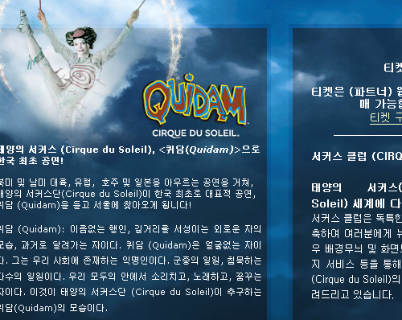

얼마 전부터 자꾸 태양의 서커스 (Cirque du Soleil)의 <Quidam> 한국 공연이 임박한 듯한 이야기들이 들린다. 한글판 페이지도 열렸고. (아직 구체적인 페이지들은 없지만)

<!-- truncate -->

찾아보니 내년 3월부터 6월 초까지 70일간 78회 공연한다고 한다. 이 한국 공연은 노라 존스, 리사 오노 등 내한공연을 기획했던 [마스트 미디어](http://www.mastmedia.co.kr/)가 맡고 [SBS](http://www.sbs.co.kr/)도 참여한다고 한다. 제작비는 150억원대, 배우와 스태프들은 전부 70여명. 공연 장소로 한강 둔치와 성남 탄천 둔치, 혹은 올림픽 경기장 부근 등이 거론되고 있다고 한다.

호주에 있을 때 내가 지내던 곳에서 태양의 서커스가 공연을 했었는데, 당시 돈도 없고 함께 갈 사람도 마땅치 않아서 무리하지 말아야겠다는 생각에 가지 않았던 적이 있다. 물론 그러고 나서 몇달을 후회했다 - 결국 <라이온 킹>을 보긴 했지만. 이번엔 보고 싶다. 그 때 놓쳤던 공연도 <Quidam> 이었다.

내년 3월. 벌써부터 두근두근. 이번엔 놓치지 않으리 !

https://www.youtube.com/watch?v=pwnQUJ_AfVo
Quidam Trailer

p.s. 유튜브에서 [**Cirque Du Soleil 로 검색**](http://youtube.com/results?search_query=Cirque+Du+Soleil&search=Search)하면 <Quidam> 를 비롯해서 많은 영상을 볼 수 있다.

---

**태양의 서커스 (Cirque Du Soleil)**

'태양의 서커스'는 캐나다 퀘벡주 몬트리올에 본부를 두고 있는 단체로 체조, 무용, 연극, 음악 등을 총망라한 극적인 서커스를 보여주고 있다. 1984년 창단된 이래 130여 개의 도시에서 순회공연을 펼쳤으며 에미상, Drama Desk, Ace, Felix 등 각종 상을 휩쓸었다. 창단 20여년 만에 연매출 5억달러(약 4860억원)를 올리는 거대 엔터테인먼트 그룹으로 초고속 성장, 블루 오션의 대표적인 성공 사례로 꼽힌다. 지금껏 전세계 120여개 도시에서 4300여만명의 관객이 이들의 서커스 공연을 관람했다.

'태양의 서커스'의 가장 큰 특징은 동물을 배제하고 인간의 신체를 최대한 이용한다는 것이다. 거기에 연극, 음악, 조명, 분장 등이 어우러져 미학적인 수준을 극대화시킴으로써 단순한 여흥이나 재미로만 여겨지던 서커스의 개념을 무너뜨렸다. 이들의 공연은 한마디로 무용, 춤, 체조, 음악, 연극, 마임 등이 한데 어우러진 크로스오버를 표방한다. 서커스 고유의 진기한 묘기가 있는가 하면 웬만한 뮤지컬 뺨치는 정교한 춤과 노래가 있고 문학적 은유와 시적 운율, 철학을 지니고 있다.

'태양의 서커스'는 괴짜 캐나다 청년에 의해 만들어졌다. 캐나다 퀘백주 동부 베이생폴이란 작은 마을에 살고 있던 기 라리베르테 (현 최고경영자)는 서커스에 관심이 많은, 평범한 20대 초반의 청년이었다. 그는 어릴 때부터 호기심과 모험심으로 똘똘 뭉쳐 있었다. 14살 때 아코디언 연주자가 되고 싶어 가출을 하기도 했고, 18세엔 홀로 유럽으로 건너가 거리를 헤매며 입으로 불을 뿜는 기술을 배우기도 했다.

그는 뛰어난 서커스 기술은 없었지만 동물이 나오고 광대가 춤추는, 지금까지 익숙한 서커스와 는 다른 걸 하고 싶었다. 극작가 다니엘 고티에를 비롯, 아코디언 연주자, 저글링 고수, 바이올리니스트 등을 쭉 끌어 모아 '하이힐 클럽'이란 조직을 만들었다. 거리 공연은 뜻밖에도 대박을 터뜨렸다. 미국과 유럽에 비해 마땅한 문화 상품이 없던 캐나다 정부로선 이 '특이한 서커스'에 관심을 가졌고, 무려 100만달러란 재정 지원을 쏟아 부어 84년 '태양의 서커스'가 만들어졌다.

설립 당시 73명이었던 단원은 현재 3000명을 넘어섰다. 체조 선수 출신 연기자들만 700여명에 달한다. 슬럼이었던 몬트리올 북동쪽 생미셸 지구는 태양의 서커스 본부 '토후', 국립 서커스 학교 등이 들어서면서 현재 세계 서커스의 메카로 변모했다. 태양의 서커스는 '상설'과 '순회' 두 가지 방식으로 운영된다. 미국 플로리다 월트디즈니 리조트와 라스베이거스 주요 호텔 4곳에서는 93년부터 상설 공연을 하고 있다. 라스베이거스 공연의 경우 하루 평균 1만여명이 관람한다. 순회 공연은 세계 주요 도시를 돌며 평균 2~3개월 동안 진행된다.

이상 여러 신문기사에서 발췌

**관련 링크**

- [태양의 서커스 (Cirque du Soleil) 홈페이지](http://www.cirquedusoleil.com) (한글 페이지로 연결)
- [태양의 서커스 (Cirque du Soleil) 홈페이지](http://www.cirquedusoleil.com/CirqueDuSoleil/en) (영문)
- [굿데이 - 비틀스 소재 작품 선보인 '태양의 서커스'](http://news.goodday.co.kr/2006/07/12/200607120755553300.shtml)
- [**유튜브 동영상 : Gala Premiere of The Beatles' LOVE part 1**](http://www.youtube.com/watch?v=dKcqTkPqOJQ) **(추천)**
- [**유튜브 동영상 : Gala Premiere of The Beatles' LOVE part 2**](http://www.youtube.com/watch?v=GslifEaDTwI) **(추천)**
- [도깨비뉴스 - 환상 태양의 서커스](http://www.dkbnews.com/bbs/zboard.php?id=coolmovie&no=1781&p_page=14&p_choice=&p_item=&code=) (알레그리아 (Alegria) 관련)
- [김성준 특파원의 <포토맥 강가에서> - Cirque du soleil 서커스도 돈을 벌 수 있다](http://ublog.sbs.co.kr/forumjoon?targetBlog=11665)
- [Yes24.com - 태양의 서커스 관련 상품들](http://www.yes24.com/searchCenter/searchResult.aspx?keywordAd=&qdomain=%C0%FC%C3%BC&query=%C5%C2%BE%E7%C0%C7+%BC%AD%C4%BF%BD%BA&x=0&y=0)
