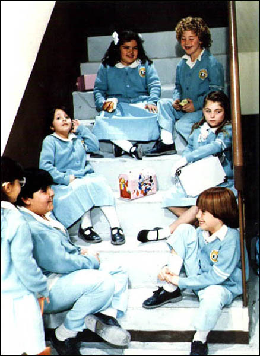

예전에 자주 보았던 [<천사들의 합창> (Carrusel)](http://www.imdb.com/title/tt0170885/) 등장인물들의 요즘 모습이라고 합니다.

<!-- truncate -->

다만 스페인어를 모르니 무슨 말을 하는지 전혀 모르겠다는 거;;; 제일 놀라운 건 마리오의 저 핸섬한 모습! 다른 사람들도 대체적으로 알아볼 수 있다는 게 참 신기하군요. 히메나 선생님은 살이 조금 찌셨지만 여전히 예쁘시군요. :) (게다가 나이 들면 살찌는 게 어느 정도 당연하다는 거; )

다들 아시다시피, <천사들의 합창>은 멕시코의 평범한 학교를 배경으로 외모뿐만 아니라 마음 씀씀이도 천사 같은 히메나 선생님과 파블로, 마리오, 하이메, 시릴로, 라우라, 마리아 호아키나, 카르멘, 다비드 등 여러 아이들의 따뜻한 일상을 담고 있는 작품이지요. 원제목인 Carrusel은 스페인어로 회전목마라는 뜻이라고 합니다. 우리나라에서는 [KBS에서 방영](http://www.kbs.co.kr/2tv/enter/specialmovie/list/movieinfo.html?uid=111&catesection=10)했었고 전세계적으로도 히트한 작품이라고 하네요.

화질은 상당히 좋지 않지만 <천사들의 합창> 영상도 있습니다. 예전의 영상을 지금 봐도 묘한 향수를 떠올리게 만드는군요. 아아- 기억나요. :)

https://www.youtube.com/watch?v=XqAqND5O838
<천사들의 합창> 인트로

https://www.youtube.com/watch?v=-OEaXPlucyc
<천사들의 합창> 시즌 2 놀라운 기적 (마지막편) (더빙)

**관련 링크**

- [천사들의 합창 음악 듣기 & 여러 사진들 보기](http://www.patrickducaud.com/ver6_1/angel.htm)
- [엠파스 리뷰 - 천사들의 합창](http://review.empas.com/review/artdesc_list.html?artsn=8412808&descsn=1&p=1&ls=l&pq=psn%3D2209)
- [오마이뉴스 - 눈을 보고 떠올린 '천사들의 합창'](http://life.ohmynews.com/articleview/article_view.asp?at_code=172914)
