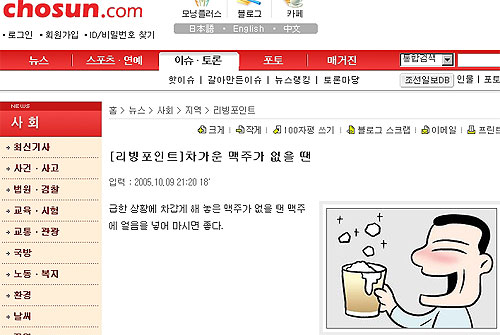

수많은 사실들을 조작, 왜곡을 서슴치 않으며 수많은 사람들을 낚아대던 조선일보. 아무리 봐도 요즘은 해외로 눈을 돌린 듯 싶다. 솔직히 과거사를 왜곡 보도 하거나 사회 곳곳에 편파적인 시각과 잣대를 들이대며 권력을 휘둘러왔다는 사실도 이젠 대중들에게도 상당히 알려진 상태.

<!-- truncate -->

**관련 링크**

- [서명덕 기자의 人터넷 세상 - '차가운 맥주' 조선일보 유머 아닌 듯](http://itviewpoint.com/tt/index.php?pl=784)
- [삼돌이세상 - 조선일보의 리빙포인트](http://www.niliri.com/blog/19)
- [√ MIRiyA's AstraLog - 조선일보 리빙포인트 뜰것같다.](http://blog.daum.net/miriya/9645828)

이 위기를 타개하기 위해 [**[리빙 포인트 시리즈]**](http://search.chosun.com/news/search_news.asp?keyword=%B8%AE%BA%F9%C6%F7%C0%CE%C6%AE&order=DATE&sort_order=1)를 승부수로 띄웠으나 제대로 먹히지 않은데 충격을 받고 그 강도를 높이고 있는 게 아닐까 생각해본다. 그리하여 그들은 해외시장 공략에 나선다.

---

**1** **불안은 성욕을 자극한다?**

북핵실험 이후 사람들은 불안함을 느끼고, 이는 성욕을 자극하여 콘돔 판매가 늘어나고 있다는 명쾌한 삼단논법을 주장하고 있다. 아아… 이 명쾌함이란. 그런데, 이 놀랍고도 획기적인 기사는 스페인의 주요 일간지 La Vanguardia지에 인용이 되었다고 한다. 세계의 유명 일간지에서 인용되는 우리의 조선일보!

> (전략)
>
> 또한 러브호텔들도 성업중이다.
> 한 유명한 러브호텔 예약 사이트는 첫 핵위기 이후에 예약이 급증했고
> 한 달 내내 100%의 객실 점유율을 기록했다고 밝혔다.
>
> 이 수치가 중요한 것은
> 남한에서는 러브호텔이 넓게 퍼져있고
> 모든 사람들이 이용하는 곳이라는 사실이다.
> 남한은 세계에서도 가장 인구밀도가 높다는 사실을 주지하여야 한다.
> 그들은 많은 수의 가족들이 한 집에 살기도 하기 때문에
> 러브호텔들은 커플들의 은밀한 만남을 위해 은밀한 피난처를 제공한다.
>
> 위와 같은 자료를 **분석**한 남한의 신문사인 조선일보에 의하면
> 이러한 변화는 불안이 고조될 때 일어나... 어찌고 저찌고...(안 보임)
>
> (후략)
>
> 출처 : [행복한 ogisa](http://blog.naver.com/nifilwag/100030159334)

분석, 분석… 분석이래. ㅠ.ㅠ

**관련 링크**

- [조선일보 - 불안은 성욕을 자극한다?](http://www.chosun.com/national/news/200610/200610260075.html)
- [은파 - ♣조선일보의신개념 "콘돔대박"코미디♣ (한토마)](http://bbs2.hani.co.kr/board/ns_society/Contents.asp?STable=NSP_005000000&Idx=33183&Search=&Text=&GoToPage=&Sorting=&RNo=27821)

---

**2** **美는 많은 전쟁 한 나라, 전쟁나면 피해자는 한국**

지난달 송민순 청와대 외교안보실장의 발언을 앞두 맥락을 잘라내고 기사화를 시켰는데, 이 기사 때문에 도널드 럼즈펠드 미 국방장관은 불쾌감을 표시했고, 급기야 청와대는 송실장 발언의 원본과 영어 번역본을 미국에 전달해서 미국측으로부터 별 문제 없는 발언이라는 답변을 얻었다는 것.

어설프게 힘없는 우리나라 국민과 네티즌 몇몇을 낚기 보다는 저기 멀리 파워있는 대어를 직접 자신들의 손으로 낚겠다는 이 놀라운 의지는 정말 대단하다. 안그래도 한나라당이 집권하면 부시와 짝짝꿍하며 전쟁낼 것 같아 무서워 죽겠는데, 벌써부터 조선일보가 이렇게 손발 거들어주며 낚시질을 해대면 어떻게 살지? 흑흑.

**관련 링크**

- [한겨레 - 조선일보 ‘맥락무시 보도’에 미국도 낚였나?](http://www.hani.co.kr/arti/politics/politics_general/169462.html)

---

**보너스** **한국 정부와 미국 정부 사이를 이간질?**

사실 조선일보는 예전부터 한국 정부와 미국 정부의 사이를 이간질시키는 듯한 기사들을 많이 선보였다. 작통권 환수 때 삽질한 것도 잊은 채 최근에는 고의적으로 두 정부의 불협화음을 부추기기도 했는데, 한겨레 신문을 인용하자면 이런 식이다.

> 부시 대통령은 11일 핵실험에 성공했다는 북한 선언과 관련, “우방과 미국의 국익을 지키기 위해 모든 방법을 강구할 것이지만, 북한을 침공할 의사는 없다”며 기자회견에서 공개적으로 중국과 한국, 일본, 러시아가 북한 핵실험을 강력히 비난한 데 대해 고마움을 표시했다.
>
> 하지만 부시가 한국에 고마움을 표시한 이 부분이 12일자 조선일보 기사에서는 빠졌다. 조선은 이날 1면과 3면에 이 내용의 기사를 실었다. 조선일보는 “군사대응 이전에 외교적 해결할 것”이라는 제목으로 부시 기자회견 문답내용까지 실으며 “중국·러시아·일본 지도자들은 북한의 핵실험을 강력히 규탄했다. 그들의 동참에 감사한다”고 보도, 부시가 언급한 나라들 가운데 ‘한국’만 슬그머니 빼 북핵사태와 관련해 한국과 미국 사이에 ‘불협화음’이 있는 것처럼 보도했다.
>
> 출처 : [한겨레](http://www.hani.co.kr/arti/society/media/165356.html)

이제 우리나라에 영어 잘하는 사람들도 많고 인터넷으로 찾을 수 있는 정보도 많다는 사실을 조선일보는 아직도 모르나보다. 한편으로 어설프게 작문, 번역하고 돈 받는 기자들이 부럽다. 크흑.

**관련 링크**

- [한겨레 - 조선일보, 부시대통령 발언 ‘왜곡보도’ 의도 논란](http://www.hani.co.kr/arti/society/media/165356.html)
- [[신문 분석] 조선 · 동아, 한미 정상회담 '성과' 외면 '폄하' 급급](http://korea.kr/newsWeb/pages/brief/categoryNews/view.do;jsessionid=V7QjFLTfT5dFF27vKmyNt1jBQL3jymyy2FnMp0vJndQh921tnvn5!747776385?newsDataId=105082392&category_id=p_mini_news&netporterSectionId=&out_site_id=&currPage=)
