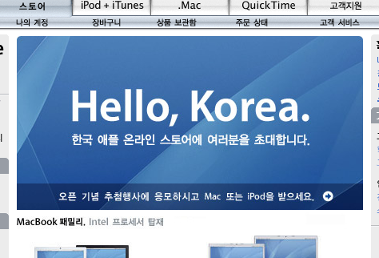

애플 코리아에서 운영하던 온라인 스토어가 애플 본사쪽 서버를 이용한 상점으로 정식 오픈 되었다.

<!-- truncate -->

http://store.apple.com/080-3404-622/WebObjects/koreastore

디렉토리명에 전화번호가 들어가는 게 재밌네;

나야 맥 유저도 아니고 그 쪽에 대한 정보가 밝지도 않지만 내가 생각하는 이 정식 오픈의 의미는 딱 두 가지이다.

**첫째**, 이거 정말 중요한 건데 **액티브엑스 (ActiveX) 없이도 인터넷 쇼핑이 가능해졌다는 점**. 무통장 입금 같은 방법이 아니라 신용카드로 결제해도 별다는 설치 프로그램 없이 물품의 구매가 가능하다는 것이다.

정말 대단한 거 아닌가? MS 윈도를 사용하지 않아도 인터넷 익스플로러를 사용하지 않아도 물건을 구입할 수 있는 것이다. 우리나라의 대규모 온라인 쇼핑 업체들 중에서 (중소업체들을 포함해서도) 첫번째가 아닌가 싶다. (아직도 바보 같은 우리의 정통부는 액티브엑스 사용을 은근히 부추기고 있는데 말이다.) 왠지 애플 제품들의 국내 판매율이 서서히 올라갈 듯 싶다.

**둘째**, **BTO가 가능해졌다는 점**. BTO란 Built To Order의 약자로 **'맞춤형 주문'**을 의미한다. 우리나라 구매자들도 아이팟에 무료로 글자를 새긴다거나 (engraving) 구입할 때 부품의 사양을 지정하는 게 가능해졌다는 이야기. (향후 프로그램들도 **수준 이상의** 로컬라이제이션이 이루어질까? 이제껏 고객들에게 똥배짱을 튕기던 애플 코리아가 달라질지도 궁금해진다.)

꽉 막힌 전자정부, 꽁꽁 닫힌 웹페이지 - 문 좀 열어줘!
첫번째 의미의 경우엔 아직 애플의 물건을 살 예정도 없으면서도 내 속이 다 시원한 느낌이다. [**오픈웹**](http://openweb.or.kr)에도 좋은 영향을 끼쳤으면 하는 바램.

**관련 링크**

[▶ **Open Web - 오픈웹 소개**](http://open.unfix.net/about/)

[▶ 전자신문 - 공인인증서 없으면 '공인받은 넷맹'된다](http://news.media.daum.net/edition/it_sci/200510/28/etimesi/v10618647.html) (이미 오래 전에 완료된 사안. 입으로는 불경기 불경기 하면서 우리나라 쇼핑몰들은 외국인들에게는 아무리 원해도 안판다 이거지. 한글 윈도 사용 안하면, 인터넷 익스플로러 사용 안하면 돈 쓰겠다는데도 안 받겠다 이거지. 쇄국정책이 별건가.)

[▶ Glamorous days - 전자사전 구매 실패](http://outback.egloos.com/2529165) (솔직히 이런 일은 비일비재…)

앞으로 IE7에서는 액티브엑스를 사용하지 않는다고 하던데, 어떻게 될지 궁금하다, 정말.
