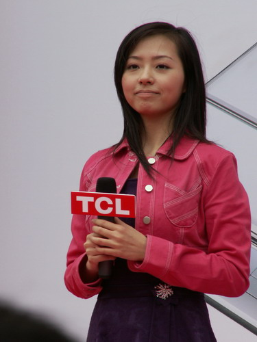

aka Jane Zhang  

<!-- truncate -->

  
장쯔이 주연의 영화 **야연 (夜宴, The Banquet)**의 주제곡 '我用所有報答愛'을 부른 장량잉은 2005년 후난(湖南) TV의 슈퍼 보이스 걸 (超級女聲) 컨테스트에서 3위에 올라 단숨에 전국적 인기를 얻었다고 한다. 이 프로에서 주로 영어권 노래들을 불렀는데, 그래서 2008년 베이징 올림픽에 사용되는 곡을 부를 가수로 선택되기도 했다고.  
  
또한 드라마 "신조협려 (神鵰俠侶)" (~~2006~~2003)의 주제가 "天下無雙"을 불러 많은 사랑을 받았다.  
  
  
張靚穎 - 我用所有報答愛 (라이브)  
  
  
張靚穎 - 天下無雙 (드라마 神鵰俠侶 중에서)  
  
  
張靚穎 - Loving You  
  
  
張靚穎 - What's Up  
  
  
張靚穎 - Hero  
(유튜브에 이 곡 말고도 머라이어 캐리 곡을 부른 영상들이 좀 있군요.)  
  
  
張靚穎 - Don't Cry For Me Argentina  
  
  
張靚穎 - How Do I Live  
  
  
張靚穎 - Open Up Your Dreams  
(베이징 올림픽 주제곡은 [One World One Dream](http://www.youtube.com/watch?v=DOvSkSgtTXI) ?)
