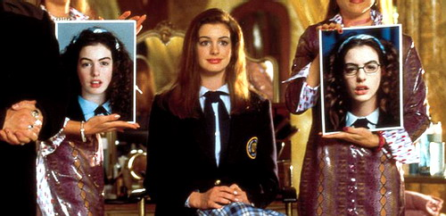
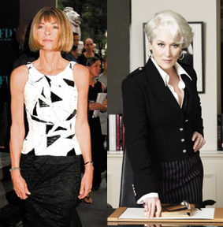
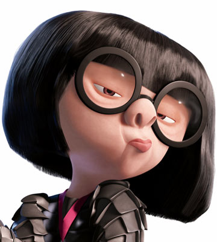
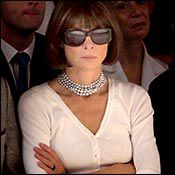

aka The Devil Wears Prada

<!-- truncate -->

**원작**

원작 소설을 읽지 않았는데, 몇몇 글을 읽어보니 책 속 화자의 "꼬장꼬장함"이 만만치 않은가 보다. 우선 이 영화는 동명의 소설을 원작으로 하고 있는데 한마디로 내용은 소설의 저자인 로렌 와이스버거가 보그 패션잡지사인 보그 (Vogue)에서 안나 윈투어 (Anna Wintour)의 어시스턴트로 일하면서 얻은 경험을 바탕으로 쓴 것이다.

그런데, 내용이 패션업계를, 보그를, 안나 윈투어를 그리 호의적으로 그리지 않았나 보지? 하긴, 제목부터 프라다를 입는 악마라니… 게다가 몇몇 평론가들도 '자신의 상사를 왜 존경해야 하는지도 모르는' 원작의 저자를 호의적으로 평가하지 않았다는 걸 보면 말이다.

**영화**

그렇지만 영화는 원작하고는 그 매무새가 살짝 다른 듯 싶다. 영화 속 주인공 앤드리아 삭스 (앤 해서웨이 분)의 이야기를 따라가다 보면 일단 제목의 강한 뉘앙스는 별 게 아니라는 생각이 든다. 영화 속 자신의 보스 미란다 (메릴 스트립 분)에 대한 적대감도 거의 드러나지 않는다. 오히려 교훈적인 분위기까지 풍긴다.

게다가 실제로 이 영화의 내용은 거의 '전래동화' 수준이다. 내용을 요약하면 대충 이렇다.

---

스포일러 alert

---

청운의 꿈을 안고 도시로 나온 한 소녀는 취직을 하고 싶었으나 인터뷰조차 보지 못하고 있다가 우연한 기회에 패션잡지사에 입사하게 된다. 그 곳에서 편집장 미란다의 어시스턴트로 일을 하며 사회의 혹독함을 온 몸으로 느껴가며 힘든 도시 생활을 하게 되는데, 직장에서는 **우연찮게** 우군 (스타일리스트 나이젤)을 만나 공짜로 명품을 얻어 온 몸을 치장하며 변화된 생각을 몸으로 실천하게 되고, 직장 밖에서는 **우연찮게** 우군 (칼럼니스트 크리스찬 톰슨)을 만나 직장에서도 승승장구 할 뿐더러 잠깐의 로맨스도 경험하게 된다. 하지만 결국 치열한 패션업계의 생리가 자신과 맞지 않음을 깨닫고 일 때문에 소흘했던 애인과도 관계 회복을 시도하고, 본래의 꿈인 신문사에 취직을 하게 되는데 취직이 가능한 이유도 알고 보면 자신이 비웃던 그 패션업계의 거물 미란다가 추천서를 써 줬기 때문이다.

영화를 보고 나서 떠오른 생각은 "원작의 저자는 자신의 운이 좋았다는 걸 자랑하고 싶었던 걸까?" 였다. 영화 속에서 표현된 그대로 본다면 외투와 가방을 아무렇게나 던지면 그걸 정리해야 한다는 사실이 조금 기분 나쁠 수는 있겠지만, 그것 말고는 사실 대단한 건 없다. 영화 속에서 발생하는 그런 상황은 여느 집단에서도 충분히 벌어질 만한 정도의 혹독함이다. 게다가 저자의 직책은 바로 어시스턴트 아닌가. 게다가 신입이고 말이지.

게다가 비아냥 거리며 훌훌 털어버리고 나온 그 직장의 상사가 써준 프로의식 가득한 추천서 때문에 ("이 사람은 나를 제일 실망시킨 사람이다. 하지만, 그렇다고 만약 이 사람을 뽑지 않는다면 당신은 멍청이다.") 취직을 하게 된다.

영화를 보면서 소설이 어쨌는지 심히 궁금해졌으나 그냥 묻어두기로 했고, 다만 영화의 마무리가 "섹스 앤 더 시티 (Sex and the City)"의 여느 애피소드와 참 닮았다는 사실을 떠올렸다. 바쁜 현대, 바쁜 도시에서 여러가지 소동을 겪은 후 창가에서 하루를 마무리하는 TV시리즈처럼 이 영화도 1년 동안 신참 커리어 우먼에게 벌어진 소동극이라는 느낌이 들었기 때문이다.

결국 스스로 자신의 경험을 제대로 정리하지 않은 채 끝내는 이 영화의 주인공은 카리스마와 더불어 인간미까지 슬쩍 보여준 미란다 프레슬리 아닐까? 현실에서의 승리자도 저자인 로렌 와이스버거보다는 안나 윈투어가 아닌가 싶다.

**클리셰**

변형된 신데렐라 이야기라는 영화의 주된 골격 말고도 즐겁게 본 클리셰가 하나 더 있는데, 그건 바로 **"원래부터 본판이 예쁜 주인공을 덜 예쁘게 등장시켰다가 어느 계기를 통해 예쁘게 변했다고 주장하는"** 클리셰다. 아니, 내가 볼 땐 처음 나올 때부터 예뻐 보이더구만 뭘. 그렇다고 <내겐 너무 가벼운 그녀> (Shallow Hal)의 기네스 펠트로우처럼 특수분장을 하라는 건 아니지만 그래도 맵시가 조금 덜 드러나는 옷을 입었다고 예쁘지 않다고 하는 건 좀 그렇잖아.

게다가 이건 주인공 역을 맡은 앤 해서웨이 (Anne Hathaway)가 뜬 영화 <프린세스 다이어리> (The Princess Diaries)에서 써 먹은 수법 그대로 아닌가. 아무래도 감독이나 캐스팅 담당자들의 머리 속에도 같은 생각이 들어있었나 보다 싶었다. :)

**대사 #1**

인상적이었던 대사는 매릴 스트립이 연기한 미란다의 입에서 나온다.

> 넌 그냥 네 옷장으로 가서 그 미련스러운 파란색 스웨터를 골라들었겠지. 옷 따위에 신경쓸 틈 없는 진지한 인간이라는 걸 세상에 증명하고 싶어서 말이야. 하지만 네가 모르는 사실은, 그 파란색이 그냥 파란색이 아니라는 거야. 그건 파란색 중에서도 터쿼즈(Turquoise)색이 아니라 정확히는 세룰리언(Cerulean)색이지. 2002년에 오스카 데 라 렌타가 세룰리언색 이브닝 가운을 발표했고, 다음에는 입생로랑이 세룰리언색 군용 재킷을 선보였지. 그러자 세룰리언색은 급속하게 퍼져나가 8명의 다른 컬렉션에서도 등장하기 시작했고, 이후에는 백화점을 거쳐서 네가 옷을 사는 그 끔찍한 캐주얼 코너로 넘어가게 된 거지. 네가 입고 있는 그 파란색은 셀 수 없이 많은 일자리와 수백만달러의 재화를 창출했어. 그러니까 근본적으로 너는 여기 패션계의 사람들이 골라준 색깔의 스웨터를 입고 있는 거야.
>
> 
>
> You go to your closet and you select out, oh I don't know, that lumpy blue sweater, for instance, because you're trying to tell the world that you take yourself too seriously to care about what you put on your back. But what you don't know is that that sweater is not just blue, it's not turquoise, it's actually cerulean. You're also blindly unaware of the fact that in 2002, Oscar De La Renta did a collection of cerulean gowns. And then I think it was Yves St. Laurent, wasn't it, who showed cerulean military jackets? And then cerulean quickly showed up in the collections of 8 different designers. Then it filtered down through the department stores and then trickled on down into some tragic casual corner where you, no doubt, fished it out of some clearance bin. However, that blue represents millions of dollars and countless jobs and so it's sort of comical how you think that you've made a choice that exempts you from the fashion industry when, in fact, you're wearing the sweater that was selected for you by the people in this room. From a pile of stuff.
>
> - 주인공 앤디가 무심코 내뱉은 **stuff**란 단어에 열받은 미란다가 하는 말
> - (한글출처 : [씨네 21](http://www.cine21.com))

**대사 #2**

또 하나의 대사는 의외의 곳에서 나왔다. 영화 속에서 앤디가 스타일리스트 나이젤을 꼬셔서(?) 처음 명품으로 몸을 휘감은 후에 출근을 하니 그의 선배와 친구가 눈이 휘둥그레지는 장면이 나온다. 여기서 선배의 친구가 **"야- 너 참 쉬크 (chic)하다"**는 대사가 나오니 객석 여기저기서 키득키득 하는 소리가 들렸다. (나 역시 키득키득)

웃던 관객들, 다들 인터넷에서는 꽤나 유명하다면 유명한 유행어 **"무심한 듯 쉬크한 XXX"**를 떠올린 모양인데 내가 알기론 이 유행어의 원전은 재밌게도 [**보그** 코리아](http://www.vogue.co.kr/)가 보아와 했던 인터뷰이다. 순간적으로 '아아, 그 인터뷰어, 단어 사용이 제대로 였구나!' 싶은 생각도 잠시 들었다. 그러고 보니 영화 속에서 "머스트 해브 아이템" 이란 말도 나왔던가? 흠흠.

> "정지된 자세에서 루주하게 '뚝' 서 있는 듯한 느낌이었으면 좋겠어."
>
> 보아는 고개를 끄덕이며 다 알고 있다는 듯 말했다.
>
> "모스키노의 인형처럼?"
>
> 순간, 고개를 흔드는 패션 에디터를 본 그녀가 까르르 웃으며 다시 말했다.
>
> "오케이, 알겠어요. 그러니까 앤 드멀미스터의 모델들처럼 말이죠? 무심한 듯 시크하게!"
>
> 하긴, 두 시간 전, 보아는 스튜디오에 들어서자마자 이렇게 외쳤었다.
>
> "아, 지난 5월호 <보그>의 컬렉션 부록은 최고였어요.
>
> 그 풍부한 비주얼과 명료한 텍스트, 깜찍한 사이즈는 바로 내가 바라던 거에요!"
>
> - 잡지 'Vogue' 의 보아 인터뷰 중

**안나 윈투어 vs. 에드나 모드**

그러고 보니 <인크레더블> (The Incredibles)의 그 중성적인 느낌이 나는 수퍼 히어로 의상 디자이너 에드나 모드 (Edna Mode)도 안나 윈투어 (Anna Wintour)를 캐릭터화 시킨 거였는데 당시에는 안나 윈투어가 일반인들에게 이렇게까지 이슈가 되지 않았었지. 하긴, 몇 년 사이에 일어난 변화가 크긴 크다.

에드나 모드

안나 윈투어

참고로 에드나 모드의 목소리 연기는 <인크레더블>의 감독인 브래드 버드가 직접 했다.

**그리고**

아주 찔끔 음악 이야기를 하자면, 영화에 사용된 음악들은 대부분 전자 음악들이었는데, 베이스 라인이 여느 액션 영화에서 사용됨직한 것들인데도 나름대로 어울려서 재밌었다. 아무래도 주인공의 긴박한 사회 생활을 표현하기 위한 것이었겠지.

- http://imdb.com/title/tt0458352/
- http://movie.naver.com/movie/bi/mi/basic.nhn?code=60484/
- http://www.rottentomatoes.com/m/the_devil_wears_prada/

**관련 링크**

- [씨네 21 - <악마는 프라다를 입는다> A to Z](http://www.cine21.com/Article/article_view.php?mm=005001001&article_id=42357) [**[1]**](http://www.cine21.com/Article/article_view.php?mm=005001001&article_id=42357) [**[2]**](http://www.cine21.com/Article/article_view.php?mm=005001001&article_id=42358)
- [프리첼 영화 - 경이의 배우 <악마는 프라다를 입는다>의 메릴 스트립](http://film.freechal.com/m_free/m_f_plan_view.asp?AID=167561)
- [씨네21 - 미워할 수 없는 악녀, <악마는 프라다를 입는다>의 에밀리 블런트](http://www.cine21.com/Article/article_view.php?mm=005002004&article_id=42469)
- [Il Naezza, the Story Designer - 까페 베스트드레서](http://soov.egloos.com/2655542)
- [외계인 교차점 - 패션여성지를 기피하는 이유](http://fruitsmilk.egloos.com/2581371)
