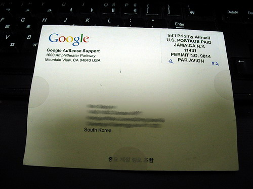
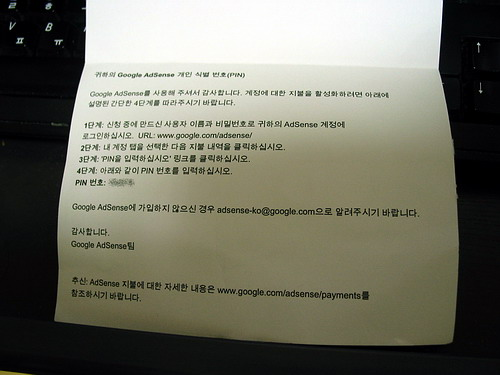

  
  

사실 온지 좀 됐어요. 하지만, 제 블로그에서 클릭해주시는 분들이 상대적으로 적은 편이라(^^) 핀은 왔지만 $100 에 도달하기 까지는 아직도 한참 남았네요. 1년도 넘었는데 $100 채우기가 이렇게 힘이 들다니. ㅠ.ㅠ  

<!-- truncate -->

다른 분들의 **센스**가 참 궁금해요.  
어떻게 그렇게 자알~ 클릭되게 해서 적립하는지 말이죠. (^^)a  
(하긴 댓글도 많이 안달리는 블로그인데 어떻게 보면 당연한 건가요? ^^)  
적절한 노하우가 있으신 분들, 조언해 주시면 감사하겠습니다. (\_ \_)  
  
아직 $100 채우려면 멀었지만, 이거 받으면 호스팅비 제하고 좋은 곳에 쓰려고요. (솔직히 1년도 넘는 호스팅비를 제하면 뭐가 남을까 걱정이 되기도 합니다만, 최대한 좋은 곳에 쓰렵니다.)  
  

**영어 한마디** PIN : Personal Identification Number, 개인 식별 번호
