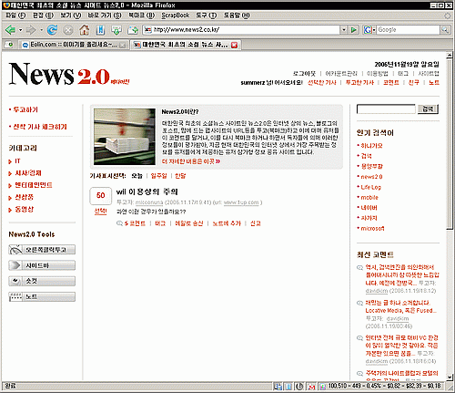

 [**http://www.news2.co.kr**](http://www.news2.co.kr)

<!-- truncate -->

재밌는 시도 같다. 제목에서 2가지가 드러난다. 미디어 지향 + 웹2.0 [**digg.com**](http://digg.com/)에서 많이 본 친숙한 방식.

여러가지 측면에서 좋은 아이디어라고 생각되면서도 **뉴스**라는 사이트명 때문에 링크 시키기 부담스러울 것도 같다.

p.s. 테스트로 내 사이트의 글을 하나 링크시켜봤는데, url 이 잘못 들어가있다. 서비스에서 지원하는 북마크렛으로 링크한 건데. ~~삭제도 안되고 수정도 안된다.~~ 삭제 요청 했더니 삭제가 되었다.
