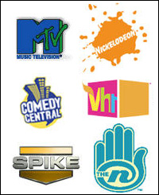

**2006.11.18.** **무한도전, 한국형 쌩얼**
<무한도전>은 한국 시청자가 요구하는 선을 유지하면서 ‘은근슬쩍’ 변화를 주면서 지금의 모습으로까지 발전한 것이다. 지금의 <무한도전>은 겉으로 보기에는 평범한 주말 버라이어티쇼 같지만 실상은 여섯 명의 고정 출연자가 무슨 일을 어떻게 벌일지 모르는 리얼리티쇼이자, 프로그램 이름이 조금씩 바뀔 때마다 콘셉트도 함께 변하는 한국형 시즌제 오락 프로그램이다. 개인적으로 '유재석의 유치한 진탕 코미디'를 좋아하기 때문에 더 재밌게 보는 듯 하다. 유재석은 아무래도 그런 코미디에 대한 애착 같은 게 있는 듯 하다. 일본 TBS의 링컨이나 NTV의 다운타운과 비슷하다는 이야기가 게시판에 있어서 찾아봤는데 한두편만 봐서는 잘 모르겠다. 하지만 '리얼'과 '각본'의 묘한 조합이라는 측면에서 그런 이야기를 한 게 아닐까? 어쨌든 요즘 무한도전, 재밌다.

<!-- truncate -->

[▶ 기사보기](http://h21.hani.co.kr/section-021015000/2006/10/021015000200610260632063.html)

**2006.11.17.** **핀홀 카메라를 다운받으세요.**
핀홀 카메라는 렌즈 대신 조그만 구멍으로 사진을 찍는다. 조그만 구멍을 통해 들어온 빛으로 필름에 이미지를 맺게 하는 원리다. 물론 linatree.com이 제공하는 핀홀 카메라도 조립 후 완성되면 이런 원리로 사진을 찍을 수 있다. 필름은 일포드(Ilford)사의 PAN 필름이나 후지필름의 Neopan 100 또는 35mm 필름을 사용하면 된다. 와- 멋지다. 그래도 DSLR 하나 있었음 싶다. -\_-;

[▶ 받으러가기](http://arisnoba.tistory.com/2630680)

**2006.11.16.** **넥슨, 엄청난 사고를 치다**
넥슨이 선택한 카드는 ‘바이아컴’이었습니다. 국내 게이머들은 ‘바이아컴’에 대해 대부분 모릅니다. 아마 미국 게이머들도 ‘바이아컴’을 모를 수도 있죠. 하지만 ‘니켈로디언’을 모르는 어린이, ‘MTV’를 모르는 청소년은 결코 없을 겁니다. 넥슨은 미국 최대의 음악, 애니메이션 케이블 방송들을 통해, 국내와 아시아에서 그랬듯, 용산 혹은 EB를 건너 뛰어서, 바로 어린이와 청소년들에게 다가갈 수 있게 된 것이죠. 엔씨가 미디어에 나올 뉴스를 잘 잡았다면, 넥슨은 아예 미디어를 잘 잡은 그림입니다.

이 선명한 로고들. 넥슨은 정말 천국으로 가는 질기고 튼튼한 동앗줄 하나를 잡은 것일까? 흥미롭다.

[▶ 보러가기](http://www.thisisgame.com/board/view.php?id=67140&category=116)

**2006.11.14.** **3000cc 생맥주 실제량은 평균 2300cc**
오는 16일 방송되는 '불만제로'에서 제작진은 거품의 양을 감안해 측정했음에도 불구하고 3000cc의 경우 최소 1930cc를 주는 곳도 있었으며 평균 2338.8cc로 정량을 준 곳은 한 군데도 없음을 밝혔다. 모르는 사람이 있다면 그게 더 신기할 일이 아닐까 싶다. 공공연한 비밀 정도도 안되는 사안들. 하긴 뭐, 공중파 방송 무한도전을 통해서는 대놓고 '술에 물탄다'는 농담을 주고 받는 것도 나가는 걸.

[▶ 기사보기](http://news.media.daum.net/entertain/broadcast/200611/14/starnews/v14709796.html)

**2006.11.13.** **SK컴즈의 엠파스 인수는 울며 겨자먹기?**
SK커뮤니케이션즈가 필요로 한 것이 (검색)서비스가 아니라 (검색)기술이라면, 굳이 엠파스를 인수할 필요가 없었다. 코난테크놀로지를 인수하면 훨씬 저렴하게 검색기술을 얻을 수 있었던 것이다. / 여기서 중요한 것은 코난테크놀로지는 엠파스와 독점적으로 계약을 맺고 있다는 점이다. / 코난은 엠파스의 매출에 따라 검색엔진 제공비용을 받는 형식으로 엠파스와 독점계약을 맺고 있다. / 즉, 검색 기술을 확보하고 싶은 SK커뮤니케이션즈가 코난테크놀로지를 인수한다고 해도 '네이트'에 코난의 엔진을 쓸 수 없었던 것이다. / 코난테크놀로지의 엔진은 엠파스에서만 쓸 수 있기 때문이다. / 결과적으로 SK커뮤니케이션즈가 울며 겨자먹기로 엠파스를 인수했다는 추론도 가능하다. 흥미로운 이야기이다.

[▶ 기사보기](http://www.ddaily.co.kr/news/?fn=view&article_num=16326)
