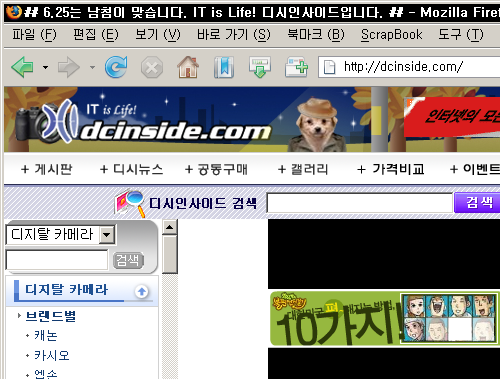

 2006년 11월 21일, 디시인사이드의 타이틀 태그에는 **6.25는 남침이 맞습니다. IT is Life! 디시인사이드입니다.** 라고 ~~적혀 있다~~적혀 있었다.

<!-- truncate -->

**관련 링크**

- [KBS - 이재정 “6·25 남침 규정 적절치 않다” 논란](http://news.kbs.co.kr/article/politics/200611/20061117/1253797.html)
- [**프리존 - 김유식 디시인사이드 대표 인터뷰 (“은혜를 원수로 갚는 좌파정부”)**](http://www.freezone.co.kr/cafebbs/view.html?gid=fz&bid=free&pid=99674)
- [디시인사이드 - 그랜드 개죽이의 그랜드 서울 이야기](http://dcinside.com/webdc/lecture/study_list.php?code1=60)
- [조선일보 - "동경 북경은 가라, 서울을 더 크게 만들테니"](http://www.chosun.com/national/news/200508/200508260224.html) (역시 대단! 이 짜고치는 고스톱)
- [**김중태 문화원 - 그랜드서울프로젝트, 디씨인사이드, 김유식, 한현규**](http://www.dal.co.kr/blog/2005/11/20051115_grand_seoul.html)
- [매일경제 - 디시인사이드, '뜬금없는' 코스닥 우회상장](http://news.mk.co.kr/newsRead.php?no=482963&year=2006)
- [**조선일보 백강녕 기자 - DC인사이드 인수합병 막전막후**](http://blog.chosun.com/blog.log.view.screen?blogId=2295&logId=1615655&menuId=-1&from=19000101&to=29991231&listType=2&startPage=1&startLogId=999999999&curPage=0)
- [민트켄디의 패러디/허접논평 - 김유식의 ucc꿈과 보수정치성향](http://www.mediamob.co.kr/mintkendy/blog.aspx?id=118681)
- [오마이뉴스 - "<디시> 팔아먹었다? 햏자들의 오해"](http://www.ohmynews.com/articleview/article_view.asp?at_code=374357)
- [오마이뉴스 - "술값 너무 나와서 아예 술집 차렸다"](http://www.ohmynews.com/ArticleView/article_view.asp?at_code=374360)
