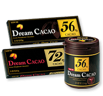

이 것 역시 몇 주 된 이야기입니다.  

<!-- truncate -->

  

요즘 롯데 드림 카카오 초콜릿이 인기죠? (아닐지도;; ) 언젠가부터 편의점 갈 때마다 눈에 띄더라고요. 56%가 두 종류, 72%가 한 종류. 평상시 다른 군것질은 안하는데, 초콜릿이나 음료만 종종 사 먹습니다. 그래서 이것도 먹어봤죠. 어떤 분들은 72%가 진하다고 하는데 저는 잘 모르겠어요. 적어도 제겐 느껴질 정도의 진한 맛은 아니예요. (원통형 용기에 들은 제품에 들은 건 초코볼 형태라서 가끔 조카들 줄 때 좋더군요. ^^)  
  
그래서 99% 짜리로 도전해 보기로 했지요. 그런데, 우리나라에는 아직 99% 짜리가 나오지 않아서 일본에서 나온 제품을 인터넷 쇼핑몰에서 주문했습니다. (옥션, 지마켓, 인터파크 등에 있더군요.) 1개에 2500원씩인데, 4개를 주문했어요.  
  
[meiji\_cacao\_99.jpg](./meiji_cacao_99.jpg)  
물건을 받자마자 얼른 포장 뜯고 한입 베어 물고 평상시 습관대로 **씹어줬습니다.** '그래 너는 얼마나 진하길래 99%더냐' 하면서. 그런데…  
  
**으윽~ 이건 하나도 달지 않아요. 써요. ㅠ.ㅠ**  
심지어 조카들에게 조금씩 떼어주고 맛을 보게 했는데, 그 이후로 제가 "애들아, 초콜릿 줄까? 이 초콜릿~!" 하면서 포장을 보여주면 다들 고개를 절레절레 하면서 뒷걸음질을 칩니다. 이건, 애시당초 씹어먹을 초콜릿은 아니구나 싶었습니다. -\_-;  
  
처음엔 괜히 4개나 샀다 싶은 생각이 들기도 했지만 나중에 요령이 생겨서 조금씩 떼어서 녹여 먹으니 먹을만 하더군요. 게다가 달지 않으니 질리지 않으면서도 한꺼번에 많이 먹기엔 (맛이 쓰고) 진하니 오래 먹게 되고요.  
  
여러 모로 괜찮은 제품 같아요. :)
