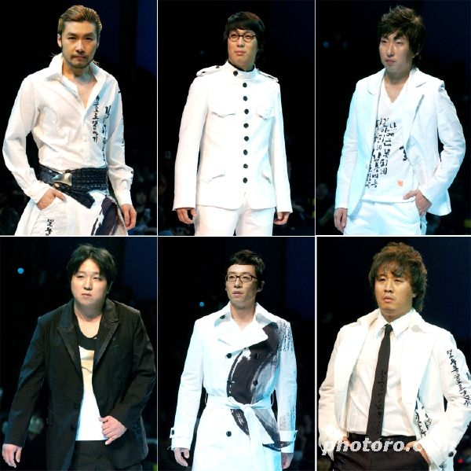
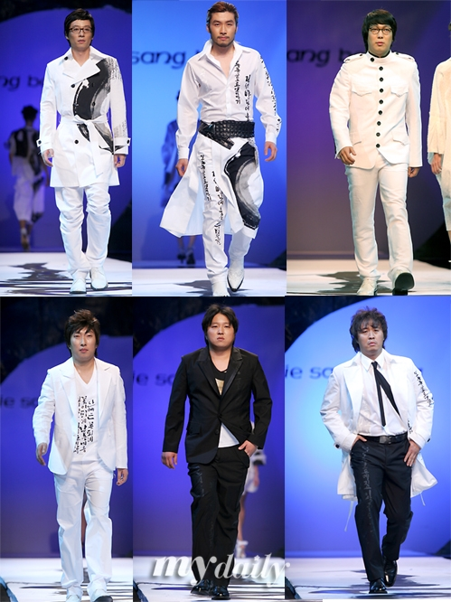

[무한도전로고.png](./무한도전로고.png)[**무한도전**](http://www.imbc.com/broad/tv/ent/challenge/)은 TV를 거의 보지 않는 제가 유일하게 챙겨보는 프로그램 중의 하나입니다. [한겨레 21에 소개된 평론](http://h21.hani.co.kr/section-021015000/2006/10/021015000200610260632063.html)을 빌려 거창하게 이야기하지 않아도 제게 이 프로그램은 재밌어요. 단지 그 뿐입니다. 앞뒤 가리지 않고 다른 방송사의 프로그램들을 패러디해는가 하면, 완벽하지 않아 보이는 여러명의 주인공들이 현실과 쇼를 오가는 내용들이 흥미로워요.  

<!-- truncate -->

이 패러디들은 2주에 걸쳐 방송된 "무한도전 슈퍼모델" 편에서 이루어졌습니다. 평소에 좋아하던 광고 [(제일모직 갤럭시)](http://www.galaxy.co.kr/) 를 패러디한 것도 좋았지만, 한가지 더 재밌었던 건 이런 거죠 - 보통 슈퍼모델들의 일상사를 다룬 리얼리티 쇼는 외국산 프로그램인데, 외국은 프로그램 중간에 광고를 틀기 때문에 편집의 호흡도 그렇게 맞춰져 있죠. 우리나라 케이블도 마찬가지고요. 무한도전의 이 패러디는 자체로 웃길 뿐더러 프로그램이 케이블에서 볼 수 있는 리얼리티 쇼 분위기를 내는데 도움을 줬다고 생각해요.  
  
처음엔 갤럭시의 세번째 광고를 노홍철 편으로 패러디 했는데, 반응이 좋았는지 나머지 두 편도 정준하와 박명수를 이용해 패러디를 했습니다. 세 편 중 두 편은 이전 편들에서 나왔던 내용들을 기초로 하고 있기 때문에 (박명수의 연애, 노홍철과 빨간 하이힐 그리고 키높이 구두) 조금 매니악한 팬들을 위한 서비스라 할 수도 있을 것도 같아요.  
  

**갤럭시 - 피어스 브로스넌 1편**  
  
  
  
  
박명수편

  

**갤럭시 - 피어스 브로스넌 2편**  
  
  
  
  
정준하편

  

**갤럭시 - 피어스 브로스넌 3편**  
  
  
  
  
노홍철편

  

이 광고에 사용된 음악은 [**드라마 연애시대 OST**](http://music.naver.com/album.nhn?tubeid=2os400013050)의 **나폴리 피자**입니다.  
  
[▶ 들으러 가기](http://blog.naver.com/duck7614/50010720214)

  

  
[무한도전-패션쇼-3.jpg](./무한도전-패션쇼-3.jpg)  

**관련 글**  
  
**제록스 광고 = 무한도전 노홍철 + 갤럭시 패러디**
