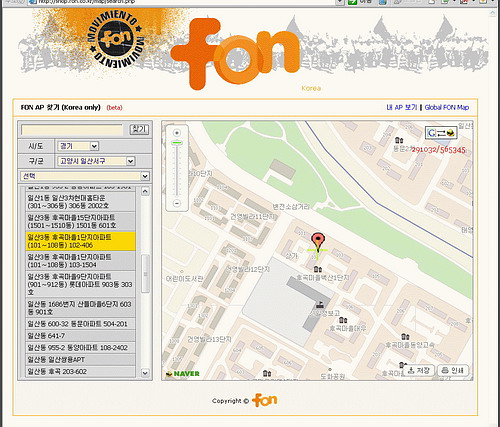

[**FON 코리아**](http://kr.fon.com/)가 [**FON 지도**](http://shop.fon.co.kr/map)라는 서비스를 열었군요. FON에 가입되어 있는 사용자들의 위치를 알려주는 서비스로 어떤 장소에서 FON을 이용할 수 있는지를 미리 체크하는 게 가능해졌군요. (지도는 구글맵과 네이버 지도검색을 이용하고 있습니다.)

<!-- truncate -->

멋져요. 정말 "**계 최대의 WiFi 커뮤니티**라는 이름이 어울립니다.

그런데, 세가지 단점이 있군요. 차차 수정되리라 생각합니다.

1. 주소와 지도가 정확하게 일치하지 않는 경우가 있다.
2. 주소에 아파트의 동, 호수까지 나오는 건 좀 심하다.
3. (적어도) 파이어폭스 2.0에서는 작동하지 않는다.

**관련 링크**

- [FON Maps (전세계 FON 지도 검색)](http://maps.fon.com/)
- [FON이란 무엇인가?](http://kr.fon.com/info/whats_fon.php)
- [제닉스의 사고뭉치 - 전 세계 어디서든 무선랜이 무료. FON 리뷰](http://xenix.egloos.com/1344205)
- [라디오키즈@LifeLog - 짧은 만남... 첫번째 FON 얼리어답터 모임](http://www.neoearly.net/2461374)
- [Crow’s Maniacal World - FON서비스. 내심 걱정이다.](http://crowmaniac.net/crowmania/?p=335)
