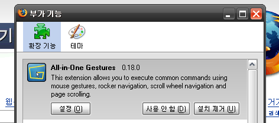

<!-- truncate -->

[**파이어폭스**](http://www.mozilla.or.kr/products/firefox/) 설치 후 이 부가 기능 (확장 기능)을 사용하지 않으면 웹서핑을 할 수 없을 정도로 익숙해져 버린 [**올인원 제스쳐 (All-onOne Gestures)**](https://addons.mozilla.org/firefox/12/).

별다른 설정 없이 마우스 움직임만으로 웹서핑이 몇 배는 더 쉬워지게 만들어주는 아주 유용한 확장 기능인데 얼마 전 전혀 몰랐던 기능을 알게 되었다.

파이어폭스를 쓰기 전 인터넷 익스플로러를 쓸 때 IE Toy의 비슷한 기능에 익숙해지는 바람에 [맨 위로 스크롤]과 [맨 아래로 스크롤]은 설정값을 변경하고 쓰기는 한다.

**[한 페이지 뒤로 가기]**와 **[한 페이지 앞으로 가기]**에 관련된 기능인데, [한 페이지 뒤로 가기]를 하고 싶으면 **마우스 우클릭 상태를 유지하며 좌클릭**을 하고 [한 페이지 앞으로 가기]를 하고 싶으면 **마우스 좌클릭 상태를 유지하며 우클릭**을 하면 되는 것이다. 글로 설명하면 갸우뚱 할지도 모르지만 직접 해보면 감이 온다.

왜 이제까지 몰랐을까? 우클릭한 채로 좌측이나 우측으로 드래그하는 것보다 손목을 사용하지 않는다는 점 등 여러모로 편하다.

파이어폭스에 올인원 제스쳐 (All-onOne Gestures)를 설치한 후

- [한 페이지 뒤로 가기] : 마우스 우클릭 상태 유지하며 좌클릭
- [한 페이지 앞으로 가기] : 마우스 좌클릭 상태 유지하며 우클릭
