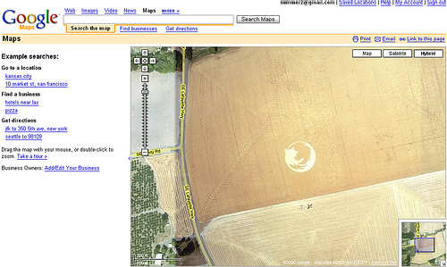
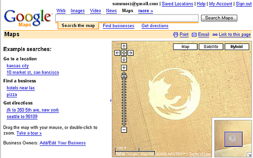

장소는 미국 오레곤주의 포틀랜드와 살렘 사이 지역이군요. 잘 만들었네요. :)

<!-- truncate -->

 [잘 만들었습니다.](http://maps.google.com/?ie=UTF8&om=1&z=16&ll=45.123785,-123.113962&spn=0.012112,0.024097&t=h)

 [가까이서 봐도 잘 만들었네요.](http://maps.google.com/?ie=UTF8&om=1&z=16&ll=45.123785,-123.113962&spn=0.012112,0.024097&t=h)

**관련 링크**

- [OSU (Oregon State University)의 리눅스 유저그룹 - Firefox Crop Circle](http://lug.oregonstate.edu/gallery/main.php?g2_itemId=153)
- [유튜브 영상 - Firefox Crop Circle](http://www.youtube.com/watch?v=4_K5gfIE7qo)
