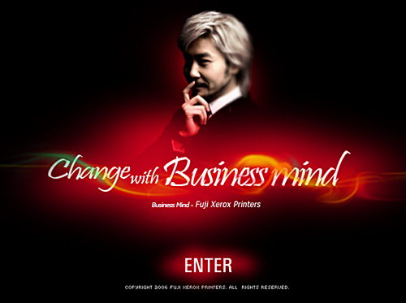

 원래는 플래시 광고인데 적당히 캡쳐했어요;;; 오오- 무한도전의 갤럭시 광고 패러디가 반응이 좋았나봐요. 얼마 전부터 퀵마우스 노홍철이 제록스의 지면 광고에 나오는 건 봐서 아는데, 웹에서 갤럭시 광고의 패러디로 나오는 걸 보니 새삼 재밌네요. 흐흐.

<!-- truncate -->

문득 건방진 뚱보 형돈이가 불쌍하다는 느낌이 드는 건 왜일까요;;;

https://www.youtube.com/watch?v=KSLxJDfOss8
갤럭시 - 피어스 브로스넌

(영상 삭제됨) 노홍철편

**관련 글**

- [무한도전, 세 편의 갤럭시 광고 패러디](/blog/2006/11/28)
