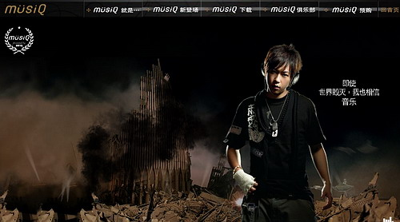
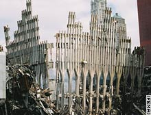
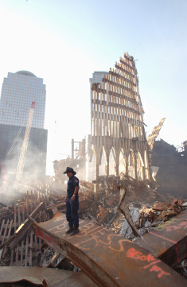
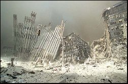
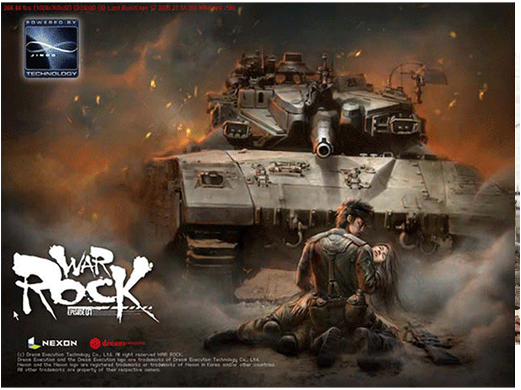

[기즈모도](http://www.gizmodo.com/gadgets/portable-media/wtf-alert-chinese-benq-musiq-dog-tag-player-site-has-guy-posing-in-front-of-wtc-ruins-218714.php)에서 봤습니다.  

<!-- truncate -->

BenQ의 중국 사이트 중 musiQ (mp3 플레이어) 페이지에 가면 한 소년이 mp3 플레이어를 들고 있는데, 그 뒷배경이 무너진 월드 트레이드 센터 같다며 흥분하고 있군요.  
  
  
구글 이미지에서 무너진 월드 트레이드 센터 이미지들을 찾아서 살펴보니 정말 비슷하군요.  
  
  
  
  
  
  

"내일 지구가 멸망한다 해도 나는 musiQ로 음악을 들을 거야" 뭐, 이런 컨셉인 거겠죠? 문득 넥슨의 워록 이미지가 떠오릅니다.  
  

