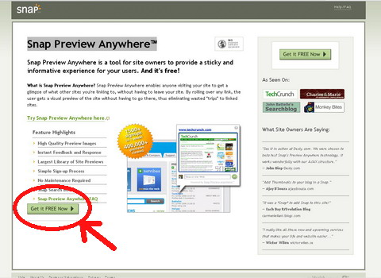
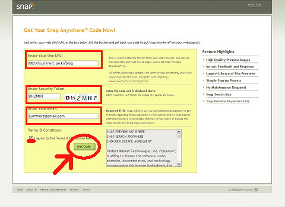
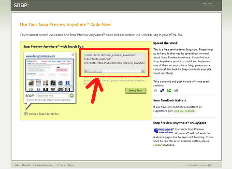
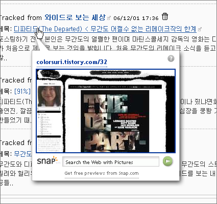

[SNAP](http://www.snap.com) 이라는 사이트가 있습니다.  

<!-- truncate -->

The other way to search™라고 하여 새로운 방식의 검색을 한다는 사이트인데 한글 지원은 제대로 되지 않아서 저에겐 반쪽짜리 서비스이지만 여러 모로 재치있는 화면을 보여줍니다. (직접 해보세요. 시각적인 효과가 재밌으면서도 시원하군요.)  
  
정작 유용한 건 여기서 제공하는 [**Snap Preview Anywhere™**](http://www.snap.com/about/spa1.php) 이라는 일종의 웹페이지용 플러그인인데, 웹페이지 상에 있는 모든 링크에 간단한 프리뷰를 보여주는 기능을 합니다. 사용법이 너무 간단하면서도 그 효과는 굉장하군요. :)  
  
사용법은 간단합니다.  
  

**1** [**Snap Preview Anywhere™**](http://www.snap.com/about/spa1.php) 로 가서 **Get it FREE Now** 버튼을 클릭합니다.  
  

  

**2** 이 서비스를 사용할 홈페이지 (블로그) 주소, 사용자 확인 문자, 이메일을 입력하고 약관을 확인한 다음 **Get Code** 버튼을 클릭합니다.  
  

  

**3** 박스 안에 있는 스크립트를 복사해서 자신의 홈페이지 (블로그)의 헤더 안에 넣어줍니다. 태터툴즈 같은 경우는 스킨 파일을 열어서 그 안에 집어넣으면 되겠지요.  
  

  
링크의 프리뷰가 처음 보여질 때는 캡쳐 중이라는 메시지가 뜨지만 조금 지난 이후부터는 제대로 뜨더군요. 이런 식으로 말이죠.  
  
  
지금 제 블로그에도 적용이 되어 있는데, 상당히 좋은 서비스인 것 같아요. :)
