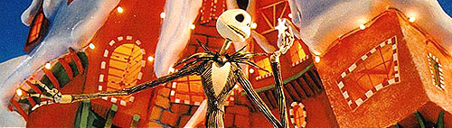
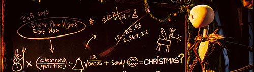
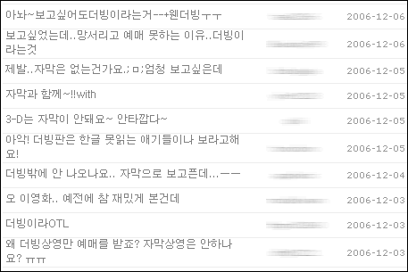
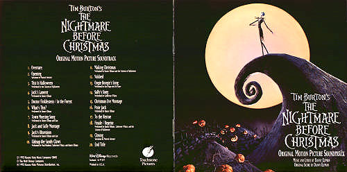
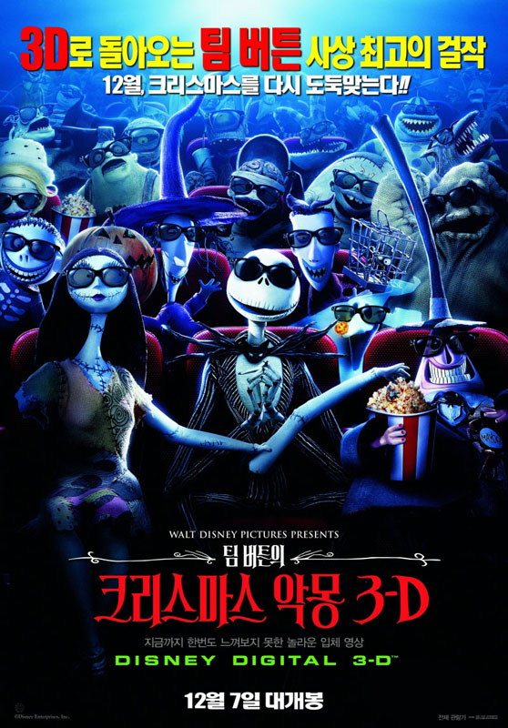
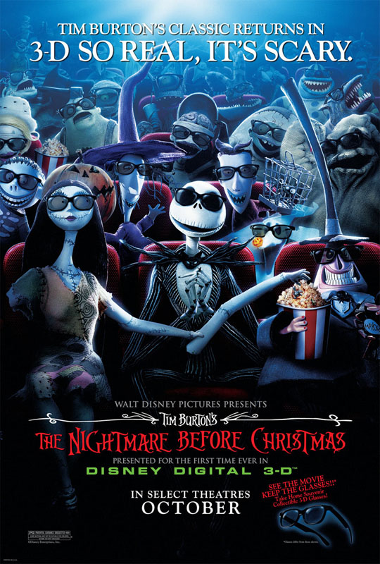

<크리스마스의 악몽>이 개봉된지 13년 만에 3D 버전이 나왔다. 벌써 13년이나 흘렀다니! 믿을 수가 없다. 하지만, 곰곰히 영화를 봤던 시절을 떠올려 보니 맞는 것 같다. 현실은 현실인 법. 그나저나 서양에서 불길한 숫자인 13에 의미를 둔 건 마케팅팀의 의도였는지 아니면 3D를 영화를 만드는 제작진의 의도였는지 궁금하다.

<!-- truncate -->

영화는 다들(?) 알다시피 할로윈 마을의 대장 잭 스켈링턴이 크리스마스에도 (자기들 방식으로) 신나게 놀기 위해 산타클로스를 납치하고 사람들의 크리스마스를 가로채다가 뒤늦게 자신의 잘못을 깨닫고 상황을 원래대로 돌려놓으려 한다는 내용이다.

이미 일반적인 영화 형태로 만들어진 영화를 어떻게 3D 영화로 만들 수 있는지 궁금했다. 극장에서 나눠준 리플릿에 적혀있던 내용을 떠올려 보면 - 이 영화는 디즈니 디지털 3D (ILM에서 3D로 랜더링, 리얼 D 프로젝션 방식) 라는 것인데, 2개의 영사기를 사용해 입체영상을 만들었던 기존의 방식들과는 달리 1개의 영사기에서 '왼쪽 눈을 위한 영상'과 '오른쪽 눈을 위한 영상'을 1초에 144프레임씩 번갈아가며 쏘는 방식이라고 한다. 궁금한 건 양쪽 눈에 각각 1초에 72프레임씩 보여진다는 건데 왜 그렇게 많은 프레임이 필요할까 하는 것이다. (참고로 현재 일반 극장 상영 영화는 초당 24프레임, 비디오는 초당 29.97프레임) 혹시 예전에 작업했던 프레임과 디지털로 새로 만든 프레임을 교차해서 보여주는 방식인 걸까? 그렇다면 어느 정도 이해가 갈 듯도 싶다.

이제까지 3D 영화 많이 보지는 못했지만 볼 때마다 느끼는 점은 **영화라는 매체 역시 새로운 길을 모색하고 있구나**와 **역시 기술의 발전이 문화의 흐름에 영향을 줄 수 있다**는 점이다. 현재의 기술로 3D 영화의 느낌을 가장 잘 살리는 방법은 바로 원근감을 적극적으로 활용하는 것이다. 즉, 시각적인 즐거움을 극대화하고 싶으면 깊이가 강하게 드러나는 씬을 많이 넣으면 된다는 것. '깊이의 미장센'이라는 게 나중엔 상업 영화 기법에 중요한 위치를 차지할지 또 모르지.

상영관 홈페이지에 올라온 이 불평들을 보라! 아쉬운 게 2가지 있는데 첫째는 대니 앨프먼의 곡을 오랜만에 극장에서 듣고 싶었는데 극장에서 상영하는 건 더빙판이었다. 이건 참 큰 아쉬움이었다. 성우들의 목소리 연기도 나쁘진 않았지만 그래도 원작팬의 입장에서는 아쉬울 수 밖에 없다. 이 새로운 3D 영화를 위한 사운드트랙에는 마릴린 맨슨, 피오나 애플 등이 부른 곡들이 수록되어 있다고 하던데, 그걸로 만족해야 할까 보다. (참고로 아직까지 3D 영화에서는 자막 지원이 기술적으로 불가능하다고 한다.)

둘째는 디즈니 디지털 3D 기술을 위해 디즈니의 로고도 3D로 새로 만들고, 영화 시작 전에 간단한 3D 영상을 보여주는데, 그것에 비해 본편의 입체감은 덜 했다는 점이다. 솔직히 이건 아쉬운 점은 아닐 수도 있다. 본편의 입체감만으로도 충분히 즐거웠으니까. 다만 3D 효과를 부각시키기 위해 만든 영상을 본편을 감상하기 바로 직전에 보니 상대적으로 비교가 되는 것이다. 뭐, 그렇다고 그런 것들을 영화 끝나고 집어넣으면 아무도 보지 않겠지.

예전에 굉장히 좋아했던 작품을 큰 화면으로 오랜만에 보며 가장 크게 느낀 건 무엇보다 **역시 대니 앨프먼은 위대하다**는 것이었다. 그 자유분방한 듯한 편곡과 멜로디들이 어떤 하나의 점으로 수렴하는 느낌이랄까? 자유로운 듯 보이면서도 전체적으로 통일성있는 사운드 디자인이었다.

- http://imdb.com/title/tt0107688/
- http://movie.naver.com/movie/bi/mi/basic.nhn?code=14584
- http://www.rottentomatoes.com/m/1170918-the_nightmare_before_christmas_3_d/

**관련 링크**

- [코리아필름 - 팀 버튼의 크리스마스 악몽3D](http://www.koreafilm.co.kr/movie/review/nightmare_christmas.htm)
- [씨네21 - 팀 버튼의 크리스마스의 악몽 3D](http://www.cine21.com/Movies/Mov_Movie/movie_detail.php?s=note&id=7283)
- [네이버 영화 - 크리스마스 악몽 제작 노트](http://movie.naver.com/movie/bi/mi/detail.nhn?code=14584&mb=c#02)

 새 포스터 한글 버전

 새 포스터 영문 버전
