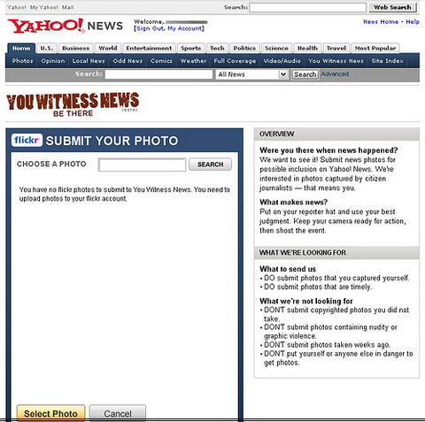
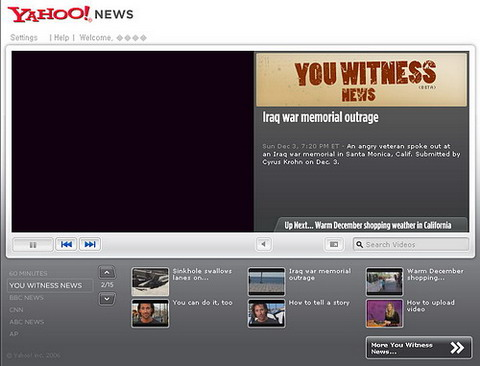
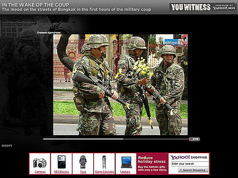
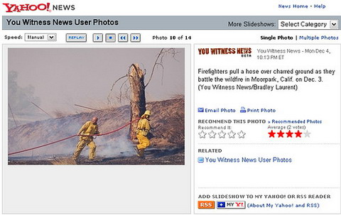

요즘 여기저기서 새로운 미디어, 새로운 저널리즘과 UCC (UGC)를 이용한 서비스에 대한 시도들이 한창이다. 내가 가장 흥미롭게 본 것 중의 하나는 바로 [**야후!**](http://www.yahoo.com)의 시도이다.

<!-- truncate -->

야후!에서 새롭게 시작한 서비스는 바로 [**You Witness News (beta)**](http://news.yahoo.com/you-witness) 한마디로 뉴스 현장에 있던 인터넷 사용자 중 뉴스에 사용될 사진이나 동영상을 확보한 게 있으면 올려달라는 서비스이다. 간단한 절차를 거쳐 누구나 자신이 확보한 동영상이나 사진을 통해 기자가 될 수 있다는 그런 취지라고 생각이 된다.

이런식으로 저널리즘의 성격을 분명하게 하는 서비스들이 하나씩 생겨나는 것이 개인적으로 흥미롭다. 굳이 우리나라의 서비스들과 비교를 하자면 [**오마이뉴스**](http://www.ohmynews.com) 보다는 조금 가볍고, [**뉴스2.0**](http://www.news2.co.kr)보다는 조금 더 전문성을 띈 서비스라고나 할까?

이런 형태의 미디어가 잘 발전하면 조금 더 생생하고 첨가물이 덜 들어간 뉴스가 될 수 있을 것도 같고, 반대로 점점 선정성을 띈다면 수많은 스몰 브라더들이 서로를, 대중을 감시하는 매체가 될 수 있을 것도 같다.

몇몇 스크린샷을 보면 다음과 같다.

 처음 들어가면 이런 화면이 보인다. 야후!에 로그인을 하고,

 사진을 올리려고 하면 [**플리커**](http://flickr.com)와 연결되어 있으니 계정을 하나 만들든지 이 서비스와 연결시키라고 한다. (동영상의 경우엔 100MB 미만의 파일을 바로 올릴 수 있다.)

 그런 다음 자신의 플리커에서 사진을 골라 올리면 된다. (이 다음 과정으로 제목을 적는다든지 오디오 코멘터리를 다는 과정이 있을 듯 한데, 플리커에 올려놓은 사진이 없는 관계로 패스)

 이미 올려진 동영상 뉴스 하나를 봤다. 창이 팝업으로 뜨면서 재생이 된다. 코멘트야 촬영자가 촬영하면서 직접 할 수 있으니 별다른 추가 과정은 필요없을 듯 싶다.

 사진과 오디오 코멘터리로 이루어진 슬라이드 하나 봤다. 플래시로 플레이가 되면서 코멘트가 함께 나온다. 별다른 효과 없이도 썩 볼만한 형태의 뉴스이다.

 일반적인 사진 뉴스를 하나 봤다. 연합뉴스 등에서 자주 보던 '사진만 달랑 들어있는 기존의 기사'들과 크게 다를 바 없어 보인다.

 그리고 첫화면 우측 사이드바를 보면 다른 시민 저널리즘에 대한 자료들에 대한 링크도 걸어놓았다. 별거 아닐지 모르지만 난 이런 센스가 좋다. 자신의 틀 안에 모든 걸 가두지 않는 자연스러운 확장.
