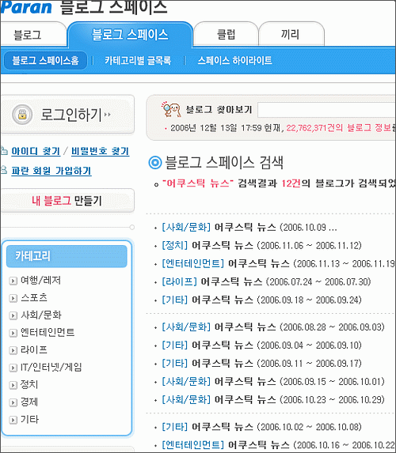
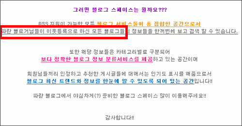

  
파란의 [블로그 스페이스](http://blogspace.paran.com).  

<!-- truncate -->

말들이 많아서 한번 가봤다.  
검색해보니 내 블로그의 글들도 들어 있다.  
그런데, 내 블로그에 대한 정보를 볼 수 있는 곳은 찾을 수 없었다.  
  
어쨌든.  
  
주제 신경쓰지 않고 모으는 일종의 주별 링크인 저 **어쿠스틱 뉴스**의 카테고리가 다 다른 걸 보니 과연 저 카테고리는 누가 정하는 건지 궁금해졌다. 사람일까, 로봇일까. 혹시 랜덤?  
  
게다가 가만히 보니 검색되는 글들이 날짜순도 아니다. 무슨 순일까. 역시 랜덤?  
  
  
어떤 기준으로 내 블로그의 글들이 등록된 걸까?  
  
그건 그냥 짐작으로 알겠다 싶었다.  
  
[블로그 스페이스 공식 블로그](http://blog.paran.com/blogspace)에 가니 **파란 블로거님들이 이웃등록으로 하신 모든 블로그들**의 정보들을 한꺼번에 검색 할 수 있다는 문구가 있다. ~~(그런데, 저 구문도 좀 이상하다. 그냥 **이웃등록하신** 하면 되지, 저렇게 이상한 비문을 쓰는 이유는 뭘까.)~~  
  
아, 누군가 파란 블로그 사용자들이 날 링크했으면 내 글들을 긁어다 주겠다는 뜻인가? 그런 것 같다.
