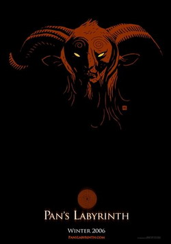
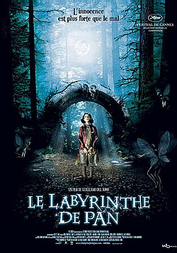
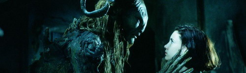
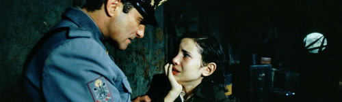
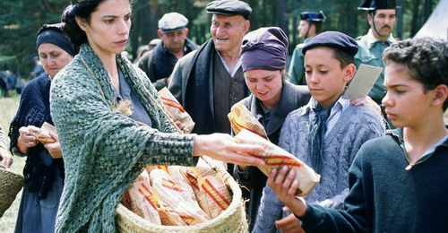
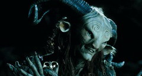
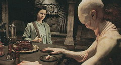
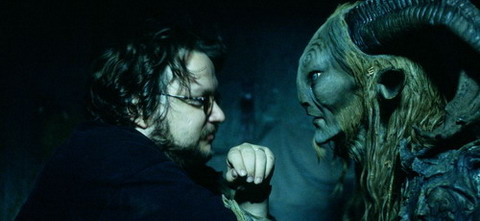

aka El Laberinto Del Fauno, Pan's Labyrinth  

<!-- truncate -->

  
워낙 잔인하다는 말을 여기저기서 많이 들었던 지라 마음을 단단히 먹고 봤다. 사실 그 정도의 소문이라면 예전에 관람 욕구가 사라졌어야 옳다. 호러 및 고어물은 실눈 뜨고 웅크리고 보기 때문에. 하지만, 기예르모 델 토로 감독의 작품을 보고 싶다는 욕망 하나 때문에 보게 되었다.  
  
결과는? 마음을 단단히 먹었기 때문인지 무난하게 봤다. 문득 마케팅 담당자들의 회의 장면이 떠올랐다. 그들은 흥행을 위해 <해리 포터와 마법사의 돌> 이라든지 <나니아 연대기 - 사자, 마녀 그리고 옷장>과 같은 느낌으로 뜬금없는 부제 "오필리아와 세 개의 열쇠"를 붙인 걸까, 아니면 이러한 영화도 대중의 선택을 받아야 한다는 사명감에 부제며, 홍보며 각종 마케팅 자료를 그렇게 꾸민 것일까? 후자라면 진심으로 박수를 보낸다. 짝짝짝. :)  
  
  
판과 오필리아  
스페인 내전 당시의 생활이 영화의 한 쪽 현실이다. 다른 한 쪽은 행복과 평화만이 가득한 지하왕국. 이 둘의 극단적인 비교는 잔인하게 슬프다. 그리고, 감독은 끝까지 오필리아가 봤던 지하왕국이 혹독한 시기를 이겨내기 위해 만들어낸 판타지인지 아니면 진짜로 있는 내용인지 (즉, 영화가 판타지물인지)에 대한 해석을 열어두고 있다. (물론 판이 준 분필은 이 영화가 전적으로 오필리아의 환상에 관한 이야기는 아니라는 뉘앙스를 주고 있긴 하다.)  
  
  
군인 아버지와 오필리아  
영화에 등장하는 인물들은 그 선악의 구분이 굉장히 명확하다. 또한 영화의 내용 역시 어느 정도 도식적으로 흘러가는 면도 있다. 임무를 완수해서 지하왕국으로 돌아가고 싶은 어린 소녀, 그녀에게 자꾸만 위험한 임무를 주는 정체모를 인물, 아프신 어머니, 반군을 지원하는 한 여인과 의사… 이들은 아들의 탄생을 바라는 악의 화신 군인 아버지 (게다가 계부다. 신데렐라의 계모처럼. 이 얼마나 명확한 인물인가.)와 무서운 괴물들을 상대로 환상 속이든 현실에서든 모두 나름대로 어떤 성취를 이룬다.  
  
  
독재에 대항하는 반군과 난민들을 도와주는 메르세데스  
이처럼 이 영화는 슬픔과 서러움에 대한 이야기를 전혀 하고 있지만 (오히려 주인공들은 다들 소기의 목적들을 달성하지만) 결정적으로 이 영화가 슬픈 지점은 바로 여기에 있다. 실제로는 스페인 내전에서 승리한 건 프랑코 독재였기 때문이다. 이 때 희생된 사람들만 50여만명 정도에 이른다고 한다.  
  
영화를 다 보고 나서 이 감독이 영화를 통해 말하고자 하는 주제는 무엇일까 궁금해졌다. 스페인 내전의 참혹함을 보여주기 위함일까, 아니면 한 소녀의 비극을 나타내기 위함일까? 내 생각으로는 그보다 **은근히 피어오르는 공포의 기운, 지극히 잔인하면서도 아름답기까지 한 공포**가 감독이 나타내고자 하는 주제가 아닌가 싶다. 그러면서도 이 영화가 현실적인 느낌을 준다면 그 공포의 강력한 부분이 현실에서 볼 수 없는 것들에게서 오는 것이 아니라 파시스트들에게서 느껴지기 때문일 것이다.  
  

**그리고**  
  
재밌는 건 판을 연기한 더그 존스 (Doug Jones)라는 배우인데, 그는 기예르모 델 토로 감독의 작품에서 괴물 전문 배우인데, (물론 다른 감독의 작품에서도 특이한 분장을 하곤 한다.) <미믹>, <헬보이>에서도 괴물 분장을 했었고, 이 영화에서도 판과 페일 맨 (~~눈에 손이 달린~~손에 눈이 달린 그 괴물)을 동시에 연기했다.  
  
  
판과 그나마 덜 징그러운 모습의 (눈 뜨기 전의) 페일 맨  
  
  
기예르모 델 토로 감독과 판

  
 /  /   
  

**관련 링크**  
  
[스페인 내전](http://hssmen.com.ne.kr/politics/4.htm)  
  
[씨네21 - 상상과 모험의 세계, 기예르모 델 토로의 영화왕국](http://www.cine21.com/Article/article_view.php?mm=005001001&article_id=43084)  
[씨네21 - <판의 미로: 오필리아와 세개의 열쇠>에 이르는 다섯 가지 열쇠](http://www.cine21.com/Article/article_view.php?mm=005001001&article_id=43086)  
[씨네21- 제59회 칸영화제 총결산[2] - 기예르모 델 토로의 <판의 미로>](http://www.cine21.com/Article/article_view.php?mm=005001001&article_id=39089)  
  
[필름2.0 - 얼굴없는 배우, '판'의 더그 존스](http://film2.co.kr/moviedb/movie_news.asp?mkey=41181)  
[필름2.0 - 현실 속에서 피어난 잔혹동화](http://film2.co.kr/feature/feature_final.asp?mkey=4090)  
  
[영국 가디언지 - 기예르모 델 토로 감독의 스케치들 (그림 9장)](http://film.guardian.co.uk/flash/page/0,,1949730,00.html)
