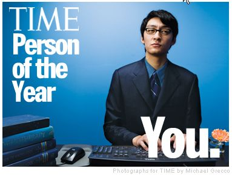
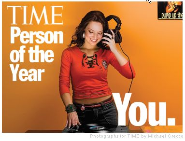
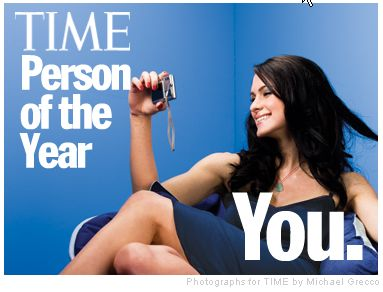
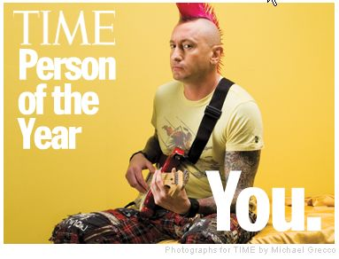
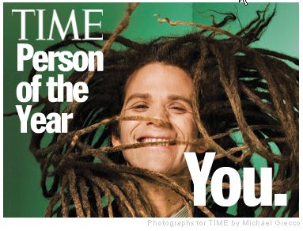
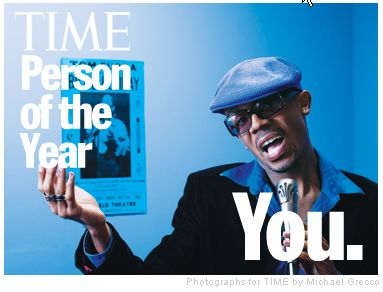
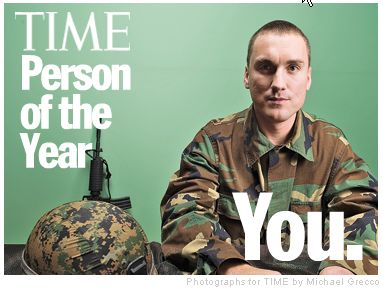
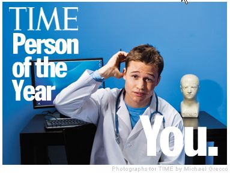

토마스 칼라일의 **"세계의 역사는 위대한 자들의 전기에 불과하다"**는 인용으로 시작하는 [**타임지의 기사**](http://www.time.com/time/magazine/article/0,9171,1569514,00.html)는 올해의 인물로 **당신 (You)**를 선정했습니다.  

<!-- truncate -->

[**Time.com - Cover Story : Person of the Year: You**](http://www.time.com/time/magazine/article/0,9171,1569514,00.html)  
  
세계는 여기저기 핏빛으로 물들고, 어느 것 하나 제대로 굴러가지 않았던 한 해 (심지어 소니는 플스 3를 제대로 만들지도 못했지요), 위키피디아, 유튜브 그리고 마이스페이스 안의 수많은 개인들이 빛나는 활약을 보여줬기 때문이라고 하는군요.  
  
페이스북과 세컨드 라이프, 아마존과 팟캐스트의 예는 아무래도 우리나라의 실정과는 조금 다른 이야기일지 모르겠지만, 이름만 다른 유사한 서비스들은 우리나라에도 많죠.  
  
올 한 해 IT 쪽을 휩쓴 화두 중 하나인 **웹2.0** 이라는 주제에 타임지가 마침표를 찍어주는 듯 합니다. 참 절묘한 타이밍이랄까요?  
  
하지만 개인적인 생각으로는 아무리 개인의 역량이 중요하고 그것을 바라볼 수 있는 시선을 가질 수 있는 시대가 되었더라도 사회가 책임지고 해야 할 것들, 구조적인 모순들까지 개인들의 탓이나 능력에 있다고 착각하면 안되겠다는 생각을 해봅니다. 막말로 "이 모든 게 노무현 때문"인 것도 아니고, "KTX 승무원들이 투쟁하는 것이 배부르기 때문"인 게 아닌 것처럼 말이죠.  
  
  
  
  
  
  
  
  
  
  
  
  
예, 맞습니다. 여기까지 적고 나니 생각나는 우리나라 CF가 있군요.  
  
  
SK텔레콤 - 영웅편
