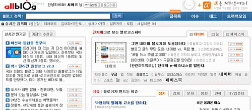

  

**0** 올블로그 2.3 이 베타 오픈 되었다. 예고 때는 2.5 였던 것 같은데. 어쨌든.  

<!-- truncate -->

**1** 화면이 뭔가 이것저것 가득 차있는데, 개인적으로는 괜찮다고 본다. 올블로그를 쓰면서 느낀 건데, 난 결국 몇몇 섹션 중에서 내가 사용하는 섹션에만 눈이 가고 사용하게 되더라. 예를 들어 digg.com 같은 경우는 그 섹션을 하나로 단순화 시켰기 때문에 사용자들의 선택이 쉽다고 본다. 서비스를 충실히 사용하거나 아니면 아예 사용하지 않거나. 이건 추후 올블로그가 서비스 성격을 정하면서 어차피 결정할 문제이니 잘 알아서 하겠지.  
  
**2** 추천수를 드러낸 건 좋은 시도인 듯 하다. 자신이 추천을 했는지 안했는지를 보여주는 것 역시 좋다. 다만 앞으로 추천수들이 전체적으로 많아지면 다른 방식을 사용해야겠지? 그렇다면 역시 숫자로 가는 건가? 그럼 인기글이라든지 추천글의 개수도 늘어나야 할 듯 싶다.  
  
**3** 예전처럼 글에 패널티를 주는 방안이 있으면 좋겠다. 굳이 digg.com 의 인터페이스를 예로 들자면 bury (이건 뭍어버려) 겠지. 광고/스팸을 신고하는 버튼이 있긴 하지만, 간혹 광고도 아니고 스팸도 아닌 글이라도 패널티를 주고 싶은 글들이 있다. 글쓴이의 인격에 패널티를 주는 것이 아니므로 이를 도덕적으로 판단할 필요는 없고, 추천에 대한 최소한의 반대 개념이 있으면 좋겠다는 뜻이다. (예를 들어 개인적으로 음담패설에 가까운 농담이나 이미지들, 논쟁을 위한 논쟁들, 낚시글들은 실시간 인기글이나 추천글 등에서 보기 싫다.)  
  
**4** 실시간 글목록과 맞춤 글목록이 너무 길다. 한 화면에 너무 많은 목록이 주루룩 쏟아진다. 첫 페이지에 그렇게 길게 늘어져 있다고 스크롤바를 주욱 내려서 다 읽어보지는 않을 것 같다. 조금만 줄이든지, 사용자가 어느 범위 안에서 선택할 수 있게 하면 좋을 듯도 싶다.  
  
**5** 검색 결과 쪽은 아직 디자인이 변하지 않았다. 뭐, 디자인 뿐이니 이건 금방 적용하면 될테지만 검색에 대해 한마디 하면 - 현재 버전에서는 예전에 있었던 검색도구가 사라졌는데 이건 계속 있으면 좋겠고, 검색할 때 사용자명 (블로거 이름)으로 검색하는 게 없는 듯 하다. 이것도 꽤 유용하지 않나? 있으면 좋겠다.  
  
**6** 이건 이번 1단 변신과는 관계 없을지 모르지만, 다시 한번 올블로그 툴바에 대해 생각하게 된다. 예전과 같은 모양이 아니라 느낌이 많이 달라졌지만 (순화됐지만) 사실 '주소납치'는 여전한 사실이다. 지금처럼 ajax를 사용하는 김에 조금만 더 신경쓰면 툴바를 사용하지 않고도 비슷한 기능을 해낼 수 있지 않을까?  
  

**아이디어 하나**  
  
모든 블로그툴에서는 안되더라도 워드프레스나 태터툴즈 등 몇몇 블로그툴을 위해서라도 올블로그에서 간단한 스크립트를 만들어주고, 그것이 올블로그의 툴바 역할을 하게 하면 어떨까? 그래서, 원하는 사람은 그 툴바를 직접 블로그에 설치하고, 올블의 주소를 떼어낼 수 있게 말이다. 말로만 UCC, UGC, 웹2.0 하지 말고 사용자의 컨텐츠를 주소까지 오롯이 존중하는 모습을 올블에서 먼저 보여줬으면 좋겠다. :) (뭐, 아직도 배고프다고 하면 어쩔 수 없겠지만.)

  
**7** 수동싱크 URL이 사라졌다. ajax 방식으로 바뀌면서 사라진 듯 한데, 수동싱크 URL을 하나 남겨주면 좋겠다. ^^  
  
**8** 마지막으로 이슈, 태그, 트랙백모임 페이지에 가면 글목록에 달려 있어야 할 upgrade 라는 아이콘이 엉뚱한 곳에 가 있다. 이 역시 조금 손만 봐주면 되겠지.
