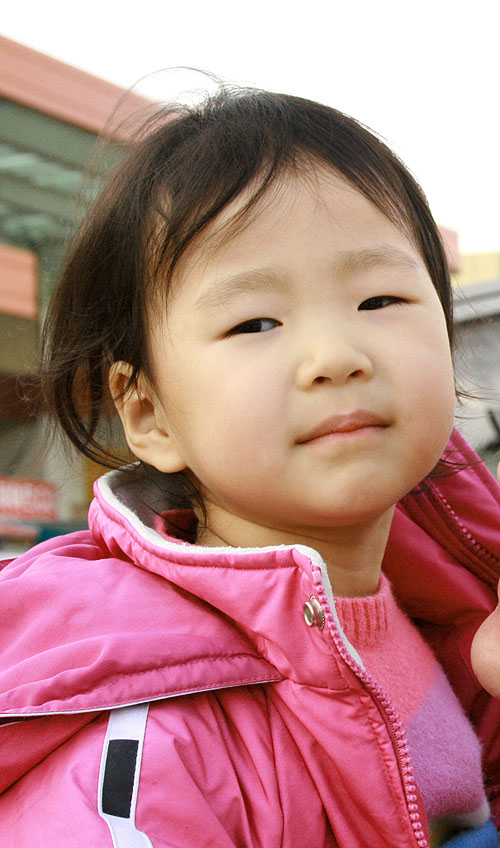

사실 제목은 [연말, 프로포즈] 정도 될텐데, 이런 식으로 적으면 또 이상하게 검색엔진에 걸려서 뭔가를 찾고 싶은 사람들에게 본의 아닌 낚시질을 하게 되는 경우가 있더군요. 각설하고.  

<!-- truncate -->

저녁밥을 먹고 매형이 감을 깎는다. 조카들은 포크를 하나씩 들고 맛나게 감을 먹었고, 나는 좀 뒤늦게 거실에 나가 감을 먹는데, 도연이 (4살)가 나를 보면서 한 마디 한다.  
  

도연이 : (크크크 웃으면서) 삼촌이랑 결혼하고 싶어요~  
  
나, 누나, 매형 : 하하하하하~  
  
한참을 웃는데 주연이가 쐐기를 박는다.  
  
주연이 : 도연이 네가 어른이 되면 삼촌은 어른이 아니라 할아버지가 되잖아. 그러니까 결혼할 수 없어.  
  
나, 누나, 매형 : 하하하하하하하하하~

  
연말에 받은 프로포즈 끝. :)  
  
  
도연이
