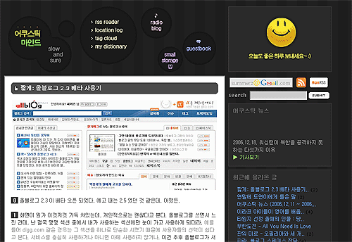

  
엄밀히 말하면 B&W는 아니지만  
검정색과 흰색을 위주로 디자인을 바꿨습니다.  

<!-- truncate -->

기본적으로 태터툴즈에서 제공하는 메뉴들에  
[**라디오 블로그**](javascript:void(0);)와  
[**자료실**](/smallpds/)이 추가된 형태로군요.  
메뉴가 예전과 크게 달라진 건 없죠.  
  
아, 대문 모음은 뺏어요.  
제가 업데이트를 잘 안해서요.  
  
앞으로 사진을 볼 수 있는 메뉴가 다시 등장할 수 있을지  
저도 기대가 되는군요.  
  
**'복잡하지 않게'**가 처음의 의도였는데,  
지금 보니 전혀 지켜지지 않은 것 같아요.  
다음엔 더 쉽게 만들 예정입니다.  
  
이상입니다. 리뉴얼 끝.
